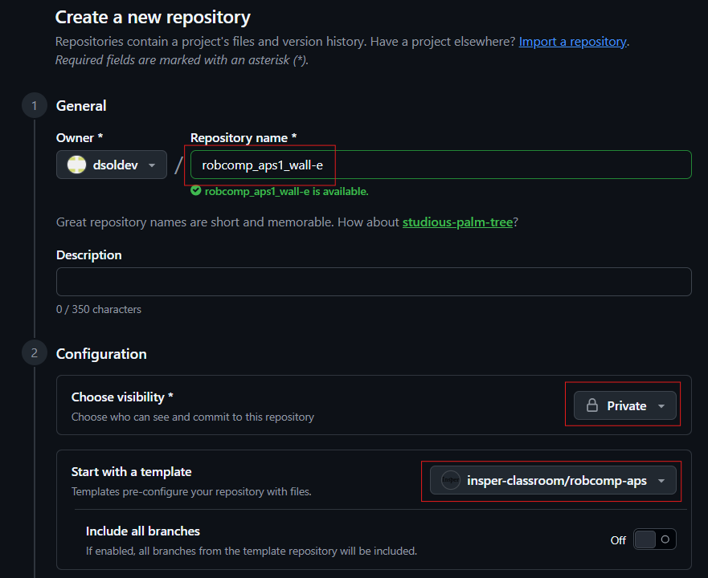

# Configuração da APS

Todas as entregas da disciplina serão feitas via GitHub.

## Entregas via GitHub

* **Criação do Repositório:** Para cada APS, um link de um repositório-template será disponibilizado.

  * Você deve **criar um novo repositório privado** usando o template fornecido no Blackboard. No caso de atividades em grupo, o repositório deve ser criado por **apenas um dos integrantes**.
  * No caso de atividades em grupo, os demais integrantes devem ser adicionados como colaboradores no repositório.
* **Escolha do Nome do Repositório:** O nome do repositório deve seguir o padrão `robcomp_aps#_XXXX`, substituindo `#` pelo número da APS e `XXXX` pelo nome do grupo. Use apenas letras minúsculas, números, hífens ou sublinhados, sem espaços e sem acentos. Exemplo: `robcomp_aps1_grupo_wall-e`.
* **Acesso ao Repositório:** Após a criação do repositório, adicione o usuário GitHub do professor como colaborador: `dsoldev`.

Ao clicar no link do template, você será direcionado para a página do GitHub. Clique em **Use this template** e depois em **Create a new repository**, como na imagem abaixo.



## Configuração do Repositório

* **Clonagem do Repositório:** Se já completou o tutorial de configuração do git e gerou sua chave SSH, clone o repositório optando por SSH. Caso contrário, siga o [tutorial de configuração do Git](modulos/01-intro/atividades/guias-infra/ssd-linux/git-e-github/index.md).
* **Atualização do `README.md`:** Adicione o nome de todos os integrantes do grupo no arquivo `README.md`, faça um commit e um push para o repositório. Após essas etapas, podem iniciar o trabalho na APS.
* **Inclusão de Colaboradores:** Em **Settings → Collaborators**, adicione:

  * os usuários GitHub dos demais integrantes do grupo;
  * o usuário GitHub do professor: `dsoldev`.

## Configuração do Pacote (ROS 2)

* **Preparação Inicial:** Primeiro, crie o repositório a partir do template e clone-o **dentro da pasta** `colcon_ws/src/` no seu SSD.
* **Criação do Pacote ROS 2:** **Dentro do diretório do seu repositório**, crie um novo pacote nomeado `entregavel_#`, substituindo `#` pelo número da APS correspondente. A criação de um pacote será ensinada no módulo 2.

## Entrega

Na plataforma da disciplina, envie:

* o link do repositório;
* o SHA completo do commit que deve ser avaliado.

Para obter o SHA do commit mais recente, execute:

```bash
git rev-parse HEAD
```

A correção será realizada com base no commit informado. O horário oficial da entrega será o registrado na plataforma da disciplina.

!!! warning
    A correção será feita considerando o histórico até o commit informado, e não necessariamente o último commit do repositório. Commits posteriores não serão considerados. Portanto, é importante informar no Blackboard o SHA do último commit que deseja entregar antes do fechamento da atividade.
