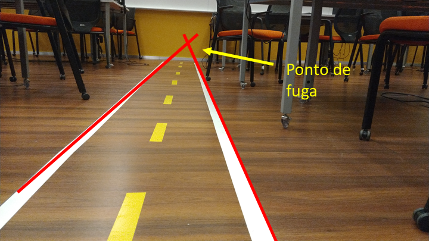
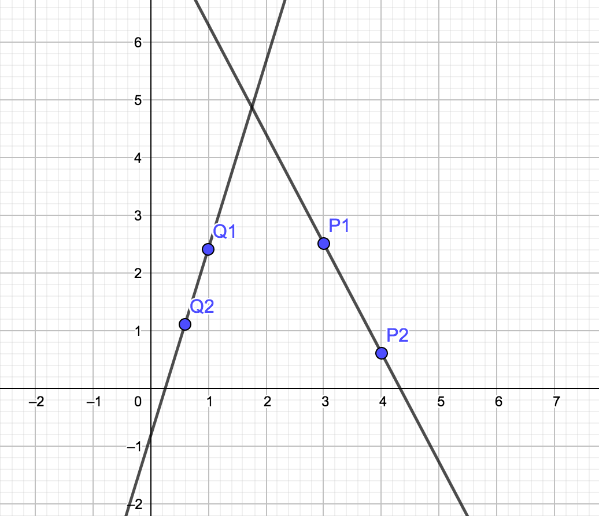
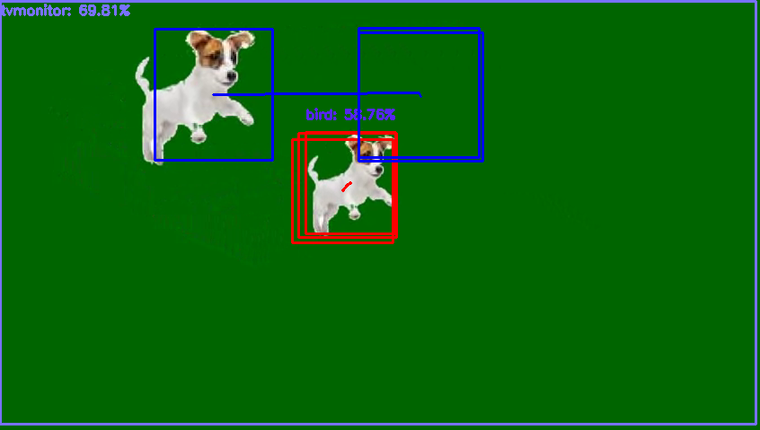

# APS 2 - Visão Computacional

**Importante:** Sempre desenvolvam nos arquivos `.py` dos respectivos exercícios.

**Aviso 1:** Não modifique o arquivo de teste, `test.py`.

**Aviso 2:** Lembre-se de dar commit e push no seu repositório até o horário limite de entrega.

**Aviso 3:** Preencha o nome completo dos integrantes do seu grupo no arquivo `README.md` do seu repositório.

## Teste seu código

Para testar seu código, execute o  teste automático usando o comando abaixo no terminal:

```bash
pytest test.py
```

Para testar apenas um exercício:

```bash
pytest test.py::test_ex1
```

Caso aparece um erro de `ModuleNotFoundError`, execute o comando abaixo no terminal:

```bash
pip install pytest
```

Se discordar do resultado do teste, verifique se seu código está seguindo o que foi pedido, leia com atenção o enunciado e a saída do teste. Se ainda assim discordar, entre em contato com os professores ou outro membro da equipe da disciplina.

Alguns exercícios possuem um resultado esperado que você pode usar para conferir o seu resultado.
___


# Exercício 1

Robôs que trabalham dentro de prédios precisam saber seguir corredores.

Uma das maneiras de fazer isso é o robô alinhar o centro de sua câmera ao ponto de fuga do corredor, para que sua trajetória seja aproximadamente paralela às paredes do mesmo.


O ponto de fuga é aquele para o qual as retas paralelas parecem convergir

Dada a seguinte imagem de um corredor:



Podemos traçar as linhas geradas pela perspectiva, seu ponto de encontro será o ponto de fuga.


## Revisão
### Reta Passando por Dois Pontos




Seja o ponto $A:(a_x, a_y)$ e o ponto $B:(b_x, b_y)$

Queremos encontrar uma reta $r: y = mx + h$ que passa por $A$ e $B$, em que $m$ é o *coeficiente angular* e $h$ é o intercepto ou coeficiente linear da reta.

Temos que:

$m = \frac{\Delta_y}{\Delta_x} = \frac{b_y - a_y}{b_x - a_x}$

Uma vez encontrado o valor de $m$, a substituição a seguir permite encontrar a equação da reta:

$m = \frac{y - a_y}{x - a_x}$

$mx - ma_x = y - a_y$

$mx = y - a_y + ma_x$

$y = mx -ma_x + a_y$

$h = a_y - ma_x$


$y = mx - ma_x + a_y$

### Interseção de Ruas Retas

Temos que na interseção as duas retas se encontram num ponto $(x_i, y_i)$

Sejam as retas $r1: y = m1x + h1$ e $r2: y = m2x + h2$

Vamos encontrar o ponto $x_i$ em que os valores de $y_i$ serão iguais:

$m1x_i + h1 = m2x_i + h2$

$(m1 - m2)x_i = h2 - h1$

$x_i = \frac{h2 - h1}{m1 - m2}$

$y_i = m1x_i + h1$

### Dados de teste:

Caso precise testar seu código, você pode conferir com estes valores. As retas definidas por pontos $r1: (P_1, P_2)$ e $r2: (Q_1, Q_2)$, para os valores:

```python

p1 = (3.0, 2.5)
p2 = (4.0, 0.6)
q1 = (1.0, 2.4)
q2 = (0.6, 1.1)
```

Encontram-se no ponto `(1.7572 4.8611)`

## Tarefa

O objetivo deste exercicio é encontrar o ponto de fuga da pista através do encontro das retas brancas que delimitam o corredor. Para isso você deve:

1. Filtrar a imagem para obter apenas as linhas brancas do corredor.

2. Utilizar o filtro de Canny para encontrar as bordas das linhas na máscara.

3. Utilizar a transformada de Hough para encontrar as linhas na imagem.

4. Filtrar as linhas encontradas para obter apenas uma linha para cada lado do corredor. Vide sugestão abaixo.

5. Encontrar o ponto de fuga a partir do encontro das retas.

6. Desenhar o ponto de fuga na imagem e executar executar seu código no vídeo `TODO.mp4`.


**Sugestão:** 

A partir do coeficiente angular, selecionar uma reta mais à esquerda e uma mais à direita para encontrar a interseção.

Lembre-se de que na OpenCV o eixo y fica **para baixo**, por isso os coeficientes angulares se comportam como na figura abaixo:


___

**Saída esperada:** (515, 326)


# Exercício 2
Trabalhe no arquivo `ex2.py`. 

Você vai notar que este programa roda o vídeo `dominoes.mp4`. Baixe o vídeo [neste endereço](https://github.com/Insper/robot20/raw/master/media/dominoes.mp4)


#### O que você deve fazer:

Um programa que escreve *na tela* o valor da peça de dominó que aparece a cada frame do vídeo. 

Por exemplo para a peça acima, deve escrever **5 por 3**

**Grave um video** da saída, publique no Youtube e escreva o link no arquivo `README.md` do seu repositório.
___


# Exercício 3
Neste exercício vamos explorar mais o uso do detector Aruco.
Na imagem abaixo temos um onde o robô real está olhando para os "creepers". Neste contexto, um creeper é um marcador Aruco com um corpo de uma cor, "creepers" de mesma cor tem ids diferentes.


Voce deve trabalhar no arquivo `ex3.py` e implementar a classe `DistanceEstimator` que vai herdar a classe `ArucoDetector` e da classe `ImageModule`. A função `run` detectar os "creepers" e e calcular o centros dos corpos de cada um deles.

Por fim, deve associar os marcadores aruco com os corpos dos "creepers" e então rankear os "creepers" de acordo com a distância até o robô.

**Grave um video** com o resultado mostrando uma linha ligando o centro do marcador aruco ao centro do corpo do "creeper" e o id do "creeper" e coloque o link do video no arquivo `README.md` do seu repositório.


___


# Exercício 4
Neste exercício vamos utilizar as detecções da mobilenet em um problema de 'multi-object-tracking'. Em visão computacional, tracking é o processo de identificar e rastrear objetos em movimento em uma sequência de imagens. O problema fica mais complexo quando temos mais de um objeto em movimento, pois precisamos identificar qual objeto é qual em cada frame.

Vocês vão trabalhar no arquivo `ex2.py` e implementar a classe `DogTracker` que vai herdar a classe `MobileNetDetector` e a cada frame vai armazenar as posições de cada um dos dois cachorros presentes no video `dogs.wmv`.

## Teoria

Para facilitar o problema, nesta disciplina vamos assumir que os objetos não se sobrepõem, ou seja, não há ocultação. Além disso, vamos assumir que conhecemos o número de objetos que queremos rastrear.

### Detecções

Observe a imagem abaixo:


Cada quadrado representa uma detecção. As detecções são associadas aos objetos de acordo com a proximidade entre elas. Note que foram encontradas 2 detecções, representadas pelo nome da classe e a probabilidade de acerto. 

Devido a limitações do detector, uma delas é o frame da imagem, representada pela classe 'tvmonitor'. A outra é um dos cachorros, mas está representada pela classe 'bird'.

Na função `run` da classe `DogTracker` você deve primeiro limpar deteções que são 'tvmonitor' e depois associar as deteções restantes aos cachorros. Se não houver deteções, deve retornar apenas a imagem original. Como no exemplo abaixo:

```python
    bgr, out = self.detect(bgr)
    dogs = [det for det in out if det[0] != 'tvmonitor']
    if len(dogs) == 0:
        return bgr
```


### Armazenando as detecções

O uso de dicionarios ajuda a armazenar as detecções de cada objeto, `self.tracking`. Cada objeto é identificado por um id, que pode ser um número inteiro ou uma string. No caso dos cachorros, vamos usar os ids 'dogA' e 'dogB'.

Então uma vez que reconhecemos um cachorro, podemos armazenar sua posição no dicionário `self.tracking` utilizando o metodo `.append()`.

### Associando as detecções

O desafio é associar as detecções de cada frame com os objetos que estamos rastreando. Para isso, vamos utilizar a distância euclidiana entre as detecções e as posições armazenadas no dicionário `self.tracking`.

Temos 3 casos:

#### Caso 1: Primeiro encontro
Se o dicionário `self.tracking` para ambos os objetos estiver vazio armazenamos a detecção no primeiro cachorro `dogA`

#### Caso 2: Apenas um cachorro foi encontrado
Se temos uma deteção, mas apenas um cachorro foi encontrado, ou seja, `dogB` está vazio, definimos uma distância máxima para associar a detecção com o cachorro `dogA`. Se a distância entre a detecção e o `dogA` for menor que a distância máxima, associamos a detecção ao cachorro.

#### Caso 3: Ambos os cachorros foram encontrados.
A partir desse momento, vamos observar a primeira detecção e procurar qual cachorro está mais proximo. Se a distância entre a detecção e o `dogA` for menor que a distância entre a detecção e o `dogB`, associamos a detecção ao cachorro `dogA`. Caso contrário, associamos a detecção ao cachorro `dogB`.

Se houver uma segunda detecção, associamos a detecção ao outro cachorro. Note que só podemos fazer essa associação porque estamos assumindo que não há ocultação e conhecemos o número de objetos que queremos rastrear.

## Tarefa

O objetivo deste exercicio é implementar a classe `DogTracker` que vai herdar a classe `MobileNetDetector` e a cada frame vai armazenar as posições de cada um dos dois cachorros presentes no video `dogs.wmv`.

Para isso você deve:
1. Implementar a função `bbox_center` que recebe uma detecção e retorna o centro da bounding box;
2. Implementar a função `bbox_distance` que recebe duas detecções e retorna a distância euclidiana entre elas;
3. A função `run` já está implementada para você. Entenda o que ela faz e como ela funciona;
4. No caso de um dos dois cachorros ainda não foram encontrados, a função `first_detection` deve implementar o **Caso 1** e o **Caso 2**;
5. No caso de ambos os cachorros já foram encontrados, a função `update_tracking` deve implementar o **Caso 3**;
6. A função `update_2dogs` verufica se há uma segunda detecção e associa a detecção ao outro cachorro, definido pela variável `key`;
7. A função `plot_last_detections` desenha as últimas 3 detecções de cada cachorro na imagem. Representado pelas ultimas 3 caixas (se existirem) e uma linha ligando o centro das caixas. Você não precisa implementar essa função, mas entenda como ela funciona;
8. **Grave um video** com o resultado do seu código e coloque o link no arquivo `README.md` do seu repositório.