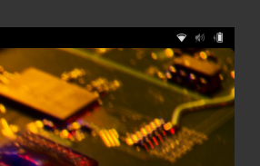
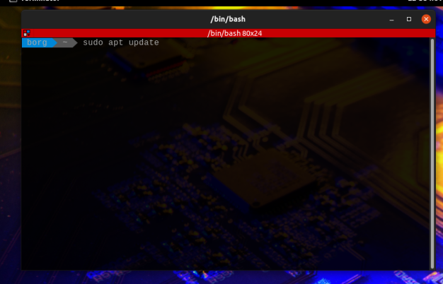

# Meu SSD subiu, e agora?

Você seguiu o tutorial anterior, conseguiu “bootar” o SSD no seu computador, excelente! Mas… e agora?? ;-) Vamos aos primeiros passos, de forma bem detalhada (pensando em você que nunca usou linux antes), do que fazer para iniciar os estudos. 

Nosso setup inicial, consiste nos seguintes passos:

## Fazendo Login

Se tudo deu certo até agora, você encontrará esta imagem:

Clique no pinguin - Usuário **borg** - e coloque a senha inicial: **fl1pfl0p**

Você encontrará este ambiente de trabalho

## Trocando a Senha

A primeira configuração que recomendamos é trocar esta senha inicial. Para isso, você pode abrir o terminal (veja dois ícones de terminais na barra de atalhos). Você pode clicar no programa com o mouse ou usar as teclas de atalho SUPER+T **(Super é a tecla do windows).**

Com o terminal aberto (não importa qual dos dois você escolheu), você digitará o comando: `passwd` em seguida forneca a **senha atual** (fl1pfl0p) e depois a **nova senha**, lembrando que precisa ter no mínimo 8 dígitos, usar letras maíusculas e minúsculas, números e símbolos. Ele pedirá para **confirmar a nova senha** e pronto! Sempre que precisar trocar a senha, refaça este procedimento.

obs: É normal não aparecer nada no terminal quando você digita a senha, é uma medida de segurança do terminal esconder o display de caracteres.

## Configurando a Rede

Esta etapa não é difícil mas requer atenção em alguns detalhes. Você precisará usar uma rede diferente para esta disciplina, chamada **Robotica**. É nesta rede que nossos robôs se conectam para serem controlados. A credencial desta rede é a mesma que você usa na rede **insper_alunos** e as configurações de conexão são iguais também. Então após este tutorial você estará apto a logar em qualquer rede do INSPER com sua máquina.

O primeiro passo é clicar nos ícones no canto superior direito, depois clicar no item da Wi-fi seguido de “Select Network”, como visto na imagem abaixo.

Na tela que se abrirá, escolha a rede que deseja conectar e clique em “Connect”.

Então você verá a tela de configurações de rede. São três informações que você deve passar:

- Clicar (”check”) na caixa: No CA certificate is required
- Username: seu usuário de rede (e-mail sem @al.insper.edu.br)
- Password: senha do seu e-mail.

Depois clique em “Connect”.

Após a conexão, você verá o ícone do Wi-Fi no canto superior direito da tela:

## Atualizando o Sistema

Algo que você precisa se habituar a usar é o terminal. Sim, no linux digitamos bastante e há algo importante neste caso, a tecla TAB é sua melhor amiga quando abrir o terminal! Ela sabe quase tudo!! (Só não supera o google hehehe).

Vamos abrir o terminal usando as teclas de atalho SUPER+T (lembrando que a tecla super é como a tecla “windows” é chamada no linux).

Em nosso SSD você verá a tela do Terminator após usar este atalho. Na imagem abaixo você verá o terminator aberto e o primeiro comando que iremos utilizar. 

O primeiro comando que iremos utilizar,  `sudo apt update`,  é dividido em três partes. A primeira palavra **sudo** diz ao sistema que você usará permissão de **root** (administrador do sistema) para executar o comando a seguir, o comando **apt** chama o gerenciador de pacotes do ubuntu, que espera uma sequência de comandos, e por fim a palavra **update** que diz ao apt que precisamos atualizar as bases dos repositórios para saber se temos alguma atualização. Como estamos usando permissão de root, pedirá a senha de usuário a seguir. 

Com a mesma premissa, vamos atualizar os pacotes que ele encontrou com novas versões. para isto utilize o comando `sudo apt upgrade`.  Este comando perguntará, a cada pacote, se você quer ou não instalar, basta teclar ENTER se quiser instalar. Se você não quer confirmar pacote a pacote, pode acrescentar o “-y” no comando, já enviando antecipadamente o “yes”, então comando ficaria assim: **sudo apt upgrade -y**.

Podemos concatenar os dois comandos utilizando `&&` no terminal. Desta forma podemos executar o update e o upgrade na mesma linha, como segue: `sudo apt update && sudo apt upgrade -y`.

## Finalizando

Se você conseguiu seguir todos os passos até agora, o seu SSD já está pronto para ser utilizado. Como você utilizará linux em outras etapas do curso, a dica é usar o SSD para tudo neste semestre. Se você ficou com alguma dúvida ou algum passo não deu certo, nos procure no Laboratório de Informática - 404 Prédio 1 ou na sala definida para a aula de Robótica que auxiliaremos com este primeiro passo.

Equipe 404