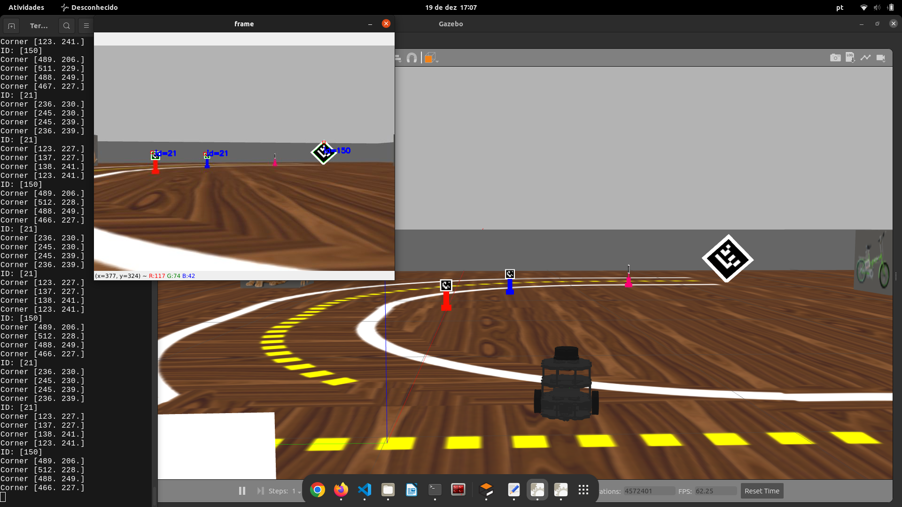
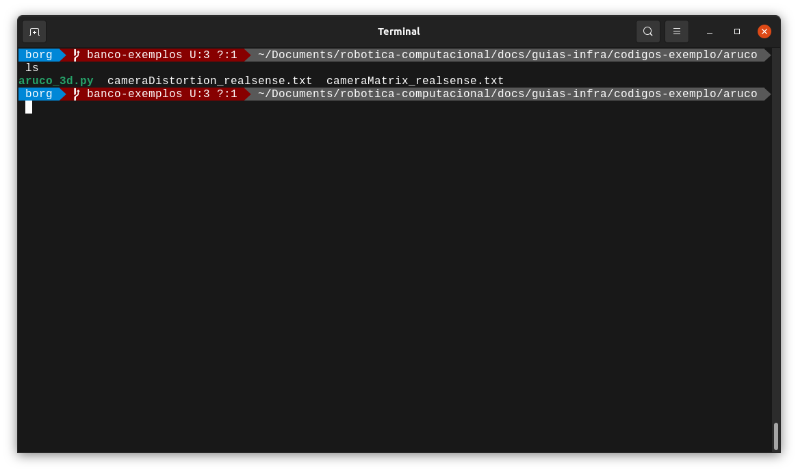

# Lendo o ARUCO

Estimar a posição relativa a um objeto é de grande importância em muitas aplicações de visão computacional, como navegação de robôs, realidade aumentada e muito mais. Este processo se baseia em encontrar correspondências entre pontos no ambiente e sua projeção de imagem 2D. Esta é geralmente uma etapa difícil e, portanto, é comum o uso de marcadores para facilitar.
Uma das abordagens mais populares é o uso de marcadores binários. O principal benefício desses marcadores é que um único marcador fornece correspondências suficientes (seus quatro cantos) para obter a posição da câmera em relação ao marcador. Além disso, a codificação binária interna os torna especialmente robustos, permitindo a possibilidade de aplicar técnicas de detecção e correção de erros.

O módulo aruco é baseado na biblioteca ArUco, uma biblioteca popular para detecção de marcadores de referência desenvolvida por Rafael Muñoz e Sergio Garrido, se quiser saber mais, recomendo a [documentação](https://mecaruco2.readthedocs.io/en/latest/notebooks_rst/Aruco/aruco_basics.html) que foi usada como base para desenvolver esse guia.

Certifique-se de que o seu arquivo [robotica.sh](http://robotica.sh) está configurado corretamente para se conectar ao robô simulado (Se não sabe do que eu estou falando, volte ao guia robo-simulado).

Inicialize o Gazebo com a pista_s2.launch

```bash
roslaunch my_simulation pista_s2.launch
```

Certifique-se de que o terminal está aberto na mesma página que está o código, usando o comando “ls” é possível listar o conteúdo do diretório, é preciso que os arquivos estejam na pasta.

***aruco_3d.py cameraDistortion_realsense.txt cameraMatrix_realsense.tx***

 

```python
ls
```

 



Execute o arquivo aruco_3d.py

```bash
python3 aruco_3d.py
```



No seu terminal será exibida a lista com todos os arucos que o robô detectou, e no display da imagem, os valores de distância do primeiro aruco da lista.

Estude o código exemplo, modifique o programa para que:

- As distâncias de todos os arucos encontrados são salvas em uma lista ou em um dicionário, você escolhe.
- O robô se aproxima e se mantém a aproximadamente 1m do primeiro aruco da lista.