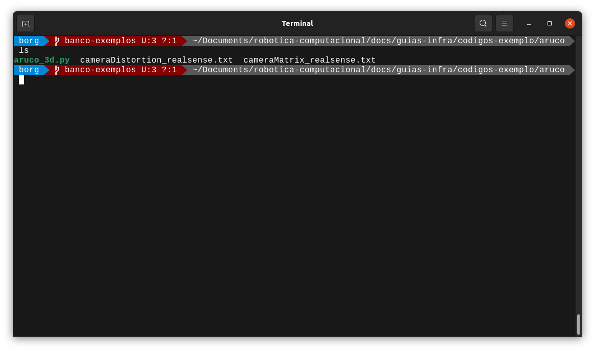
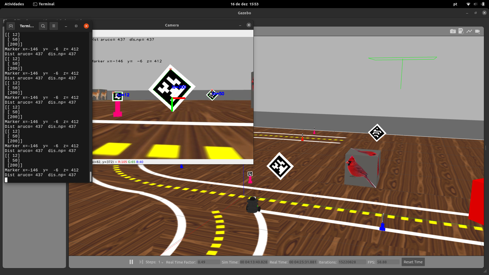

# Uma breve introdução a biblioteca ArUco

Estimar a posição relativa a um objeto é de grande importância em muitas aplicações de visão computacional, como navegação de robôs, realidade aumentada e muito mais. Este processo se baseia em encontrar correspondências entre pontos no ambiente e sua projeção de imagem 3D. Esta é geralmente uma etapa difícil e, portanto, é comum o uso de marcadores para facilitar.
Uma das abordagens mais populares é o uso de marcadores binários. O principal benefício desses marcadores é que um único marcador fornece correspondências suficientes (seus quatro cantos) para obter a posição da câmera em relação ao marcador. Além disso, a codificação binária interna os torna especialmente robustos, permitindo a possibilidade de aplicar técnicas de detecção e correção de erros.

A biblioteca ArUco é um modulo para detecção de marcadores de referência desenvolvida por Rafael Muñoz e Sergio Garrido, se quiser saber mais, recomendo a [documentação](https://mecaruco2.readthedocs.io/en/latest/notebooks_rst/Aruco/aruco_basics.html) que foi usada como base para desenvolver esse guia.


## Antes de começar

Se estiver usando o simulador, certifique-se de que o seu arquivo ***robotica.sh*** está configurado corretamente para se conectar ao robô simulado (Se não sabe do que eu estou falando, [volte ao guia robo-simulado](https://insper.github.io/robotica-computacional/guias-infra/robo-simulado/)).

Se estiver usando o robô físico, configure corretamente o arquivo ***robotica.sh*** (veja o [guia robo-fisico](https://insper.github.io/robotica-computacional/guias-infra/turtlebot3/) se tiver dúvidas sobre como se conectar ao robô fisico)


## Aruco 3D

Utilizando a técnica de marcadores aruco 3D podemos obter os corners que são as coordenadas dos “cantos” do aruco e os IDs dos arucos, também conseguimos calcular o vetor de transalação e o vetor de rotação do aruco em relação ao robô, com essas informações é possível extrair a distância euclidiana e a distância focal do aruco em relação ao robô, essas implementações estão disponíveis para você no código exemplo [aruco_3d.py](aruco_3d.py), para executar:

Certifique-se de que o terminal está aberto na mesma página que está o código, usando o comando “ls” é possível listar o conteúdo do diretório, é preciso que os arquivos abaixo estejam na pasta.

***aruco_3d.py cameraDistortion_realsense.txt cameraMatrix_realsense.tx***

```python
ls
```




Execute o arquivo aruco_3d.py


```bash
python3 aruco_3d.py
```

Neste código, temos a estrutura padrão que será utilizada na matéria. No entanto, vamos explicar agora, linha por linha, como funciona a função geraAruco que está no arquivo aruco_3d.py. Em primeiro lugar, peço que olhe para a função **image_callback** e perceba que nela tratamos a imagem que chega através do **Subscriber**, responsável por cuidar do tópico que recebe as informações da câmera do robô.

Para executar a função *geraAruco* iremos chamá-la no *image_calback*, pois é a função responsável por atualizar a imagem a para todo frame recebido.

```bash
def image_callback(self, msg: CompressedImage) -> None:

    #converte a msg do ROS para OpenCV 
    cv_image = self.bridge.compressed_imgmsg_to_cv2(msg, "bgr8")
    #chama a função de leitura dos Arucos
    self.ids, self.centros_aruco, self.distancias =self.geraAruco(cv_image)
```

Agora, vamos entender a função **geraAruco**. Cada ponto a seguir apresenta uma linha de código:


- **Centros:*** Criamos uma lista vazia chamada *centros* para armazenar os pontos centrais das coordenadas de posição dos Arucos detectados.

- **distancia_aruco**: Criamos outra lista vazia chamada *distancia_aruco* para armazenar as distâncias calculadas a partir dos vetores de translação dos marcadores Aruco.

- ***grayColor***: É aqui que realizamos a conversão da imagem colorida de entrada (img) para uma imagem em tons de cinza utilizando a função cv2.cvtColor() da biblioteca OpenCV. 


Agora observe que criamos um dicionário que irá conter os marcadores Aruco pré-definidos, utilizando a função **aruco.getPredefinedDictionary()** da biblioteca OpenCV.

- **Dicionário ArUco:** A função ***cv2.aruco.getPredefinedDictionary()*** é usada para criar um dicionário contendo os marcadores Aruco pré-definidos, que são um conjuntos de marcadores com ID's únicos e padrões específicos. Esses dicionários são usados para detecção e estimativa de posição dos marcadores em imagens de entrada. O dicionário é criado com base em uma constante passada como parâmetro, que especifica o tipo de dicionário Aruco desejado.

Por exemplo, no código abaixo, a linha ***dicionarioAruco = aruco.getPredefinedDictionary(aruco.DICT_6X6_250)*** cria um dicionário Aruco pré-definido com *250 marcadores de 6x6 bits*. 

```bash
def geraAruco(self,cv_image):   
    centros = []
    distancia_aruco=[]
    # Gera mask Cinza
    grayColor = cv2.cvtColor(cv_image, cv2.COLOR_BGR2GRAY)
    #Gera Dicionario com Arucos
    dicionarioAruco = aruco.getPredefinedDictionary(aruco.DICT_6X6_250)
```

- **cv2.aruco.detectMarkers(grayColor, dicionarioAruco)**: Essa função realiza a detecção dos marcadores Aruco em uma imagem em tons de cinza. O primeiro parâmetro, grayColor, é a imagem em tons de cinza onde a detecção será realizada. O segundo parâmetro, dicionarioAruco,é o dicionário Aruco pré-definido que será utilizado para a detecção. Essa função retorna três valores: 


- **cornersList:** É uma lista contendo os pontos dos cantos dos marcadores detectados; 

- **ids:** É uma lista contendo os IDs dos marcadores detectados;

```bash
cornersList, ids, _ = aruco.detectMarkers(grayColor, dicionarioAruco)


```


Na próxima etapa, é feita uma verificação pra identificar se foram encontrados marcadores Aruco na imagem, neste *if* verificamos se a lista ids não está vazia.


```bash
if ids is not None:
```

Fazer esse tratamento previne que o seu código trave caso não exista ArUcos disponíveis no Frame analizado pela função.

Fazemos um ***for*** nos ids detectados na lista ids, onde *i* é o índice do marcador atual. O condicional dentro do for é utilizado par verifica se o ID do marcador atual é maior do que 99. Se for, é considerado um marcador grande e são utilizados parâmetros diferentes para estimar sua posição.

- **cv2.aruco.estimatePoseSingleMarkers():** é usada para estimar a pose (orientação e posição) de um marcador Aruco individual a partir dos pontos dos cantos (corners) detectados desse Aruco na imagem. Vamos analisar os parâmetros dessa função:

```bash
  for i in range(len(ids)):
    if ids[i]>99:
        ret = aruco.estimatePoseSingleMarkers(cornersList[i], 19, self.camera_matrix, self.camera_distortion)
        rvec, tvec = ret[0][0,0,:], ret[1][0,0,:]
        distancia_aruco.append(np.linalg.norm(tvec))
```

- **cornersList[i]:** É a lista de pontos dos cantos (corners) do marcador Aruco. ***[[x1,y1],[x2,y2]]***

- **19:** É o tamanho do lado do Aruco, ou seja, o comprimento do lado do quadrado preto que o compõe.Esse valor é fornecido manualmente, e é importante que seja o mesmo valor utilizado durante a calibração da câmera para obter uma estimativa de pose precisa.

- **Camera_matrix:** É a matriz de câmera que contém os parâmetros intrínsecos da câmera, como a distância focal e o centro óptico. Essa matriz é usada para corrigir as distorções da imagem e projetar os pontos 3D no espaço da câmera.

- **Camera_distortion:** É o vetor de distorção da câmera que contém os coeficientes de distorção radial e tangencial da câmera. Esse vetor é usado em conjunto com a matriz de câmera para corrigir as distorções da imagem.

- **ret:** É resultado da função cv2.aruco.estimatePoseSingleMarkers(), que é uma tupla contendo as informações de posição estimadas do Aruco. Essas informações incluem a matriz de rotação (rvec) e o vetor de translação (tvec) que representam a orientação e a posição do marcador no espaço 3D da câmera, respectivamente. Esses valores podem ser utilizados posteriormente para realizar a renderização de objetos virtuais ou para outros fins de aplicação. Mas a criterios de código, retorna uma tupla ret que contém duas informações: ***ret[0] é uma matriz de rotação 3x1 (rvec)*** e ***ret[1] é um vetor de translação 3x1 (tvec)***. 

**Vetor de Transalção e Vetor de rotação:** A linha ***rvec, tvec = ret[0][0,0,:], ret[1][0,0,:]*** está pegando os valores de rotação (rvec) e translação (tvec):

- Em **ret[0][0,0,:]** está acessando o valor da matriz de rotação (rvec) na posição [0,0,:]

- Em **ret[1][0,0,:]** está acessando o valor do vetor de translação (tvec) na posição [0,0,:]. 

!Tip A notação **":"** é usada para indicar que queremos considerar todos os valores da última dimensão da matriz ou vetor, que no caso é a dimensão 3

- **distancia_aruco.append(np.linalg.norm(tvec))** está calculando a norma Euclidiana do vetor de translação tvec usando a função np.linalg.norm() e adicionando o resultado à lista distancia_aruco.  

- **np.linalg.norm():** É uma função da biblioteca NumPy que calcula a norma Euclidiana de um vetor em um espaço n-dimensional. A norma Euclidiana é a medida do módulo de um vetor, calculada como a raiz quadrada da soma dos quadrados dos componentes do vetor. 

```bash
v = ai+bj , norma = sqrt(a²+b²)
```

## Resumindo:

- tvec é um vetor de translação estimado para um Aruco na posição 3D da câmera. A norma Euclidiana desse vetor representa a módulo ou distância desse vetor em relação à origem do sistema de coordenadas 3D da câmera. Portanto, np.linalg.norm(tvec) está calculando a distância do aruco em relação à câmera no espaço 3D. 


A mesma ideia do que foi explicada no if se aplica aqui no else, porém para ids menores que 99

```bash
else: 
    ret = aruco.estimatePoseSingleMarkers(cornersList[i], 6, self.camera_matrix, self.camera_distortion)
    rvec, tvec = ret[0][0,0,:], ret[1][0,0,:]
    distancia_aruco.append(np.linalg.norm(tvec))
```

Na linha seguinte, iremos percorrer a lista de **cantos do aruco** para calcular o seu respectivo **centro** e guarda na lista de centro, após fazer a média entre esses 2 pontos **[[x1,y1],[x2,y2]]**.

```bash
for corners in cornersList:
    for corner in corners:
        centros.append(np.mean(corner, axis=0))
```

As demais linhas do código são responsáveis por desenhar na tela a identificação e posição do aruco, esses comandos são apenas para visualização.

```bash
#-- Desenha um retanculo e exibe Id do marker encontrado
aruco.drawDetectedMarkers(cv_image, cornersList, ids) 
cv2.drawFrameAxes(cv_image, self.camera_matrix, self.camera_distortion, rvec, tvec ,0.03)
#-- Exibe tvec --> vetor de tanslação em x y z
str_position = "Marker x=%4.0f  y=%4.0f  z=%4.0f"%(tvec[0], tvec[1], tvec[2])
#-- Desenha na imagem o vetor de tanslação em x y z
cv2.putText(cv_image, str_position, (0, 100), cv2.FONT_HERSHEY_PLAIN, 1, (0, 0, 0), 1, cv2.LINE_AA)
# Desenha a linha referencia em X
cv2.line(cv_image, (cv_image.shape[1]//2,cv_image.shape[0]//2), ((cv_image.shape[1]//2 + 50),(cv_image.shape[0]//2)), (0,0,255), 5) 
# Desenha a linha referencia em Y
cv2.line(cv_image, (cv_image.shape[1]//2,cv_image.shape[0]//2), (cv_image.shape[1]//2,(cv_image.shape[0]//2 + 50)), (0,255,0), 5) 

# Exibe tela
cv2.imshow("Camera", cv_image)
cv2.waitKey(1)
```


# Hora de codar!




1. Inicialize o Gazebo com a pista_s2.launch **se estiver usando o robô simulado**

```bash
roslaunch my_simulation pista_s2.launch
```


## Desafio 1:

- Estude o código [aruco_3d.py](aruco_3d.py), faça as modificações necessárias para que o robô gire em torno de si mesmo e seja capaz de contar quantos arucos de Id's diferentes estão no campo de visão de robô no cenário **pista_s2.launch**.

No seu terminal será exibida a lista com todos os arucos que o robô detectou, e no display da imagem, os valores de distância do primeiro aruco da lista.


## Desafio 2

Estude o código exemplo, modifique o programa para que:
- O robô encontra um ArUco
- O robô se aproxima do AruCo, e se mantém a aproximadamente 1m do primeiro aruco encontrado.


Divirta-se!
