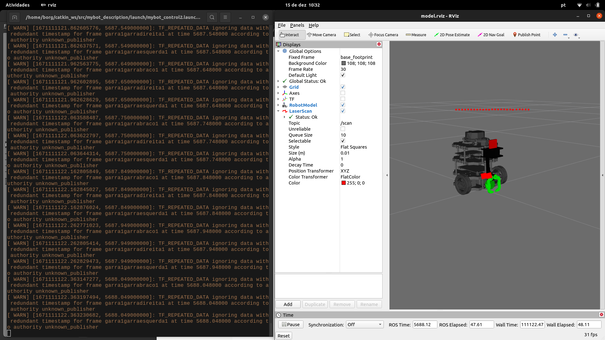
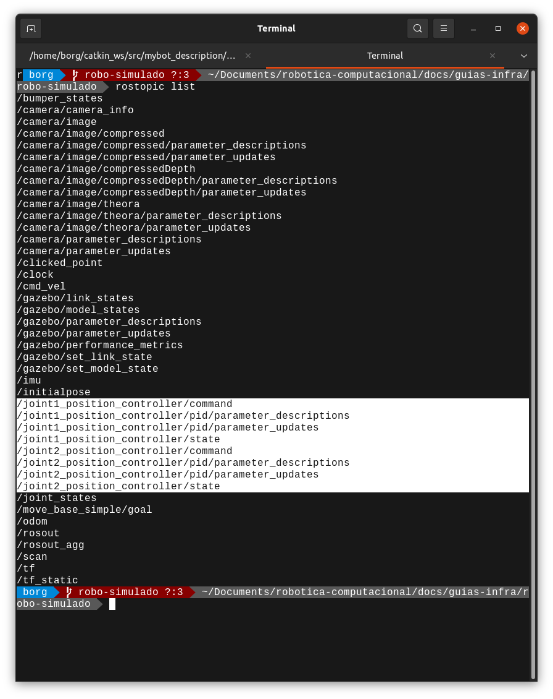
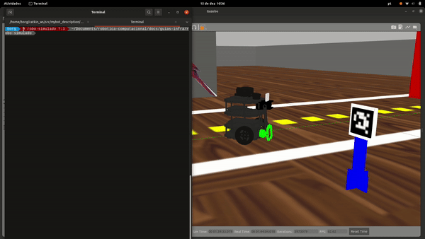
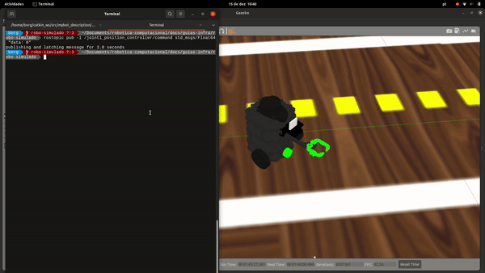
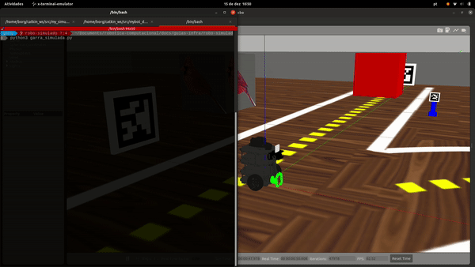

# Controle da Garra

O nosso belo robozinho tem uma garra que funciona de forma semelhante ao robô real, com a garra do robô simulado é possível capturar objetos e carregá-los pelo cenário.

Para começar a controlar a garra, é importante que você esteja com o Gazebo aberto

```bash
roslaunch my_simulation pista_s2.launch
```

Para habilitar o controle da garra no robô simulado é preciso rodar esse comando em um terminal novo

```bash
roslaunch mybot_description mybot_control2.launch
```

Algo assim vai aparecer algo assim na sua tela:



Minimize as duas janelas, se quiser, pode verificar com o rostopic list que novos tópicos estão disponíveis agora:

```bash
rostopic list
```



A garra do robo é composta de duas partes braço e pinça. Cada parte possui uma articulação chamada de joint, são nestas articulações que atuamos para movimentação.

Joint1 = braço da garra. 

```
Garra recolhida: -1.5
Garra para frente: 0
Garra levantada: 1.5
```

```bash
rostopic pub -1 /joint1_position_controller/command std_msgs/Float64 "data: 0"

rostopic pub -1 /joint1_position_controller/command std_msgs/Float64 "data: -1.5"

rostopic pub -1 /joint1_position_controller/command std_msgs/Float64 "data: 1.5"
```



Joint2 = Pinça da garra com mimica (joint2 e joint3 juntos)

```
Pinça fechada: 0
Pinça aberta: -1
```

```bash
rostopic pub -1 /joint2_position_controller/command std_msgs/Float64 "data: -1"

rostopic pub -1 /joint2_position_controller/command std_msgs/Float64 "data: 0"
```



Para controlar a garra via código, crie um arquivo python novo com o nome garra_simulada.py, cole o código abaixo e salve:

```python
#! /usr/bin/env python3
# -*- coding:utf-8 -*-

import rospy
from geometry_msgs.msg import Twist, Vector3
from std_msgs.msg import Float64

if __name__ == "__main__":
    #inicializando o node com o ROS
    rospy.init_node("garra")
    #Criando o publisher para controle do braço
    braco = rospy.Publisher("/joint1_position_controller/command", Float64, queue_size=1)
    
    #criando o publisher para controle da pinça
    pinca = rospy.Publisher("/joint2_position_controller/command", Float64, queue_size=1)

    #loop para movimentar a garra do robo
    try:
        while not rospy.is_shutdown():
            braco.publish(-1.0) ## para baixo
            pinca.publish(0.0)  ## Fechado
            rospy.sleep(1.0)
            braco.publish(1.5) ## para cima
            pinca.publish(-1.0) ## Aberto
            rospy.sleep(1.0)
            braco.publish(0.0) ## para frente

    except rospy.ROSInterruptException:
        print("Ocorreu uma exceção com o rospy")
```

Para executar o código via terminal, certifique-se de que está com o terminal aberto na mesma pasta que o código está salvo, então utilize o comando:

```bash
python3 garra_simulada.py
```



Se quiser parar o programar, clique no terminal e aperte as teclas  <kbd>Ctrl</kbd> + <kbd>C</kbd>

Agora é a sua vez, crie uma função que recebe um número e executa uma ação correspondente com a garra;

1 - Subir a garra

2- Descer a garra

3 - Centralizar a garra

4 - Abrir a garra

5 - Fechar a garra