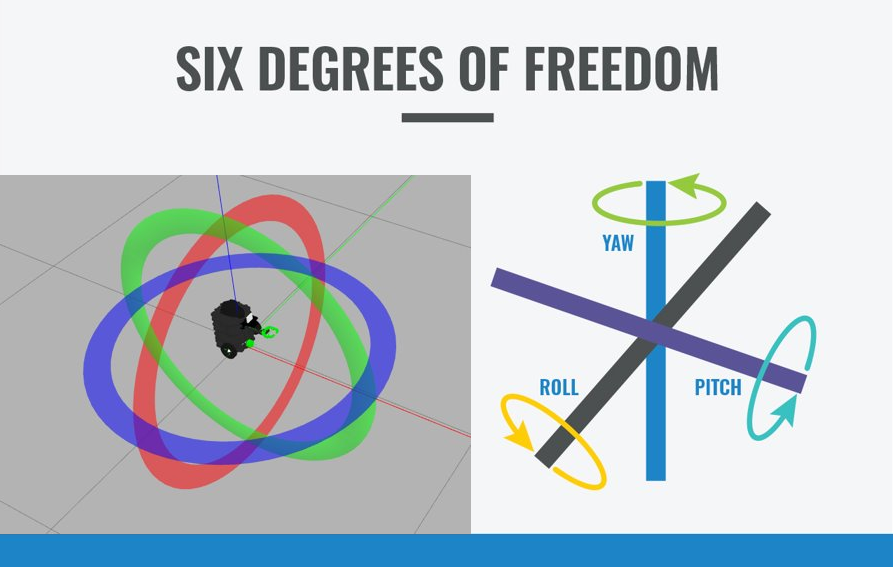
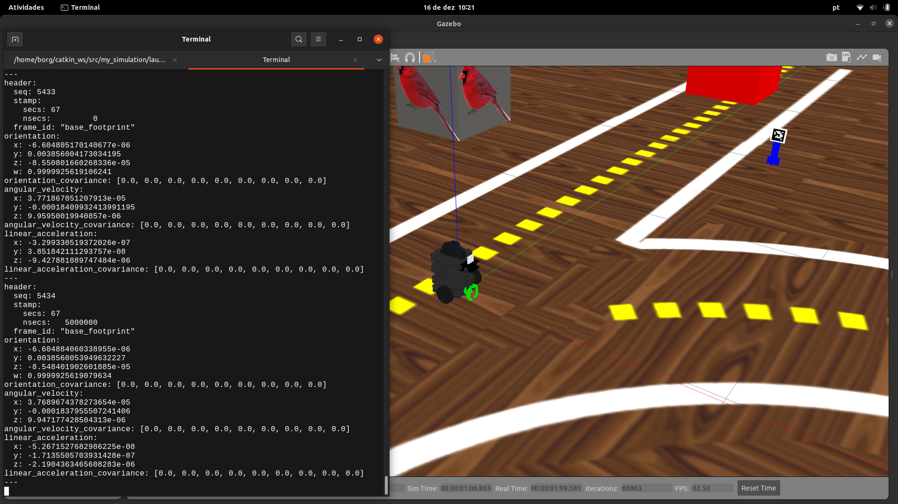
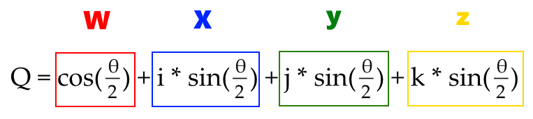
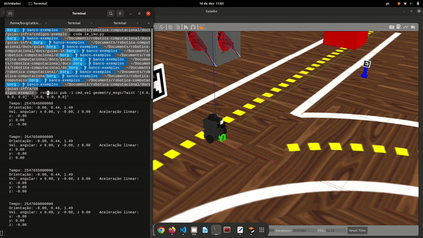

# Alinhamento angular do robô usando a IMU

A IMU - Unidade de medição inercial é um conjunto de sensores que combinam vários acelerômetros e giroscópios para uma medição tridimensional da aceleração e da velocidade angular, esse sensor é muito importante para fazer o alinhamento angular do robô.



Vamos abrir o Gazebo para capturar os da IMU. Com o arquivo robótica devidamente configurado para conectar com o robô simulado, abra um terminal novo e digite o código abaixo para abrir uma simulação do gazebo.

```bash
roslaunch my_simulation pista_s2.launch
```

Em seguida, abra um novo terminal e execute o comando abaixo para visualizar os dados da IMU no terminal

```bash
rostopic echo imu
```



A IMU está exibindo os dados de orientação nos angular no formato quartenário ( x, y, z e w), a velocidade angular e a aceleração linear nos eixos x,y e z. Um quatérnion é um tipo de dado que define a orientação de um objeto. Uma orientação pode ser imaginada como um valor de ângulo (θ) em torno de um certo vetor denominado eixo de Euler (ê).

Se quiser entender melhor o que são os quatérnions e como eles nos ajudam com a localização e movimentação espacial no mundo tridimensional, pode começar [por aqui](https://www.allaboutcircuits.com/technical-articles/dont-get-lost-in-deep-space-understanding-quaternions/)




Com os dados da IMU disponível para gente via ROS, podemos utilizar o código abaixo para visualizar os dados do sensor:

```python
#! /usr/bin/env python3
# -*- coding:utf-8 -*-

import rospy
import numpy as np
from geometry_msgs.msg import Twist, Vector3
from sensor_msgs.msg import Imu
from tf import transformations
import math

# funçao que le os dados da IMU 
def leu_imu(dado):
	quat = dado.orientation
    #cria a lista de quaternions com os eixos separados
	lista = [quat.x, quat.y, quat.z, quat.w]
    #faz a transformaçao de quaternion para angulos de euler
	angulos = np.degrees(transformations.euler_from_quaternion(lista))
    #cria o template da mensagem
	mensagem = """
    Tempo: {:}
    Orientação: {:.2f}, {:.2f}, {:.2f}
    Vel. angular: x {:.2f}, y {:.2f}, z {:.2f}\
    Aceleração linear:
    x: {:.2f}
    y: {:.2f}
    z: {:.2f}
    """.format(dado.header.stamp, angulos[0], angulos[1], angulos[2], dado.angular_velocity.x, dado.angular_velocity.y, dado.angular_velocity.z, dado.linear_acceleration.x, dado.linear_acceleration.y, dado.linear_acceleration.z)
    #exibe na mensagem os dados de angulo, velocidade angular e aceleracao linear ja convertidos para Roll, Pitch, e Yaw 
	print(mensagem)

if __name__=="__main__":

    #inicializa o node de conexao com o ROS
	rospy.init_node("le_imu")

    #Captura o dado do sensor via topico do tipo subscriber 
	recebe_scan = rospy.Subscriber("/imu", Imu, leu_imu)

    #Loop do ROS
	while not rospy.is_shutdown():
        #sleep pra nao floodar o terminal
		rospy.sleep(1)
```



Agora é a sua vez, Faça um código que faz o robô girar exatamente 90 graus em torno de si mesmo, usando a IMU!
