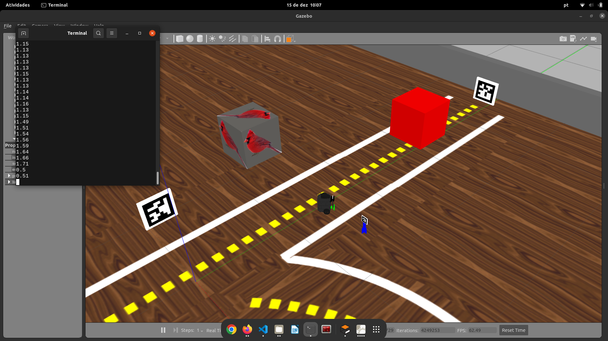

# Detectando objetos com o Laser Scan

O Robô tem um sensor chamdo LIDAR, ele é um sensor óptico de distância 360°, quer funciona como um scanner a laser 2D, coletando dados em relação a distância que os objetos estão do robô. Ele tem um range de atuação de 360° e uma resolução de 1°, com esse sensor é possível identificar objetos localizados entre 0.11 ate 3.5 metros do robô.


O tópico responsável por capturar os dados do LIDAR é o “scan”, se você estiver com um cenário do Gazebo ativo

```bash
roslaunch my_simulation pista_s2.launch
```

Abrir um terminal e executar o comando

```bash
rostopic echo scan
```

Algo assim vai aparecer no seu terminal


Esses são os dados coletados pelo Insperbot simulado. Se você quiser visualizar os pontos de distância que os objetos estão do robô para entender melhor os dados, basta abrir o RVIZ, executando este comando em um novo terminal:

```bash
roslaunch mybot_description mybot_control2.launch
```

Certifique-se de que o tópico está selecionado corretamente, conforme a figura.


Para capturar os dados do sensor LIDAR via python, podemos fazer desta forma, crie um arquivo python com o nome le_lidar.py, cole o código a seguir:

```python
#! /usr/bin/env python3
# -*- coding:utf-8 -*-

import rospy
import numpy as np
from geometry_msgs.msg import Twist, Vector3
from sensor_msgs.msg import LaserScan

# Funçao que le os dados do LIDAR
def scaneou(dado):
	#Define uma faixa valida de dados do sensor para trabalhar de 0.11 ate 3.5
	print("Faixa valida: ", dado.range_min , " - ", dado.range_max )

	#Cria uma lista com os dados capturados do sensor
	lista_dados = np.array(dado.ranges).round(decimals=2)
	
	#Percorre a lista de dados
	for leitura in lista_dados:
		#Se a leitura for um dado valido, exibe ele
		if leitura >= dado.range_min and leitura <= dado.range_max:
			print(leitura)

if __name__=="__main__":
	# inicializa o node com o ROS
	rospy.init_node("le_lidar")
	#Captura os dados do LIDAR usando o topico do tipo subscriber "scan"
	recebe_scan = rospy.Subscriber("/scan", LaserScan, scaneou)

	# loop do ROS
	while not rospy.is_shutdown():
		# aguarda um tempinho, so pra nao floodar
		rospy.sleep(1)
```

Para executar o código via terminal, certifique-se de que está com o terminal aberto na mesma pasta que o código está salvo, então utilize o comando:

```bash
python3 le_lidar.py
```



No seu terminal temos a resposta informando a distância que os objetos estão do robô.

Agora é a sua vez, estude o código exemplo e exiba apenas os objetos que estão no intervalo de 0° a 180° do robô.