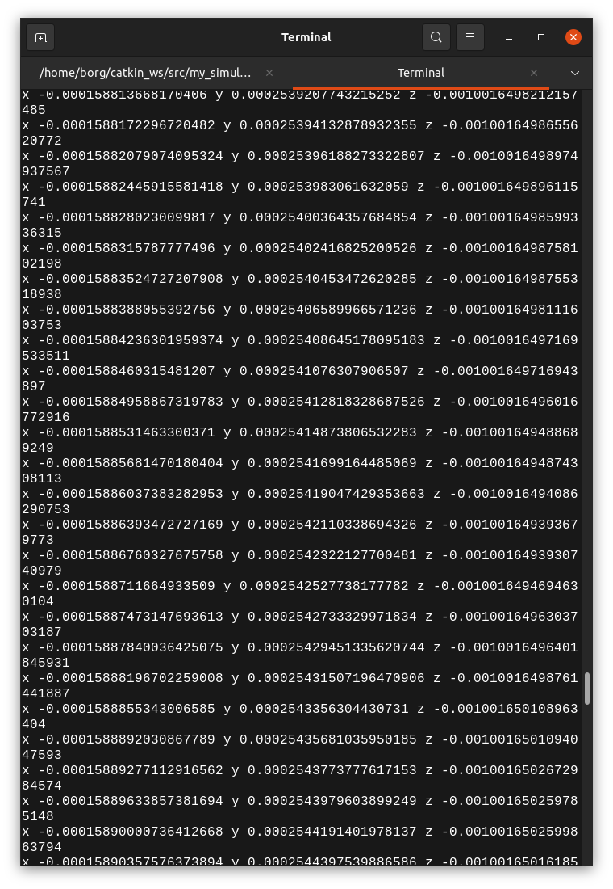

# Odometria para navegar pelo mundo

A odometria é uma técnica de localização de robôs moveis muito utilizada, seu principal objetivo é medir a distância percorrida pelo robô, usando um sensor chamado odômetro.

O tópico responsável por capturar os dados do Odometria é o “odom”, se você estiver com um cenário do Gazebo ativo

```bash
roslaunch my_simulation pista_s2.launch
```

Abrir um terminal e executar o comando

```bash
rostopic echo odom
```

Algo assim vai aparecer no seu terminal


Esses são os dados coletados pela odometria do Insperbot simulado. Agora, vamos capturar e exibir os dados da odometria via código em python, certifique-se de que o seu terminal está aberto na mesma pasta que o código [odom.py](http://odom.py), digite o comando abaixo para executar o código.

```bash
python3 odom.py
```

O seu terminal deverá apresentar algo como:



Execute o teleop e navegue com o robô pelo cenário, observe o comportamento dos dados da odometria no terminal.

```python
roslaunch turtlebot3_teleop turtlebot3_teleop_key.launch
```


Analise o código de exemplo e faça um programa que :

- Salva a posição inicial do robô
- Se aproxima da caixa laranja
- Retorna a posição inicial