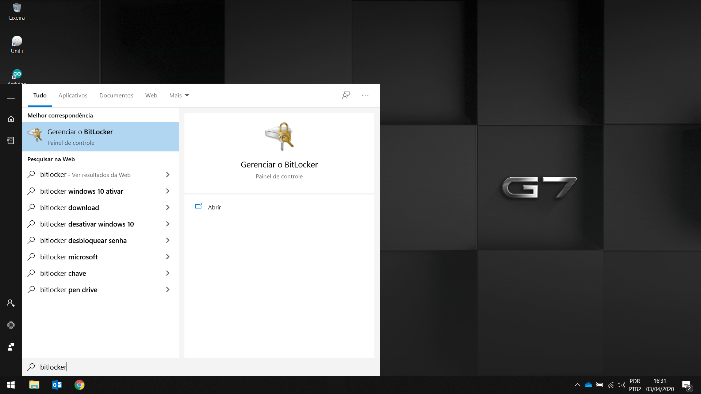
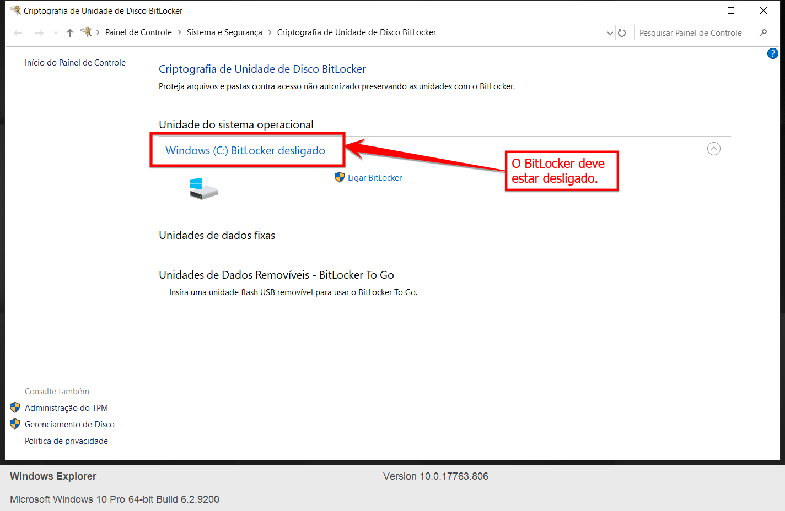
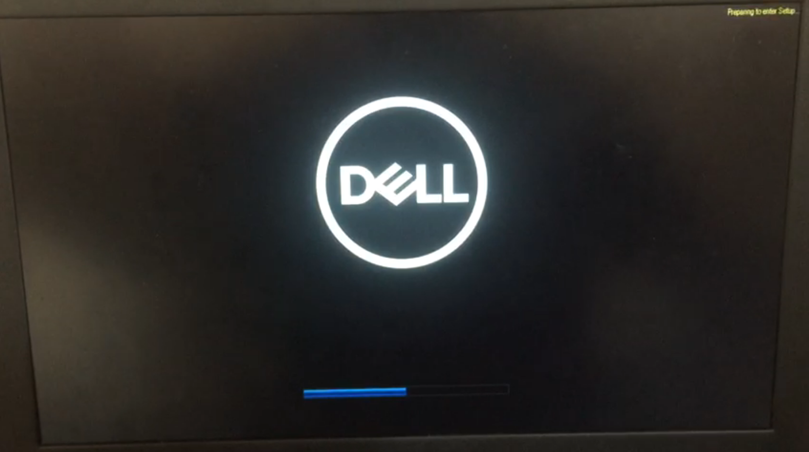
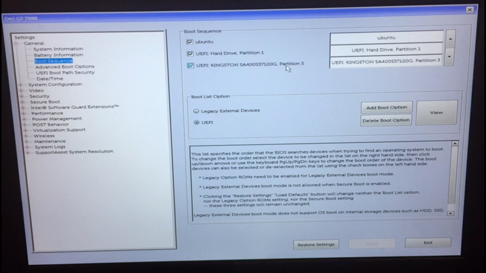
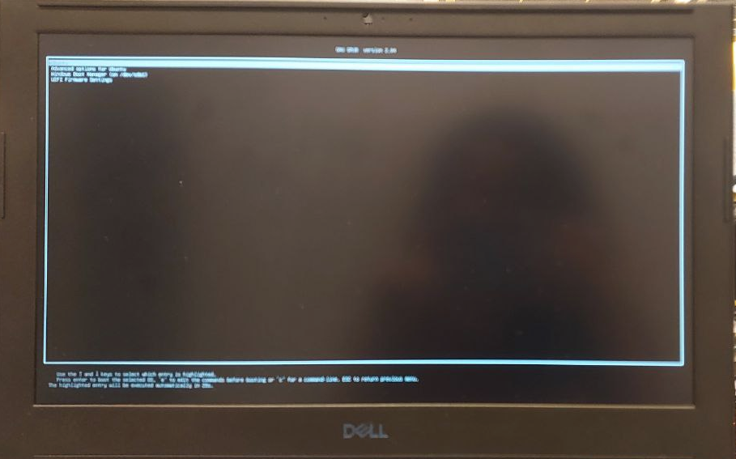
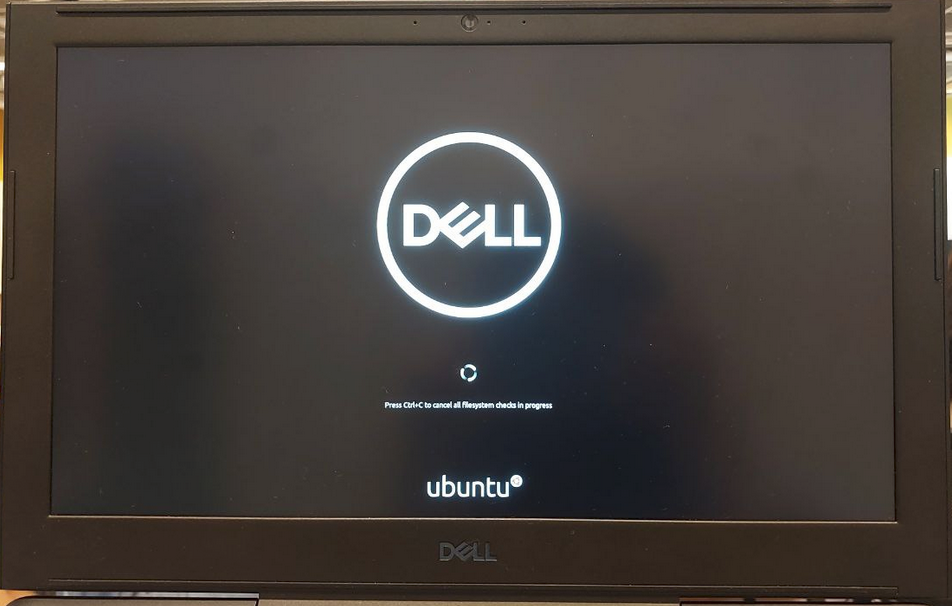

# Comece por aqui!

Você recebeu um SSD, agora precisamos preparar o seu notebook para subir o SSD corretamente.

 **⚠️ Caso você possua um MacBook Intel, clique aqui**

⚠️ **Caso você possua um MacBook M1 ou M2,  procure um dos técnicos do laboratório**

## Essa será a sequência de passos deste tutorial

 **1.** Verificando o BitLocker do Windows
 
 **2.** Como acessar a minha BIOS?
 
 **3.** Configurando corretamente a BIOS
 
 **4.** Inicializando o SSD

Utilizamos como exemplo um notebook Dell G7, de forma geral, estes procedimentos podem ser reproduzidos em notebooks de outras marcas, sendo feitas as adaptações para cada BIOS.

## Verificando o BitLocker do Windows

Com o Windowns inicializado, pesquise por **Bitlocker** no menu iniciar.

O Bitlocker deve estar desabilitado, como aparece na imagem abaixo. Se o BitLocker estiver ligado, **Desligue**.

## Como acessar a minha BIOS?

Para falar a verdade, eu também não sei, cada fabricante tem uma tecla diferente para acessar a BIOS,  recomendo que **utilize o Google** para descobrir a sua, caso você encontre dificuldades, procure um dos técnicos para buscar essa informação no Google com você 🤷🏻‍♀️

⚠️ Pesquise no Google a tecla de acesso a **BIOS** e a tecla de acesso ao **Boot Menu** do seu notebook

**Para acessar a BIOS, é necessário:**

  **1.** Desligue o seu notebook

  **2.** Concecte o SSD na sua porta USB mais rápida

  **3.** Ligue o notebook

  **4.** Assim que a logomarca do seu fabricante aparecer, pressione  a telca de acesso a BIOS, no caso do Dell G7 é a **F2**

Quando pressionar a tecla **F2** irá aparecer uma mensagem no canto superior direto, ou no canto inferior diretio, depende do seu fabricante.

Se tudo deu certo, você estará na BIOS do seu computador!

Se a sua BIOS é diferente desta que aparece na imagem acima, não fique triste, diferentes modelos de notebook tem diferentes interfaces de BIOS

## Configurando corretamente a BIOS

Procure a opção de **Security Boot** e desmarque.

Se o seu computador não tem essa opção, pode pular essa parte!

Agora procure a opção de **Boot Sequence*** 

Verifique se aparece a opção correspondente a seu SSD

Se não apareceu, procure um técnico para te ajudar.

Salves as alterações em **Aplly** e **Exit** para sair da BIOS e reiniciar o notebook.

## **Inicializando o SSD**

Para inicialiar o boot pelo SSD:

  **1.**  Desligue o notebook;
  
  **2.**  Certifique-se de que o SSD está plugado na porta USB mais rápida do seu notebook;
  
  **3.**  Assim que a logomarca do seu fabricante aparecer, pressione a tecla de **BOOT MENU** do seu notebook, no caso do **Dell G7** é a tecla **F12**

Quando pressionar a tecla de acesso ao **Boot Menu** irá aparecer uma mensagem no canto superior direto, ou canto inferior direito, dependendo do modelo do seu notebook.

Nas opções de Boot, escolha a opção correspondente ao seu SSD, normalmente é o nome da marca do SSD que aparece.

Se tudo deu certo, vai aparecer para você a tela de grub do linux. Pressione ENTER e comemore

 Agora você tem um SSD externo configurado com tudo o que você precisa pra brilhar na matéria de Robótica e de Elementos neste semestre de emoções!
 
 
 
 
 ⚠️  **A senha de acesso está disponivel no folder que acompanha o SSD, recomendamos fortemente que troque a senha, no próximo tutorial eu te mostro como fazer isso.**
 

