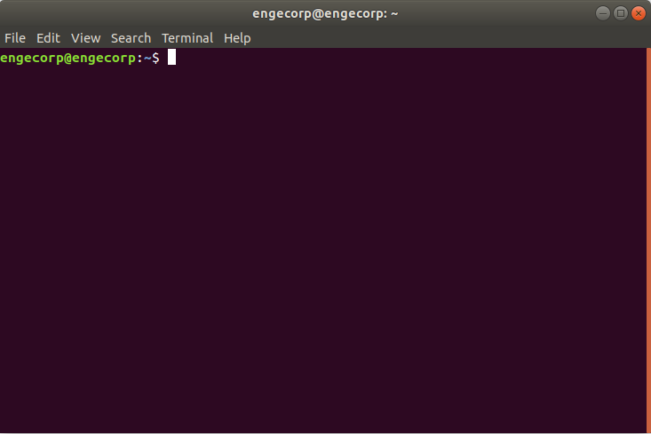
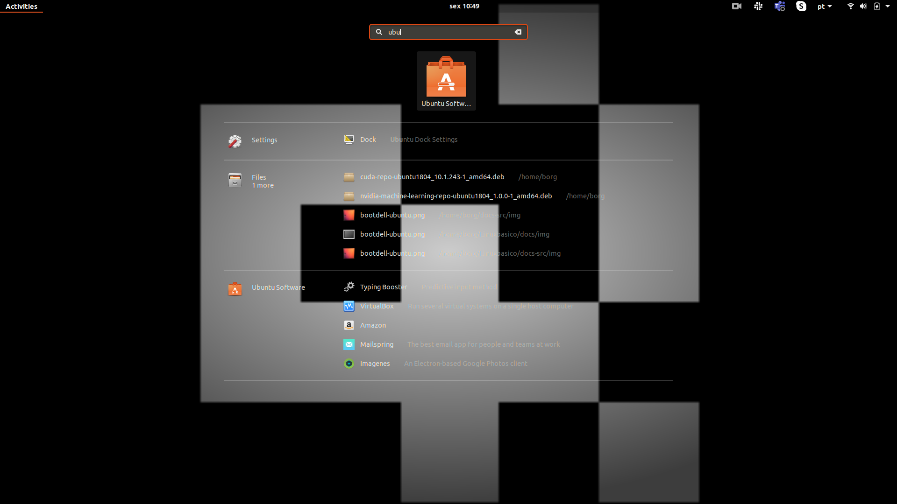
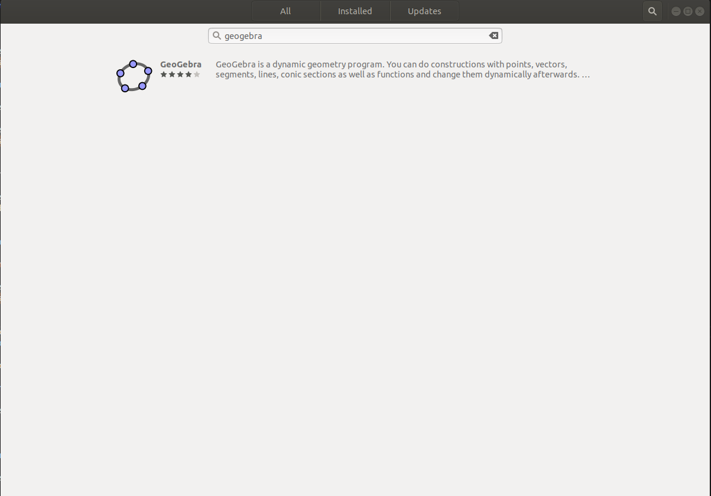
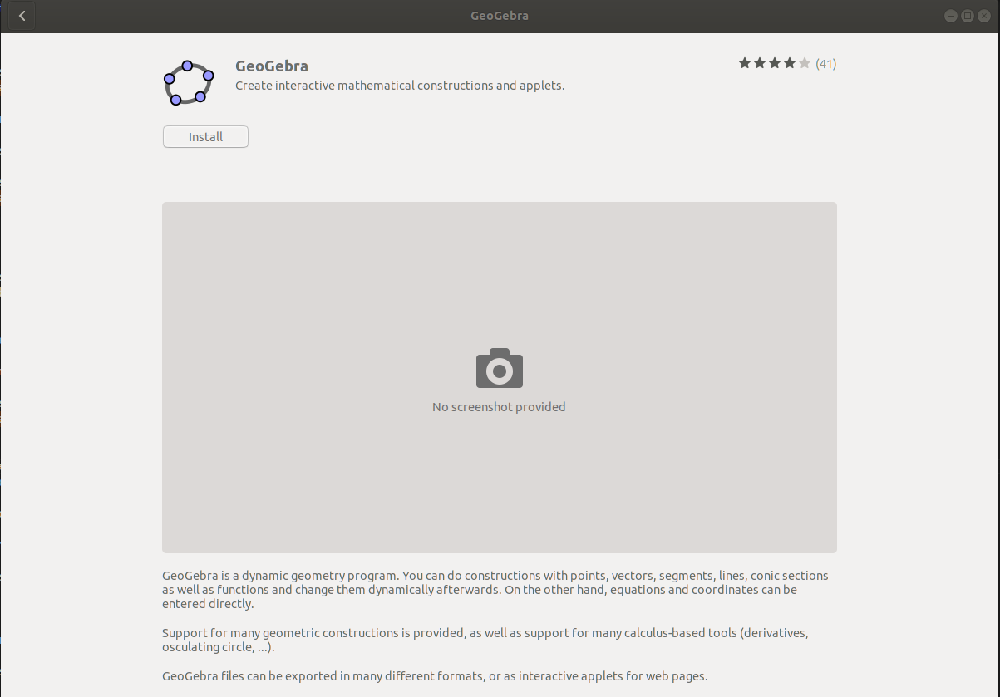
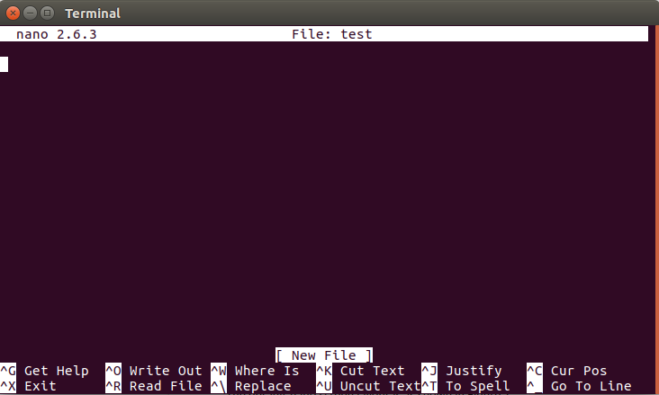
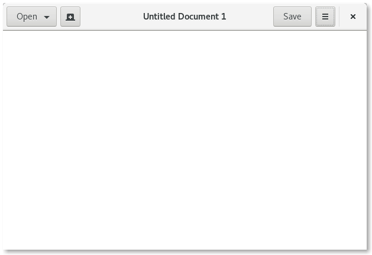

# Guia básico de Linux

Este tutorial foi feito com o intuito de te apresentar o sitema Ubuntu, o famoso terminal no Linux e, em seguida, vamos guiar você por alguns exercícios práticos para tu se familiarizar com comandos e conceitos básicos que vão te ajudar muito no decorrer do curso. Não assumiremos nenhum conhecimento prévio, mas no final esperamos que você se sinta um pouco mais confortável na próxima vez que se deparar com algumas instruções que começam com “Abrir um terminal”. 

## O que você vai aprender:

- Um pouco sobre o Linux
- Diferença entre Software livre e Open Source
- Comandos básicos via terminal do Linux
- Comando bonus para facilitar sua vida

O sistema operacional instalado no seu SSD é conhecido como **LINUX**, mas o termo correto é Ubuntu versão 20.04 o kernal sim, é o GNU/Linux. O kernel é o orquestrador do sistema operacional, ele utiliza uma série de  ferramentas para entregar as funcionalidades do sistema. Essas ferramentas foram criadas pelo projeto GNU, idealizado por Richard Stallman.

Ser [open source](https://www.redhat.com/pt-br/open-source)  talvez seja a principal vantagem do Linux. O Linux está disponível sob a [Licença Pública Geral (GPL) GNU](https://www.gnu.org/licenses/licenses.html).  Isso significa que qualquer pessoa pode executar, estudar, compartilhar e modificar o software. Por isso podemos distribuir cópias personalizadas com as ferramentas usadas pelas matérias do terceiro semestre para vocês sem problemas. O que for modificado também pode ser [redistribuído e até mesmo vendido](https://en.wikipedia.org/wiki/GNU_General_Public_License#Terms_and_conditions),  mas isso deve ser feito sob a mesma licença. O Linux é muito diferente dos sistemas operacionais tradicionais, como Unix e Windows, que são softwares proprietários, fechados e oferecidos em estado final, ele são inalteráveis.

## Sabia que existe uma diferença entre Software Livre e Open Source?

Open Source é um código pensado para ser acessado abertamente pelo público, é desenvolvido de forma descentralizada e colaborativa e conta com a revisão e suporte da comunidade. Ele costuma ser mais barato, mais flexível e mais duradouro do que as opções proprietárias, já que é desenvolvido por comunidades, e não por um único autor ou empresa.

O open source é hoje um movimento tecnológico e uma forma de trabalho que vai além da produção de software. Esse movimento usa os valores e o modelo descentralizado de produção do software open source para descobrir maneiras inovadoras de resolver problemas com a colaboração ativa da comunidade.

A ARPANET influenciou a construção de uma comunidade com esses valores. Nas décadas de 1950 e 1960, os profissionais que desenvolviam as primeiras tecnologias de Internet e protocolos de rede de telecomunicação contavam com um ambiente de pesquisa colaborativo e aberto. Na época, a rede Advanced Research Projects Agency Network (ARPANET), que é a base da Internet moderna, incentivava a revisão pelos colaboradores e o processo de feedback aberto. Os grupos de usuários compartilhavam os próprios códigos-fonte e desenvolviam com base neles. Já os fóruns facilitavam as discussões e estabeleciam padrões para a colaboração e comunicação abertas. Quando a Internet surgiu no começo dos anos 1990, sua base já tinha incorporado os valores da colaboração, avaliação por pares, comunicação e transparência.

Um modelo de desenvolvimento open source é o processo usado no projeto da comunidade para desenvolver softwares relacionados. Depois, o  software é lançado com uma licença open source, para que todos possam visualizar ou modificar o código-fonte.

Muitos projetos open source são hospedados no [GitHub](https://github.com/explore).  Lá você pode acessar repositórios ou participar de projetos da comunidade. Alguns dos projetos open source mais conhecidos são [Linux®](https://www.redhat.com/pt-br/topics/linux), Ansible e Kubernetes.

### Open Source

O nome "software livre" chegou a causar muita confusão. O termo "free" é ambíguo e pode significar "livre" ou "gratuito". Nesse caso, o software não é necessariamente gratuito, mas livre para ser usado. Para resolver a ambiguidade, "software livre" foi 
substituído por "open source", [termo criado por Christine Peterson](https://opensource.com/article/18/2/coining-term-open-source-software):
 "O problema com o nome antigo, não era a conotação política, mas o fato de que atraía novos usuários com uma gratuidade aparente. Foi necessário adotar um termo para enfatizar a questão em torno do código-fonte e não confundir quem acabou de conhecer o conceito."

Christine propôs essa substituição de termo a um grupo de trabalho que era dedicado, em parte, a incentivar práticas de software open source em mercados maiores. O grupo queria mostrar ao mundo que o software ficava muito melhor quando era compartilhado, colaborativo, aberto e modificável. E assim seria possível usá-lo de outras maneiras inovadoras, além de aumentar a flexibilidade, economia e durabilidade sem dependência de fornecedor

No começo de 1998, a [Open Source Initiative](https://opensource.org/docs/osd)  (OSI) foi fundada, o que formalizou o termo e estabeleceu uma definição comum  no setor. Embora as empresas ainda desconfiassem do movimento open source do final dos anos 1990 ao começo dos anos 2000, ele começou a ser  adotado gradualmente na produção de software para se tornar o atual padrão do setor.

A Mozilla Foundation, desenvolvedora do navegador Firefox, abre o código fonte de todos os seus aplicativos, para a modificação e redistribuição. Porém, a Mozilla criou sua própria licença, a  “Mozilla Public License”, que possui a restrição de, caso um programador modifique e redistribua seus aplicativos, eles deverão usar outro nome. Em outras palavras, um Firefox modificado fora da Mozilla Foundation não pode ser chamado de Firefox. Essa política foi adotada para preservar o nome da empresa, visto que cópias modificadas podem ser instaláveis, o que poderia sujar a credibilidade da Mozilla. 

O Firefox possui o código aberto para análise,  segue a filosofia da comunidade do código aberto, mas não pode ser considerado como Software livre.

### **Linux e open source**

O Linux é um sistema operacional open source e gratuito, disponibilizado sob a Licença Pública Geral (GPL) GNU. Ele se tornou o maior projeto de software open source do mundo.

O sistema operacional Linux foi criado como uma versão alternativa, gratuita e open source do sistema operacional MINIX, que era baseado nos princípios e design do Unix.

O Linux foi lançado com uma licença open source, que impede restrições ao uso do software. Portanto, qualquer pessoa pode executar, estudar, modificar e redistribuir o código-fonte, ou até mesmo vender cópias do código modificado, desde que façam isso sob a mesma licença.

### Software Livre

O software livre é o oposto do software proprietário ou de "código-fonte fechado", que é altamente protegido. Somente os proprietários do código-fonte têm direito de acessá-lo. Não é possível alterar ou copiar legalmente um código-fonte fechado. Além disso, quando o usuário compra o software somente pode usá-lo da forma como foi programado, sem modificá-lo para novas utilizações nem compartilhá-lo com a comunidade.

Voltando ao Richard Stallman, idealizador do projeto GNU, ele é conhecido como um dos principais militantes da idéia de Software Livre, o objetivo do projeto GNU é fornecer ferramentas para construir um sistema operacional totalmente livre, que tenha seu **código fonte aperto para leitura, modificação e redistribuição sem restrições.** Em um dos textos do Stallman, ele utiliza a seguinte frase: “The enemy is the propetary software”.

Em 1989, foi lançada a GNU GPL (General Public License), que regulamenta o uso do Software Livre. Atualmente, podemos registrar nossos softwares na GPL2 ou GPL3.  Em 1998, Stallman criou a [Free Software Fondation](http://www.fsf.org/), uma organização especializada em Software Livre, baseada na GNU GPL.

A  licença GPL prega  que as aplicações registradas com essa patente podem ser lidos, modificados e redistribuídos conforme os quatro conceitos de liberdade listados:

- **Liberdade  nº 0 -** A liberdade de executar o programa, para qualquer propósito (liberdade nº 0)
- **Liberdade nº 1 -** A liberdade de acesso ao código fonte com permissão de leitura e modificações.
- **Liberdade nº 2 -** A liberdade de redistribuir cópias do software.
- **Liberdade nº 3 -** A liberdade de aperfeiçoar o programa, e liberar os seus aperfeiçoamentos, de modo que toda a comunidade se beneficie dessas melhorias.

Depois de um pouco de história, vamos colocar os dedos no teclado para explorar esse sistema sensacional!

## Conhecendo e utilizando o Terminal

O Terminal do Linux é uma ferramenta que facilita a manipulação do sistema, interpretando os comandos do usuário, fazendo a ponte com o hardware do seu computador

### Abrindo o terminal

A forma mais facil de abrir o terminal é atraves do atalho:

<kbd>Ctrl</kbd> + <kbd>Alt</kbd> + <kbd>T</kbd>

Neste momento nos deparamos com a janela do terminal aberta no ambiente do usuário (home ou ~) pronta para receber os primeiros comandos.



## Comando "apt"

`APT` é um conjunto de ferramentas usadas pelo Linux para administrar os pacotes `.deb` de forma automática, é possível instalar, atualizar e remover programas e suas dependências via apt;

### Atualizar a "lista de pacotes"

Com o comando abaixo, usamos o `apt` para atualizar todos os programas instalados com essa ferramenta;

```bash
sudo apt update

```

### Atualizar pacotes "já instalados"

Se quiser atualizar um pacote especifico, é possivel determinar o programa a ser atualizado;

```bash
sudo apt --only-upgrade install google-chrome-stable

```

```bash
sudo apt --only-upgrade install firefox

```

Com o comando abaixo, é possível baixar e instalar a versão mais atual de todos os programas instalados anteriormente via `apt`;

```bash
sudo apt upgrade

```

### Instalar pacotes via apt

Com este comando, usamos o `apt` para encontrar, baixar e instalar o `.deb` do programa que queremos instalar no nosso computador;

```bash
sudo apt install -y geogebra

```

Após finalizar a instalação do programa, podemos executar a nova ferramenta, apenas digitando o nome dela no terminal.

```bash
geogebra

```

### Remover pacotes via apt

Tambem é possivel desinstalar um programa que foi baixado via `apt`, basta usar o comando `remove`, como no exemplo abaixo;

```bash
sudo apt remove geogebra

```

### Instalar pacotes via Ubuntu Software


{width=100}

Podemos instalar pacotes via `Ubuntu Software`, basta clicar em Show Applications, no canto inferior direito da tela, e digitar `Ubuntu Software` na janela de busca;



{width=800}

Agora clique na lupinha e digite o programa que deseja instalar;



{width=780}

Clique no software escolhido, e depois, clique no botão Instalar;



{width=780}

Terminada a instalação, basta clicar no botão `Launch` para executar o programa, ou `Remove` para desinstalar;


{width=780}

### Navegando entre diretorios e arquivos

O Sistema Linux trabalha com dois elementos principais: Diretórios(pastas) e Arquivos.

- Os arquivos armazenam dados(txt,md,doc...), executam ações (py,jar,bin...)
- Diretórios agrupam os arquivos e organizam o sistema


{width=800}

[Fonte](https://commons.wikimedia.org/wiki/File:FilesAndFolders.png)

### Comando "cd"

O comando **cd** é um dos comandos mais utilizados no terminal do Linux isso porque ele permite que acessemos um diretório especifico. Vamos acessar o nosso  repositorio de Elementos de Sistemas, e atualizar ele via comandos git.

```
cd Z01.1

```

```
git pull

```

É uma boa prática manter os seus repositórios do GitHub sempre atualizados, antes de começar a trabalhar, não esqueça de dar um `git pull`, para ter certeza de que está trabalhando com a ultima versão dos arquivos no seu repositório!

Feita a atualização, vamos instalar uma ferramenta que permite visualizar toda a estrutaras de árvore da pasta,

```
sudo apt install tree

```

Agora digite o comando para visualizar a árvore do repositório de Elementos de Sistemas:

```
tree -d -L 4

```

Esta ferramenta é útil para navegar de forma mais eficiente dentro do sistema, se não sabemos aonde determinado repositório está, é possivel consultar a árvore para localizar o seu caminho visualmente.

> os paramentros -d -L 2 indica que que queremos listar (-L )até o quarto (4) nível na hierarquia de pastas, apenas as pastas (-d)
> 

> para listar tudo digite apenas tree.
> 

Na pasta em home, Z01.1 -> Projetos -> B-LogicaCombinacional -> src  estão os arquivos .hdl da ultima aula, vamos dar uma olhada neles.

```
cd ~
cd Z01.1
cd Projetos
cd B-LogicaCombinacional
cd src

```

ou par ir direto para este diretorio digite:

```
cd /home/borg/Z01.1/Projetos/B-LogicaCombinacional/src

```

> Dica:. Podemos apenas digitar o começo do comando e usar a tecla <kbd>TAB</kbd> para auto-completar.
> 

Para acessar o diretório anterior podemos digitar:

```
cd ..

```

### Comando "pwd"

Podemos verificar o caminho do diretório que estamos digitanto:

```
pwd

```

Para acessar o diretório home, basta digitar;

```
cd

```

> Toda vez que abrimos um novo terminal, ele é inicializado na home do usuário.
> 

### Comando "ls"

O comando **ls** é utilizado pra visualizar o conteúdo de um diretório.

```
ls

```

## Visualização de arquivos e pastas ocultos

O comando "ls" sozinho não exibe arquivos ocultos, que são arquivos e pastas que começam com ".". Talvez, em algum momento será necessário atualizar ou modificar as variáveis de ambiente, para isso, teremos que editar um arquivo oculto chamado "**.bashrc**", no momento precisamos apenas saber que este arquivo se encontra na home do usuario `~` e que após editado precisamos executar o `source ~/.bashrc` ou `feche o terminal e abra um novo` para recarregar as atualizações do arquivo.

```
cd ~
ls -a

```

ou para listar informações mais detalhadas:

```
ls -la

```

ou simplismente:

```
ll

```

```
cd ~
code .bashrc
source .bashrc

```

### Comando "mkdir"

Para criar um novo diretório no ambiente em que você está, basta digitar o comando a seguir;

```
mkdir ~/Documents/nome_da_pasta/nome_da_pasta

```

Para criar um novo diretório em um local especifico, basta especificar o caminho que o diretório deverá ser criado;

> Dica:. Você sempre pode usar a tecla <kbd>TAB</kbd> para auto-completar os comandos.
> 

```
mkdir /home/borg/Documents/nome_da_pasta

```

ou

```
mkdir ~/Documents/nome_da_pasta

```

### Comando "touch"

O comando  **touch** cria arquivos vazios, na extensão que você definir;

```
touch /home/borg/Documents/nome_da_pasta/teste.py

```

```
touch /home/borg/Documents/nome_da_pasta/testando_outra_extensao.txt

```

O comando **>** funciona exatamente como o **touch**:

```

> /home/borg/Documents/nome_da_pasta/outro_teste.py

```

```

> /home/borg/Documents/nome_da_pasta/mais_um_teste.txt

```

Se você tentar abrir um arquivo que não existe, usando um editor de texto pelo terminal, o sistema cria o arquivo pra você, observe;

```

nano /home/borg/Documents/nome_da_pasta/usando_o_nano.py
code /home/borg/Documents/nome_da_pasta/usando_o_vscode.md
gedit /home/borg/Documents/nome_da_pasta/o_bloco_de_notas.txt

```

### Comando "cp"

Para copiar arquivos e diretorios, basta  digitar:

```
> /home/borg/Documents/nome_da_pasta/meu_programa_python.py
cp -R /home/borg/Documents/nome_da_pasta/meu_programa_python.py /home/borg/Documents/

```

No exemplo acima foi criado um arquivo chamado meu_programa_python.py e uma copia do arquivo "meu_programa_python.py" dentro do diretório Documents.

### Comando "mv"

Para mover arquivos e diretorios, o famoso <kbd>Ctrl</kbd> + <kbd>X</kbd> / <kbd>Ctrl</kbd> + <kbd>V</kbd>, basta  digitar:

```
mv /home/borg/Documents/nome_da_pasta/testando_outra_extensao.txt /home/borg/Documents/

```

No exemplo acima o arquivo "testando_outra_extensao.txt" foi movido para dentro do diretório Documents (recortado e colado).

### Comando "mv"

O comando **mv** tambem serve tanto para mover, com para renomear arquivos e diretorios:

```
mkdir /home/borg/Documents/nome_da_pasta/pastinha
mv /home/borg/Documents/nome_da_pasta/pastinha /home/borg/Documents/nome_da_pasta/nova_pastinha

```

> Atenção!! Cuidado para não sobrescrever arquivos e pastas atuais na hora de executar estes comandos.
> 

### Comando "rm"

Para excluir arquivos e diretórios, o famoso  <kbd>Shift</kbd> + <kbd>Del</kbd> basta digitar:

```
rm -rf /home/borg/Documents/nome_da_pasta/nova_pastinha

```

> Atenção!!! Arquivos e pastas são apagados permanentemente, não vão para lixeira. No caso de diretórios, apaga o diretório e tudo que está dentro dele.
> 

## Super Usuário

### Comando "sudo"

Por questões de seguraça, o Linux trabalha com permissões de usuários e para determinados arquivos ou comandos apenas o usuario administrador (root) pode executar.
A titulo de curiosidade, "sudo" significa **S**uper **U**ser **DO**. Quando executar comandos com sudo, será necessário informar a senha.

### Comando "chmod"

As permissões servem para determinar se um usuario ou grupo terá permissões para ler, gravar, executar. Existem diversas configurações possiveis e a que mais utilizamos dá a permissão de execução a um codigo qualquer, como um python, por exemplo;

```
touch /home/borg/Documents/nome_da_pasta/teste.py
chmod a+x /home/borg/Documents/nome_da_pasta/teste.py

```

A concatenação de a+x significa que estamos permitindo para todos (a = all) usuarios e grupos executem (x = execution) o
**[teste.py](http://teste.py/)**

## Editando arquivos

Existem várias ferramentas para edição de texto, de um modo geral, podemos dizer que existem 2 grupos principais,
os que rodam direto no console (terminal) e os que possuem uma interface gráfica.

### Editor nano

O nano é um editor do modo console, ou seja, abre no proprio terminal.



{width=600}

### Abrir

Digite no terminal **nano** e o nome do arquivo com a extensão, caso não exista um arquivo com esse nome um novo arquivo será criado.

```
nano /home/borg/Documents/nome_da_pasta/nano.md
nano /home/borg/Documents/nome_da_pasta/nano.txt

```

### Localizar palavra

Para fazer uma busca no texto pressione <kbd>Ctrl</kbd> + <kbd>W</kbd>, digite a palavra e aperte <kbd>Enter</kbd>.

### Salvar e Sair

Para salvar, precione <kbd>Ctrl</kbd> + <kbd>S</kbd>.
Para sair <kbd>Ctrl</kbd> + <kbd>X</kbd>.
Para sair sem salvar alteraçes,  <kbd>Ctrl</kbd> + <kbd>X</kbd> e  <kbd>N</kbd>.

### Editor gedit

Muito parecido com o famoso bloco de notas do Windows.



{width=600}

### Abrir

Digite no terminal **gedit** e o nome do arquivo com a extensão, caso não exista um arquivo com esse nome um novo arquivo será criado.

```
gedit /home/borg/Documents/nome_da_pasta/roda_tartaruga.py
gedit /home/borg/Documents/nome_da_pasta/roda_tartaruga.md

```

### Localizar palavra

Para fazer uma busca no texto pressione  <kbd>Ctrl</kbd> + <kbd>F</kbd>, digite a palavra e tecle <kbd>Enter</kbd>.

### Salvar e Sair

Para salvar e sair, pressione  <kbd>Ctrl</kbd> + <kbd>S</kbd> ou clique em salvar para salvar e para sair  <kbd>Alt</kbd> + <kbd>F4</kbd>

### Editor vscode

O editor vscode é uma ferramenta que possui mais recursos que auxiliam no desenvimento de codigo.


{width=600}

### Abrir

Digite no terminal **code** e o nome do arquivo com a extensão, caso não exista um arquivo com esse nome um novo arquivo será criado.

```
code /home/borg/Documents/nome_da_pasta/roda_tartaruga.py

```

### Localizar palavra

Para fazer uma busca no texto pressione <kbd>Ctrl</kbd> + <kbd>F</kbd>, digite a palavra e tecle <kbd>Enter</kbd>.

### Salvar e Sair

Para salvar e sair, pressione  <kbd>Ctrl</kbd> + <kbd>S</kbd> ou clique em salvar para salvar e para sair  <kbd>Alt</kbd> + <kbd>F4</kbd>

## BONUS

Comandos úteis para verificar informações do sistema, encontrar bugs, e matar programas travados;

### Informações dos dispositivos conectados na USB

Se você não tem certeza se o dispositivo conectado a sua porta USB foi reconhecido, use este comando e verifique o log do sistema;

```
lsusb

```

### Informações dos dispositivos conectados na USB

Se você não tem certeza se o dispositivo conectado a sua porta PCI foi reconhecido, use este comando e verifique o log do sistema;

```
lspci

```

### O programa travou, e agora?

Para destravar uma tela, use "xkill" e clique na tela com o mouse.

```
xkill

```

Para matar um processo, digite o comando abaixo, e o nome do software que deseja assassinar;

```
pkill terminal

```

É isso, espero que você esteja se sentindo mais confortável para explorar e personalizar o seu Ubuntu, divirta-se!

Fontes:

**[Linux: conheça o Linux OS](https://www.redhat.com/pt-br/topics/linux)** 

**[O que é open source?](https://www.redhat.com/pt-br/topics/open-source/what-is-open-source)**

**[Código Aberto e Software Livre não significam a mesma coisa!](https://www.tecmundo.com.br/linux/1739-codigo-aberto-e-software-livre-nao-significam-a-mesma-coisa-.htm)**

**[The Linux command line for beginners](https://ubuntu.com/tutorials/command-line-for-beginners#1-overview)**