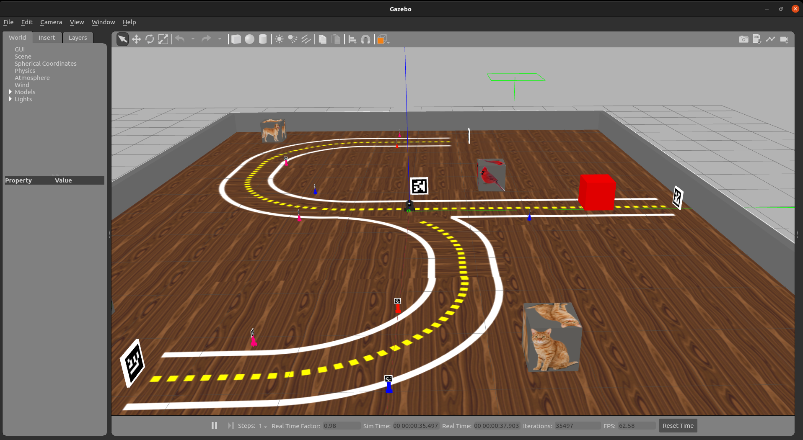

# Primeiros passos com o Robô Simulado

# Configurando o arquivo .bashrc

BASH significa Bourne Again Shell. Há um número de shells diferentes, incluindo csh, zsh, dash e korn.

Um shell é um interpretador que executa operações como navegar por um sistema de arquivos, executar programas, modificar permissões, enfim, é uma ferramenta importante do sistema operacional.

Você tem um arquivo chamado .bashrc no seu diretório “home”, o arquivo bashrc é um arquivo oculto, por isso tem um “.” no início do nome, nós usamos o arquivo .bashrc para definir personalizações ao nosso sistema, pois, toda vez que um terminal é aberto, o arquivo .bashrc é executado, isso é interessante para definir configurações ou variáveis de ambiente. 

Para acessar o bashrc, abra um terminal (<kbd>Ctrl</kbd> + <kbd>Alt</kbd> + <kbd>T</kbd>) e use o comando abaixo:

```bash
gedit /$HOME/.bashrc
```

Perceba que lá no final do arquivo, temos algo como;

```bash
##########################
# 3s
##########################

source ~/elementos.sh
source ~/robotica.sh
```

Isso é porque estamos ativando esses arquivos que estão localizados na home, o [elementos.sh](http://elementos.sh) e o , [robotica.sh](http://robotica.sh). Eles definem configurações especificas para o ambiente, tanto da matéria de Robótica, como da matéria de Elementos de Sistemas.

É preciso abrir o arquivo [robotica.sh](http://robotica.sh) para definir as configurações que permitem o acesso ao Insperbot simulado. Abra um terminal (<kbd>Ctrl</kbd> + <kbd>Alt</kbd> + <kbd>T</kbd>)e use o comando a seguir para editar o arquivo robotica.sh

```bash
gedit /$HOME/robotica.sh
```

Certifique-se de que as linhas 7 e 8 estão comentadas no seu arquivo robotica.sh, se não estiverem, comente, salve e feche o arquivo.


Abra um novo terminal para recarregar as configurações do .bashrc que chama o arquivo [robotica.sh](http://robotica.sh) (<kbd>Ctrl</kbd> + <kbd>Alt</kbd> + <kbd>T</kbd>)

Execute o comando abaixo em um terminal novo para subir o cenário pista_s2 no simulador Gazebo

```bash
roslaunch my_simulation pista_s2.launch
```

O seu terminal vai exibir algo parecido com isso:


**⚠️ ATENÇÃO: Não feche o terminal, o gazebo está sendo executado através dele, se precisar usar o terminal, é melhor abrir um novo e deixar esse quietinho.**



 Essa é a janela do Gazebo, o nosso simulador, com ele podemos simular o comportamento do robô, dos seus sensores, câmera, garra, quanto dos objetos como os creepers, arucos ou caixas coloridas. O ROS não sabe diferenciar se os dados estão vindo de um robô simulado ou se estão vindo de um robô real. É dessa forma porque os dados dos sensores chegam para o ROS através de tópicos, também é pelos tópicos que nós conseguimos enviar comandos para os motores ou para a garra do robô, isso é interessante porque via código o tratamento dos dados é bem parecido, tanto no robô real quanto no robô simulado. Para saber quais são os tópicos disponíveis para o ROS, abra um novo terminal  (<kbd>Ctrl</kbd> + <kbd>Alt</kbd> + <kbd>T</kbd>) e use o comando:

```bash
rostopic list
```

Uma lista de tópicos como essa vai aparecer pra você no terminal:


Conseguimos “escutar” os dados dos sensores que estão chegando via ROS usando o comando **rostopic echo nome_do_topico**

```bash
rostopic echo imu
```


Se quiser parar de acessar os dados da IMU do robô simulado, use o <kbd>Ctrl</kbd> + <kbd>C</kbd> 

Para abrir a câmera do robô use o comando:

 

```bash
rqt_image_view
```

Se a imagem não aparecer, provavelmente você está escutando um tópico fantasma, basta trocar a opção para acessar o tópico certo, conforme imagem abaixo:


Com o comando abaixo, podemos publicar valores de velocidade angular e linear direto no robô simulado

Em um novo terminal, utilize o comando fazer o robô andar loucamente:

```bash
rostopic pub -1 cmd_vel geometry_msgs/Twist '[4.0, 0.0, 0.0]' '[0.0, 0.0, 0.0]'
```


Com o mesmo comando, podemos enviar 0 para os motores, parando o robô, **este comando pode ser útil em momentos de emergência**.

```bash
rostopic pub -1 cmd_vel geometry_msgs/Twist '[0.0, 0.0, 0.0]' '[0.0, 0.0, 0.0]'
```


Também conseguimos teleoperar o robô com o comando abaixo:

```bash
roslaunch turtlebot3_teleop turtlebot3_teleop_key.launch
```

Para controlar o robô, use 

**w** para ir para frente

**s** para parar o robô

**a** para ir para esquerda <

**d** para ir para direita >

**x** para dar ré

É importante que você mantenha o terminal ativo para conseguir teleoperar o robô (clicando no terminal pra ativar ele)


Foi divertido, porém, vamos controlar o robô via códio não é mesmo?

Se estiver com o teleop aberto, mate o terminal, clicando no terminal que está com o comando do teleop e apertando as teclas <kbd>Ctrl</kbd> + <kbd>C</kbd>. Não é legal ter lugares diferentes enviando comandos para o robô, normalmente dá conflito.

Agora, com tudo limpo, tudo em paz, crie um arquivo python em branco e cole o código abaixo

Para criar o arquivo:

```bash
code roda_robozinho.py
```

Para dar permissão de execução para o arquivo:

```bash
chmod a+x roda_robozinho.py
```

Código em python que faz o robô andar em círculos eternamente:

```bash
#!/usr/bin/env python3

import rospy
from geometry_msgs.msg import Twist
import sys

#função que publica valores de velocidade no robô
def move_robot(lin_vel,ang_vel,sleep):
    #inicializando um node no ROS
    rospy.init_node('move_robot', anonymous=True) 

    #definindo o tópico que será utilizado pela função, o tipo da mensagem e o 
    #tamanho da fila de mensagens que serão enviadas para o tópico definido
		#no caso é cmd_vel, topico do tipo publisher que controla os motores do robô
    pub = rospy.Publisher('cmd_vel', Twist, queue_size=3)

		#definindo um metodo to tipo Twist()
		#http://docs.ros.org/en/noetic/api/geometry_msgs/html/msg/Twist.html
    vel = Twist()       

    vel.linear.x = lin_vel # Velocidade linear (eixo x)
    vel.linear.y = 0
    vel.linear.z = 0

    vel.angular.x = 0
    vel.angular.y = 0
    vel.angular.z = ang_vel  # Velocidade angular (eixo z)

		# exibindo no terminal a velocidade linear e a velocidade angular atual
    rospy.loginfo("Linear Vel = %f: Angular Vel = %f",lin_vel,ang_vel)
		# publicando a velocidade via ROS no robô
    pub.publish(vel)
		# aguardando um tempinho para dar tempo de executar o comando
    rospy.sleep(sleep)

if __name__ == '__main__':

     while not rospy.is_shutdown(): #loop do ROS
				#enviando os valores de velocidade para a função move_robot
        move_robot(0.5,0.5,0.5) 
```

O seu resultado deve ser algo parecido com isso:


Para interromper o programa, use o  <kbd>Ctrl</kbd> + <kbd>C</kbd>, você perceberá que o robô continuará girando loucamente, apesar de não existir mais um programa sendo executado, isso acontece porquê o robô mantém em execução o último comando enviado, se você quiser parar o robô, é preciso enviar 0 para os motores, o comando é esse e pode ser executado diretamente no terminal:

```bash
rostopic pub -1 cmd_vel geometry_msgs/Twist '[0.0, 0.0, 0.0]' '[0.0, 0.0, 0.0]'
```

Eu avisei que o comando seria útil para momentos de emergência. Esse comando funciona tanto com o robô simulado quanto com o robô real, se quiser facilitar a sua vida para futuros momentos caóticos de robô desgovernado, você pode criar um alias no seu arquivo robotica.sh.

Primeiro, abra o arquivo [robotica.sh](http://robotica.sh) 

```bash
code /$HOME/robotica.sh
```

depois, defina o alias que será o seu “comando de emergência” no arquivo robotica.sh, vou deixar um de exemplo aqui, mas você pode personalizar o seu;

```bash
# Comando para parar o Insperbot

alias socorro="rostopic pub -1 cmd_vel geometry_msgs/Twist '[0.0, 0.0, 0.0]' '[0.0, 0.0, 0.0]'"
```

Salve o arquivo, abra um terminal novo e teste o seu alias, ele será seu fiel companheiro. Lembre-se de que é preciso encerrar o código python que controla o robô para que não existam comandos concorrendo o controle do robô. 

 

