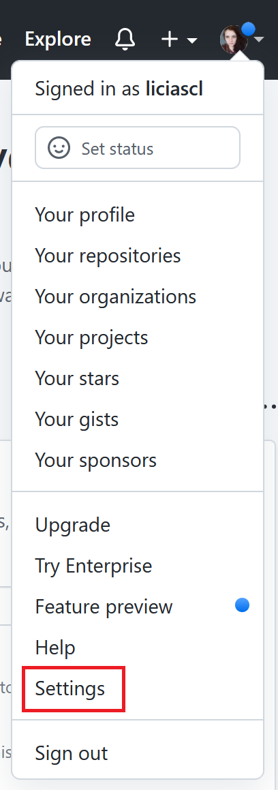
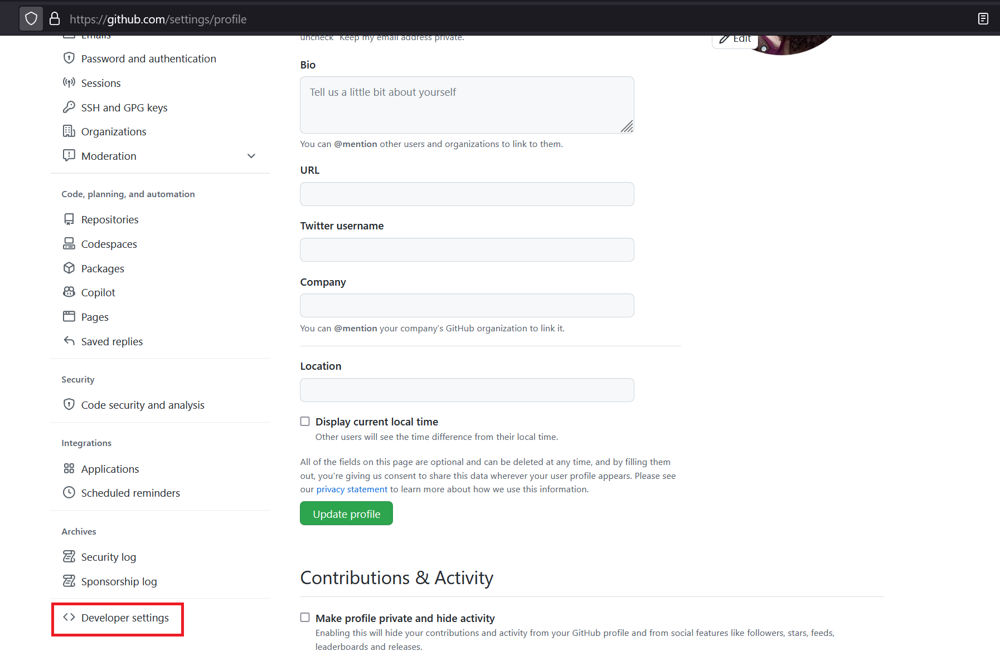
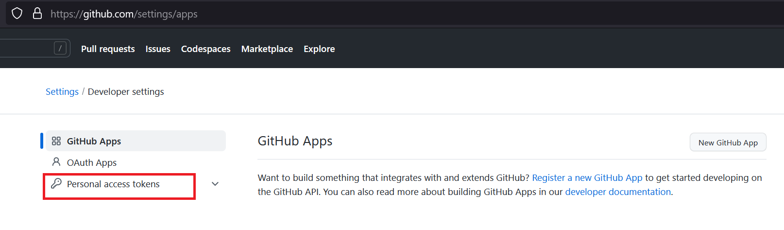
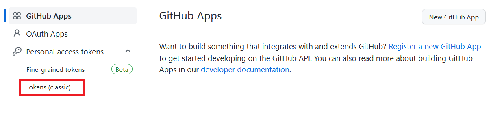
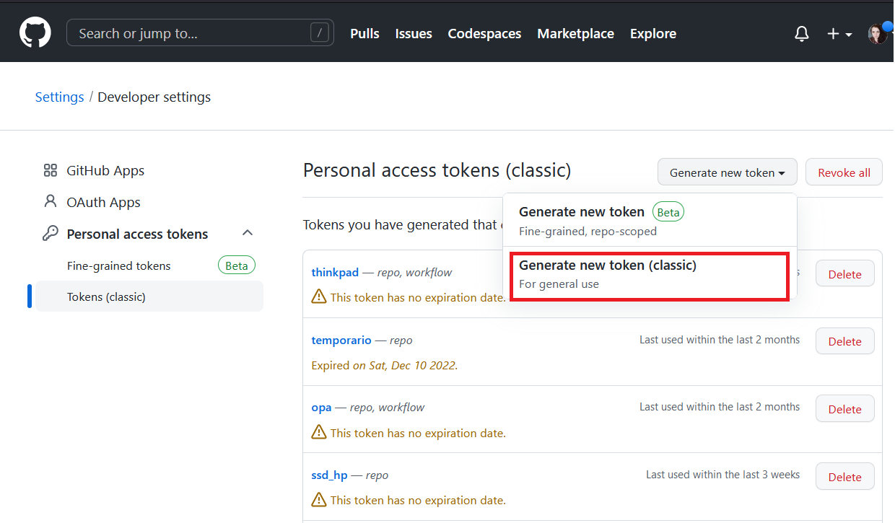
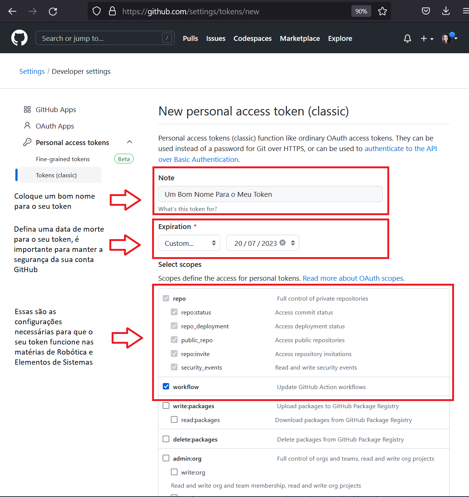
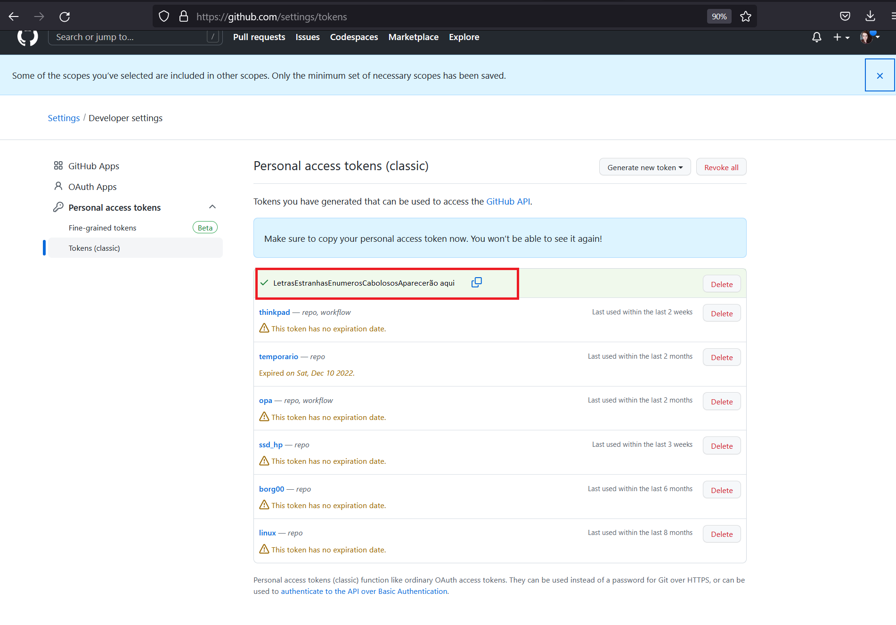

# Configure o seu Git

Boas noticias, não precisa instalar o Git, deixamos isso pronto pra você, porém, algumas configurações só você pode fazer, te mostramos neste guia algumas noções básica sobre Git, GitHub e quais são os passos para fazer as configurações necessárias, bom proveito!

## O que é o Git?

O Git é um sistema de controle de versão distribuído. Um sistemas de controle de versão tem a função de registrar qualquer alteração feita em cima de um código, armazenando essas informações e permitindo voltar a versões anteriores de uma aplicação de modo simples e rápido. Este tipo de sistema também simplifica muito o processo de compartilhamento de um projeto com um time.

Um repositório ou um projeto Git, engloba toda a coleção de arquivos e pastas associados a um projeto, junto com o histórico de revisão de cada arquivo. O histórico de arquivos aparece como instantâneos no tempo denominados commits. Os commits podem ser organizados em várias linhas de desenvolvimento denominadas branches. Os repositórios são unidades auto-confinadas e qualquer pessoa que tiver uma cópia do repositório pode acessar toda a base de código e seu histórico. Um repositório Git também permite a interação com o histórico, clonagem do repositório, criação de branches, commiting, merge, comparação de alterações entre versões de código e muito mais.

Por meio de plataformas como GitHub, o Git também oferece mais oportunidades para transparência e colaboração do projeto. Repositórios públicos ajudam as equipes a trabalhar juntas para criar o melhor produto final possível.


!!! tip
    Para saber mais, consulte a [documentação](https://docs.github.com/pt/get-started/using-git/about-git)

## O que é GitHub?

GitHub é uma plataforma de hospedagem de código para controle de versão e colaboração **usando as ferramentas Git**, possibilita que desenvolvedores trabalhem em um único projeto podendo acessar as contribuições da equipe em tempo real, o GitHub também possui recursos de organização e gestão de projetos.

GitHub cria colaboração diretamente no processo de desenvolvimento. O trabalho é organizado em repositórios onde os desenvolvedores podem definir os requisitos e expectativas para os integrantes da equipe. Em seguida, ao usar o fluxo GitHub, os desenvolvedores simplesmente criam um branch para trabalhar nas atualizações, enviar alterações para salvá-las, abrir um pull request para propor alterações e fazer merge de pull requests quando todos estiverem de acordo. Para obter mais informações, confira [Fluxo do GitHub](https://docs.github.com/pt/get-started/quickstart/github-flow).

## Resumindo as diferenças entre Git e GitHub:

### Git
É um software que é instalado na máquina do usuário e é executado localmente, possui um conjunto de ferramentas que monitora o histórico de alteraçoes onde qualquer versão anterior do projeto pode ser recuperada a qualquer momento, isso é Git:

- git init
- git clone
- git status
- git add meu_arquivo.py
- git add minha_pasta_completona
- git commit -m "minha mensagem de commit"
- git push origin nome_da_branch
- git checkout -b nome_da_nova_branch

[Resumo de comandos git via terminal](https://training.github.com/downloads/pt_BR/github-git-cheat-sheet/) 

### GitHub
É uma plataforma que hospeda códigos e possibilita a colaboração com repositórios públicos, é o chamado repositório remoto. Isso é GitHub:

- Abrir um pull request
- Criar um Fork de um repositório remoto
- Criar um repositório público
- Criar um repositório privado
- Criar um clone de um repositório remoto
- Criar plugins de automação com actions
- Criar Issues no repositório remoto
- Criar organizações com gerenciamento de permissões entre integrantes

Se quiser saber mais, visite o [canal do YouTube oficial do GitHub](https://www.youtube.com/githubguides) ou a [documentação oficial.](https://docs.github.com/pt/get-started/quickstart/hello-world)


## Se identificando para o Git

A primeira coisa que devemos fazer antes de começar a usar o Git é configurar o **nome de usuário** e **endereço de e-mail**. Isto é importante porque cada *commit*  usa esta informação, e ela é carimbada de forma imutável nos seus *commits*:

Abra um terminal usando o atalho Super + T, então use os comando a seguir para configurar o seu user name e seu email:

```bash
git config --global user.name "Seu Belo Nome Aqui"
git config --global user.email Seu_email_do_GitHub_aqui@exemplo.br
```

!!! tip
    Não precisa colocar o seu login do GitHub ao configurar o user.name, pode ser o seu nome sem problemas

Você precisara fazer a configuração de usuário e email somente uma vez, por que estamos usado a opção `--global`, o Git usará esta configuração para qualquer coisa que você fizer no Git em qualquer parte do sistema.
Se você precisar substituir os dados de usuário e email para um projeto específico, você pode executar o mesmo comando **sem a opção** `--global` dentro do projeto específico, então a configuração será local e só vai funcionar naquele espaço.

### Seu Editor

Agora que a sua identidade está configurada, você pode escolher o editor de texto padrão que será chamado quando o Git precisar que você digite uma mensagem. Se não for configurado, o Git usará o editor padrão, que normalmente é o nano.
Se você quiser usar um editor de texto diferente, como o Visual Code, você pode fazer o seguinte:

```bash
git config --global core.editor code
```

## Criando um **personal access token**

Atualmente, o GitHub oferece suporte a dois tipos de tokens, nós vamos de clássico. 

!!! tip
    Para saber detalhes e diferenças entre os tipos de tokens do GitHub e porque eles existem (Spoiler -> é por segurança) consulte a [documentação aqui](https://docs.github.com/en/authentication/keeping-your-account-and-data-secure/creating-a-personal-access-token)

Na página do seu GitHub -> clique na sua foto -> “Configuração” ou **“Settings”**



Em seguida, **Na barra lateral esquerda**, lá embaixo ->  **Developer settings.** -> **Personal access tokens** -> Tokens (classic)







Finalmente -> **Generate new token (classic)**



!!! tip "Você pode criar quantos tokens você quiser, apenas certifique-se de salvar a chave hash com carinho."

Dê um nome para o seu token, como você pode criar vários, ter um bom nome ajuda com a organização.



Role a página até o final -> Generate token.


Salve com muito carinho o token gerado, ele **não vai aparecer novamente,** se você perder o token, será necessário criar outro.



É possível salvar o seu token no gerenciador de credenciais do git.

!!! warning
    Você precisa estar dentro de um repositório git para conseguir armazenar a sua credencial.

Na primeira vez que você fizer um push para um repositório remoto, o git solicitará suas credenciais, como nome de usuário e seu token, Da próxima vez, ele vai usar o mesmo token, que permanecerá armazenado com segurança em seu Gerenciador de Credenciais dentro do repositório, basta abrir um terminal e executar o comando:

```bash
git config credential.helper store
```

```bash
git push http://example.com/repo.git
```

```
Username: SeuUserNameAqui
Password: SeuTokenAqui
```

Pronto, após essa configuração, não será mais necessário utlizar o token explicitamente para autenticar os seus commits, ele estará armazenado no gerenciador de credenciais do Git e será usado automaticamente.

!!! tip
    Se quiser entender melhor como funciona o sistema de gerenciamento de credenciais do Git, a documentação é essa [aqui](https://git-scm.com/docs/git-credential-store).

    Se quiser se começar a entender como funciona o GitHub, comece por [aqui](https://docs.github.com/pt/get-started/quickstart).
