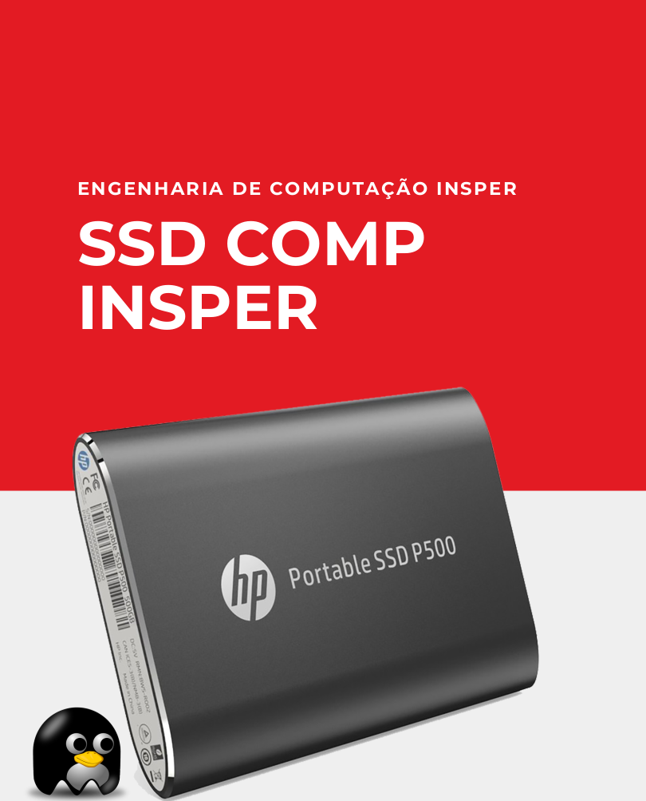

# Início

{width="700"}

Toda a infra-estrutura necessária para as disciplinas de **Robótica Computacional** e **Elementos de Sistemas** já está instalada e configurada no SSD que você recebeu. Algumas coisas importantes para lembrar:

- Temos um repositório do laboratório (**[Sala 404](https://github.com/insper/404)**) onde ensinamos como instalar todos os programas e ferramentas para as duas disciplinas. Se você quise se aventurar nesta empreitada, ganhará muito conhecimento e podemos te dar um suporte se necessário. Lembre-se o Linux é seu amigo!!!
- O básico de Linux para a disciplina está na sequência de guias de infra. Em especial, o “**[Guia básico de Linux](../guia-linux/index.md)”,** vai te ajudar com os primeiros passo no seu novo ambiente Ubuntu.
- No final do semestre **devolva o SSD utilizado** para um dos técnicos presentes na sala. Você pode apagar os dados do SSD se quiser, mas todos eles serão formatados por segurança.

Os passos para usar o SSD são diferentes se você usa Windows ou macOS. Siga os guias correspondentes abaixo.

!!! warning
    Caso você possua um MacBook M1 ou M2,  procure um dos técnicos do laboratório

* [Windows](windows.md)
* [macOS (intel)](mac-os.md)
