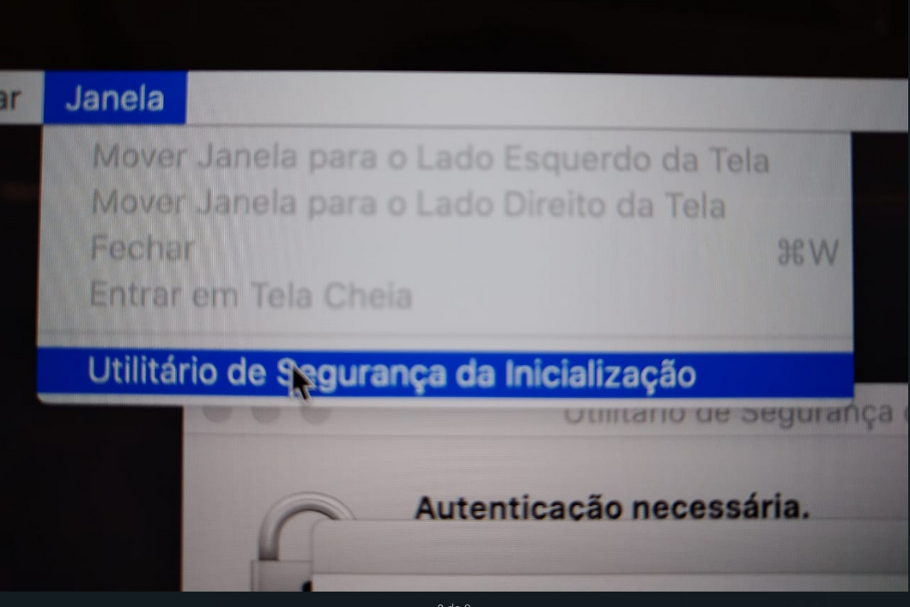
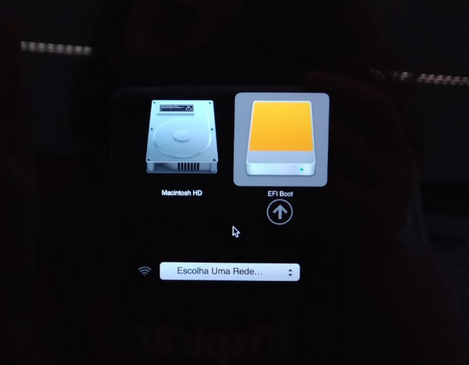

# Configurando o Notebook MacOs

### O que vamos precisar:

 **1.** Hub usb

 **2.** teclado externo

 **3.** mouse externo

 **4.** Adaptador Wifi usb

!!! warning "A etapa **Habilitando uso de midia externa para inicialização** só é necessaria para Macbook Pro 2019 + caso vc tenha alguma outra versão de Macbook, pule direto para a **Entrando no Gerenciador de inicialização**"

### Habilitando uso de midia externa para inicialização

Ao ligar o seu dispositivo, pressione e segure as teclas <kbd>Command(⌘)</kbd> + <kbd>R</kbd>

Vá em **Janela**, depois procure a opção **Utilitário de Segurança da Inicialização**

Selecione a opção **Permitir inicialização a partir de mídia externa ou removível**

{width=800}

Clique em **Ativar Senha de Firmware** Você vai precisar configurar uma senha, ela será usada toda vez que você precisar subir o Linux no seu MacOs

{width=800}

Clique em **Encerrar o Utilitário de Segurança da inicialização** 

{width=800}

### Entrando no Gerenciador de inicialização

Ao ligar o seu dispositivo, com o SSD plugado, pressione e segure a teclas  <kbd>Option(⌥)</kbd> ou <kbd>Alt</kbd>
Ao entrar na tela que permite selecionar outros volumes ou discos de inicialização, selecione a opção EFI boot 
Se o Mac estiver usando uma senha de firmware, você precisará inserir a senha.

{width=800}

Quando aparecer esta tela, apenas aperte <kbd>Enter</kbd>

{width=800}

Agora você tem um SSD externo configurado com tudo o que você precisa pra brilhar na matéria de Robótica e de Elementos neste semestre de emoções!
 
 
!!! warning "A senha de acesso está disponivel no folder que acompanha o SSD, recomendamos fortemente que troque a senha, [neste tutorial](../primeiros-passos/index.md) eu te mostro como fazer isso."
 
{width="700"}
