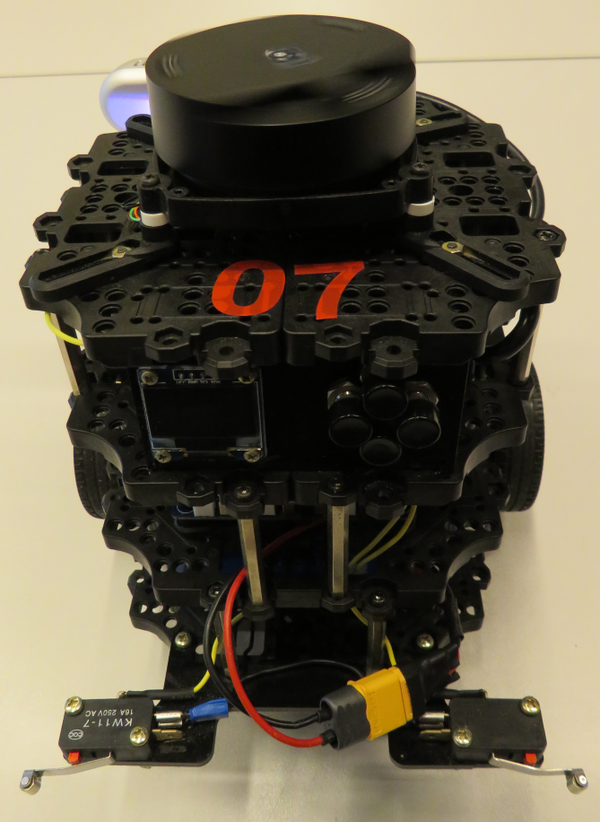
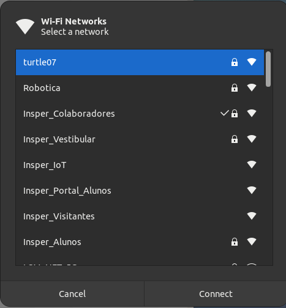
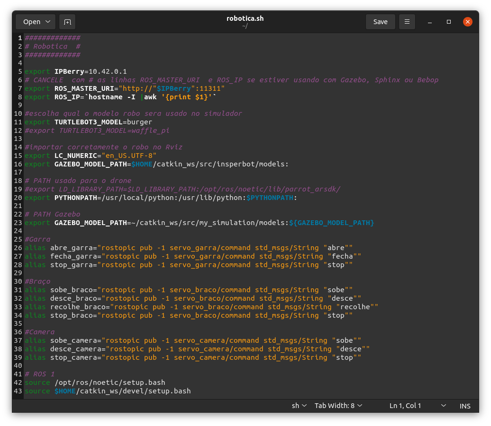
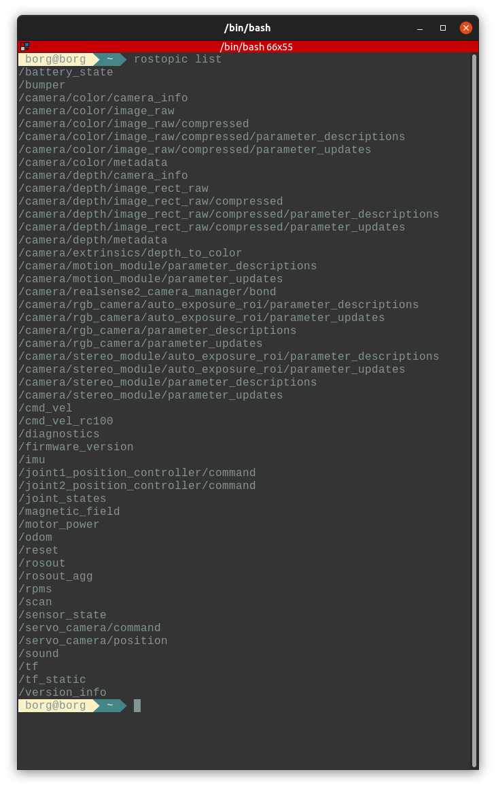
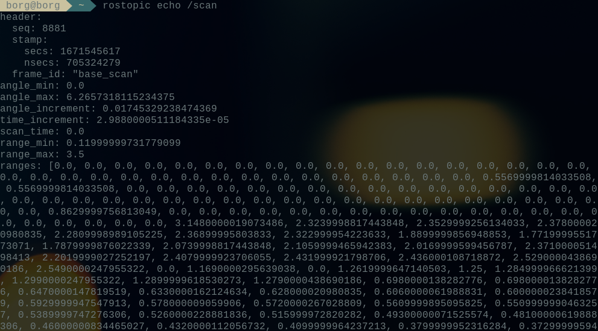
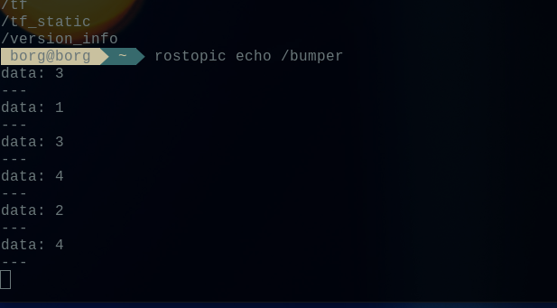
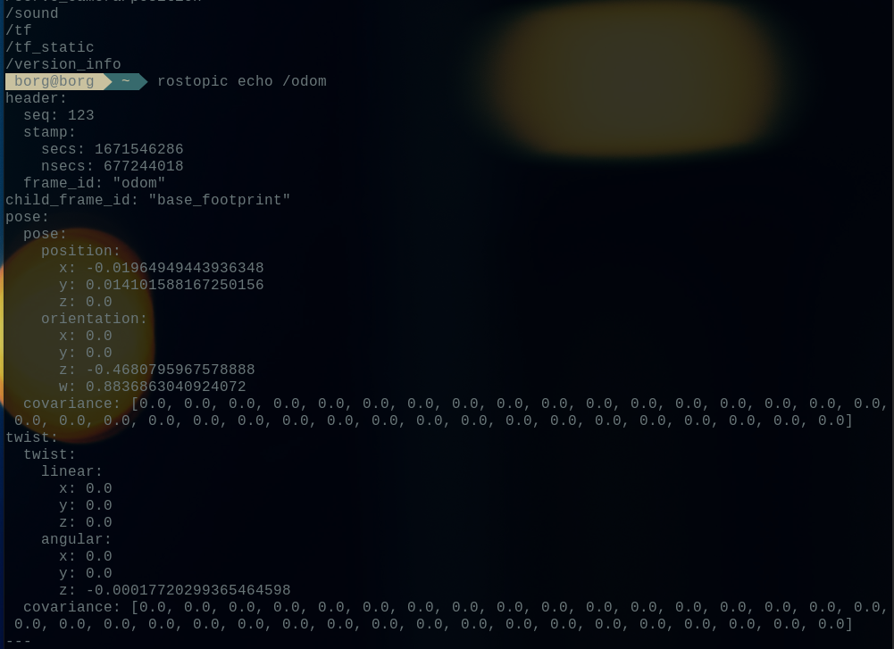
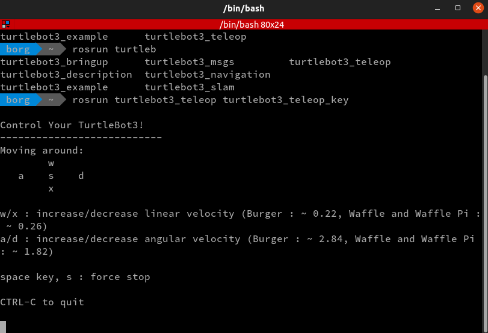
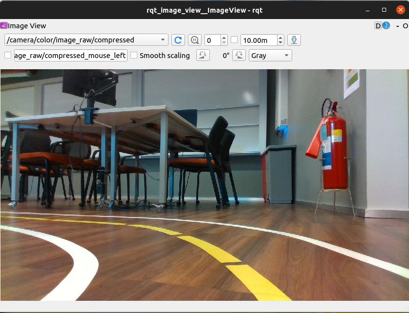

# Conectando no robô físico


## Ligando o Robô

O primeiro passo para usarmos o nosso querido Inperbot é ligar o robô. São três passos simples, mas importantes!

- Primeiro você deve conectar a bateria utilizando o plug amarelo;
- Depois você deve ligar o robô utilizando o botão que fica logo acima;
- Por último você deve aguardar o robô fazer uma pequena música. Isto significa que ele inicializou todos os serviços corretamente e está mostrando o seu endereço IP na telinha.


## Conectando na rede do robô

Para melhorar a velocidade da transmissão de imagem, nós utilizamos a conexão do tipo ah-hoc. Então é importante lembrar que ao se conectar no robô você ficará sem acesso à internet.

Agora que o Insperbot já está ligado, basta conectar na rede que ele liberou. Se atente ao número que está na parte de cima do robô, pois será o número da rede que você irá conectar. A senha da rede é **turtlebot** .





## Configurando o arquivo robotica.sh

BASH significa Bourne Again Shell. Há um número de shells diferentes, incluindo csh, zsh, dash e korn.

Um shell é um interpretador que executa operações como navegar por um sistema de arquivos, executar programas, modificar permi,ssões, enfim, é uma ferramenta importante do sistema operacional.

Você tem um arquivo chamado .bashrc no seu diretório “home”, o arquivo bashrc é um arquivo oculto, por isso tem um “.” no início do nome, nós usamos o arquivo .bashrc para definir personalizações ao nosso sistema, pois, toda vez que um terminal é aberto, o arquivo .bashrc é executado, isso é interessante para definir configurações ou variáveis de ambiente. 

Para acessar o bashrc, abra um terminal (<kbd>Ctrl</kbd> + <kbd>Alt</kbd> + <kbd>T</kbd>) e use o comando abaixo:

Perceba que lá no final do arquivo, temos algo como;

```
##########################
# 3s
##########################

source ~/elementos.sh
source ~/robotica.sh
```

Isso é porque estamos ativando esses arquivos que estão localizados na home, o [elementos.sh](http://elementos.sh) e o , [robotica.sh](http://robotica.sh). Eles definem configurações especificas para o ambiente, tanto da matéria de Robótica, como da matéria de Elementos de Sistemas.

É preciso abrir o arquivo [robotica.sh](http://robotica.sh) para definir as configurações que permitem o acesso ao Insperbot simulado. Abra um terminal (<kbd>Ctrl</kbd> + <kbd>Alt</kbd> + <kbd>T</kbd>)e use o comando a seguir para editar o arquivo robotica.sh

```
gedit /$HOME/robotica.sh
```

Para usar o robô físico, diferente do robô simulado precisamos que as linhas 5, 7 e 8 estejam ativas, ou seja sem o caractere de comentário, e a linha 5 tenha o IP do robô que aparece na telinha do robô. Veja baixo tanto a foto da telinha como deve ficar o arquivo robotica.sh:




Após estas alterações você deve salvar e fechar o gedit. Para efetivar a mudança, feche e abra novamente as janelas de terminais que está usando.

Se tudo aconteceu como deveria, usando o comando:

```
rostopic list
```

Você verá a seguinte resposta:



## Conhecendo os tópicos

Toda a troca de informações (comandos e informações ou utilizando os termos mais apropriados, publishers e subscribers) entre o computador e o robô é feita através de tópicos. No print que vimos da conexão com o robô fizemos o comando: 

```
rostopic list
```

Este comando lista os topicos disponiveis no robô. Vamos conhecer alguns destes topicos. 

O primeiro topico que vamos conhecer é o **/scan**. Este topico retorna os dados do sensor laser que fica em cima do robô. As informações obtidas são as distâncias do sensor até o obstaculo de grau em grau (360 medições).

Para vermos estas informações no terminal vamos usar o seguinte comando:

```
rostopic echo /scan
```



O print do terminal tras todas as informações do scan, incluindo os ragens mínimo e máximo (0,12m - 3,5m) e os numeros na sequência são os valores, em metros, para cada ângulo do sensor. Lembrando que ao mostrar **0.0** o sensor está nos dizendo que não tem nenhum obstáculo no range de 3,5m.

Outro topico que podemos visualizar no terminal é o topico /bumper. Este topico mostra se foram acionadas as chaves que estão nas extremidades do robô. Da mesma forma que o topico anterior, vamos usar o seguinte comando:

```
rostopic echo /bumper
```



Um ultimo topico para vermos no terminal é o topico /odom. Este topico traz a odometria do robô. Analogamente aos dois casos anteriores, utilizaremos o comando:

```
rostopic echo /odom
```



Podemos observar neste topico a localização do robô em relação ao ponto inical da odometria.

Quanto aos topicos em que enviamos informações ao robô vamos tratar dois deles nos próximos exemplos, sendo eles:

- /cmd_vel - utilizado para movimentar o robô;
- /camera/color/image_raw/compressed - utilizado para visualizar a câmera do robô;
- /joint1_position_controller/command - utilizado para mover o “braço” do robô;
- /joint2_position_controller/command - utilizado para abrir e fechar a “garra”.

## Teleoperando o robô

Para teleoperar o robô, você deve usar o seguinte comando:

```
rosrun turtlebot3_teleop turtlebot3_teleop_key
```



como podemos ver na imagem acima, os comandos para movimentação do robô são w (para frente), x (para trás), a (para a esquerda), d (para a direita) e s (parar). quanto mais tempo ou vezes se pressiona a mesma tecla, maior a velocidade do movimento.

## Abrindo a câmera

Você pode visualizar o que a camera está pegando com um comando bem simples:

```
rqt_image_view
```

Ao digitar este comando no terminal, teremos a seguinte janela aberta:



O ponto de atenção é o tópico da câmera, que no robô físico é: /camera/color/image_raw/compressed

Se você usar o tópico sem a imaem comprimida, verá que o delay entre os quadros aumenta substancialmente, impedindo o robô de ser controlado a distância com segurança. Tente ver os outros tópicos para entender um pouco mais sobre a câmera.

##