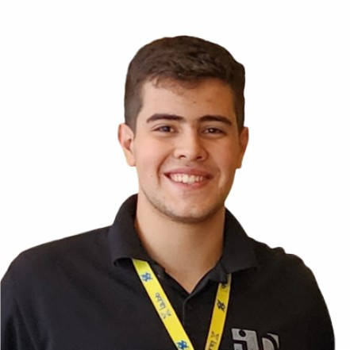

# Robótica Computacional 2023/1

Essa página reúne todos os materiais de apoio e de Robótica Computacional, 2023/1. Não deixe de se familiarizar com a disciplina visitando as seguintes páginas

- [Introdução à disciplina](modulos/00-intro/index.md)
- [Organização do Semestre](modulos/index.md)

## Informações importantes

A disciplina é dividida em duas turmas. [Clique aqui para acessar o formulário de escolha de turmas](https://forms.office.com/r/UQqCkDbWvy).

- Turma A: 
    - **SEG** 15:45 
    - **TER** 15:45
- Turma B: 
    - **SEG** 15:45 
    - **QUI** 15:45

Teremos os seguintes horários de atendimento, ambos na sala 404. 

- **TER** 18:00 (Ana Laiz + Igor)
- **QUI** 18:00 (Enricco + Igor) 

Além disso, nosso lab estará aberto de Segunda a Sexta nos seguintes horários

- **Lícia** - 07:00 - 16:00
- **Rogério** - 12:00 - 21:00

## Equipe

!!! people "Equipe atual"
    -  **Igor Montagner** *Professor*
    -  **Diego Pavan Soler** *Prof. Auxiliar*
    -  **Licia Lima** *Técnica de lab*
    -  **Rogério Cuenca** *Técnico de lab*
    -  **Ana Laiz Farias** *Ninja*
    -  **Enricco Gemha** *Ninja*

Robótica é uma disciplina que já teve contribuições de muitas pessoas. As pessoas abaixo já contribuíram para a disciplina no passado.

!!! people "Semestres passados"
    -  Fábio Miranda
    -  Antônio Selvatici
    -  Arnaldo Alves Viana Junior
