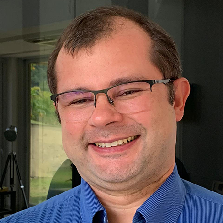

# Robótica Computacional {{ semestre }}

Essa página contém todos os materiais para o curso de Robótica Computacional de {{ semestre }}. 

## Estrutura do Curso

O curso é estruturado em três unidades principais, seguidas por um projeto final:

- **Unidade 1**
- **Unidade 2**
- **Unidade 3**
- **Projeto Final**

Cada unidade é dividida em **três módulos**, com cada módulo tendo a duração de uma semana.

### Detalhes dos Módulos

Dentro de cada módulo, os alunos participarão de:

- Aulas expositivas;
- Atividades práticas guiadas para o desenvolvimento da APS.

### Projeto Final

- Desenvolvido em grupos de 4 alunos.

### Avaliações

- A avaliação intermédiaria (AI) e avaliação final (AF), serão realizadas em suas respectivas semanas definidas no calendário acadêmico.

### Critérios de avaliação

- [Critérios de avaliação](criterios.md)

## Principais conteúdos abordados:

* **Unidade 1 - Introdução**

    * Módulo 1 - Introdução ao curso

    * Módulo 2 - Introdução ao ROS 2

    * Módulo 3 -  Controlando o Robô

* **Unidade 2 - Visão Computacional**

    * Módulo 4 - Tópicos de Processamento Digital de Imagem

    * Módulo 5 - Visão Robótica

    * Módulo 6 - Tópicos de Visão Computacional

* **Unidade 3 - Controle Robótico**

    * Módulo 7 - Ação Robótica e Visão

    * Módulo 8 - Controle Proporcional

    * Módulo 9 - Sistema de Localização

## Repositório 

Github da disciplina, pode ser acessado no link:

- [Github Robotica Computacional](https://github.com/Insper/robotica-computacional). 

Esse repositório contém todos os códigos e materiais de apoio da disciplina de todos os semestres, mas o conteúdo esta sujeito a alterações sem aviso prévio, por isso **recomendamos apenas o uso dos materiais disponibilizados nesse site**.

# Avisos

## Configuração do repositório para realização das APSs

No link abaixo você pode acessar o tutorial de configuração das APSs:

- [Configuração das APSs](aps.md)

## Informações importantes

A disciplina é dividida em duas turmas. [Clique aqui para acessar o formulário de escolha de turmas](https://forms.office.com/r/mAGHZzgGPr).

    

- Turma A: 
    - **SEG** 15:45 
    - **TER** 15:45
- Turma B: 
    - **SEG** 15:45 
    - **QUI** 15:45

Teremos o seguinte horário de atendimento: 

- **QUI** 18:00 (Diego) - sala 404

Além disso, nosso lab estará aberto de Segunda a Sexta nos seguintes horários:

- **Lícia** - 07:00 - 16:00
- **Rogério** - 12:00 - 21:00

## Equipe

!!! people "Equipe atual"
    -  **Diego Pavan Soler** *Professor*
    -  **Arnaldo Alves Viana Junior** *Prof. Auxiliar*
    -  **Licia Lima** *Técnica de lab*
    -  **Rogério Cuenca** *Técnico de lab*

Robótica é uma disciplina que já teve contribuições de muitas pessoas. As pessoas abaixo já contribuíram para a disciplina no passado.

!!! people "Semestres passados"
    -  Igor Montagner
    -  Antônio Selvatici
    -  Fábio Miranda
