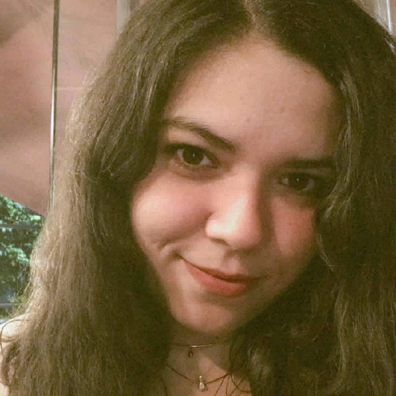

# Robótica Computacional 2023/1

TODO: resumo da disciplina

## Equipe

!!! people "Equipe atual"
    -  **Igor Montagner** *Professor*
    -  **Diego Pavan Soler** *Prof. Auxiliar*
    -  **Licia Lima** *Técnica de lab*
    -  **Rogério Cuenca** *Técnico de lab*
    -  **Ana Laiz Farias** *Ninja*
    -  **Enricco Gemha** *Ninja*

Robótica é uma disciplina que já teve contribuições de muitas pessoas. As pessoas abaixo já contribuíram para a disciplina no passado.

!!! people "Semestres passados"
    -  Fábio Miranda
