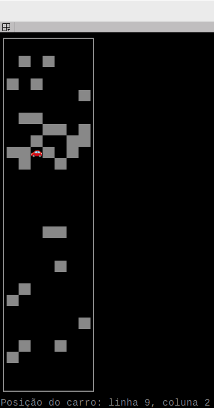

# Entregável 4 de Robótica Computacional

## Instruções gerais

**Aviso 1:** Sempre desenvolvam nos arquivos `.py` dos respectivos exercícios.

**Aviso 2:** Lembre-se de dar `commit` e `push` no seu repositório até o horário limite de entrega.

**Aviso 3:** Preencha o nome completo dos integrantes do seu grupo no arquivo `README.md` do seu repositório.

**Aviso 4:** Além de seu repositório, para todas as questões você **deve gravar um vídeo do seu robô executando a tarefa**. O vídeo deve ser feito gravando a tela do linux, [tutorial](https://insper.github.io/robotica-computacional/screen_record/), e deve ser postado no Youtube. 

No arquivo `README.md` do seu repositório existe o campo `Link do Vídeo` onde você deve colocar o link do video no youtube. Certifique-se de que o vídeo está público e que o link está correto. `NUNCA de commit no vídeo`, somente adicione o link.

# Exercício 1 (4 pontos)

Para treinar o uso de classes e funções, vamos criar um programa que simula um carro autonomo desviando de obstáculos. O carro deve ser capaz de desviar de obstáculos que estejam a sua frente, se movendo para a esquerda ou direita, e depois voltando a seguir para frente.

A parte visual do programa já está pronta, no arquivo `util.py`. A classe `Mapa` cria uma grade 2D de 30 linhas e 7 colunas, com paredes representadas por células com valor 2. O carro é representado por uma célula com valor 1, inicialmente posicionado na penúltima linha e na coluna do meio.

A cor branca representa células com obstáculos (2), a cor vermelha representa o carro (1) e a cor branca representa células livres (0).

## Instruções:

Sua tarefa é implementar a lógica de movimentação do carro usando a classe Control, que herda de Mapa. Na função `control` você deve verificar no mapa, se há algum obstáculo na linha de acima do carro. Se não houver obstáculo, o carro deve entrar no estado `forward`, modificando a variável `self.robot_state` para `forward`. Se houver obstáculo, o carro deve move para a esquerda ou direita, dependendo de onde há espaço.

As ações do carro devem achamar o método da classe `Mapa` `atualizar_posicao`, que recebe como parâmetro a ação do carro uma nova posição para o carro (y,x) ou (linhas, colunas). Quando chegar na primeira linha, o carro deve entrar no estado `stop`, finalizando o programa.

**DICA: ** Note que o carro começa na ultima linha e deve chegar na primeira linha, ou seja, o valor da linha deve diminuir.

Desenvolva seu código no arquivo `ex1.py`, na classe `Control`. Você pode testar seu código executando o arquivo `ex1.py`.

## Critérios de Avaliação:
1. **(+ 0,5)** Faz a herança da classe `Mapa` corretamente. 
2. **(+ 1,0)** Na função `control`, implementa a lógica para escolher a ação do carro, modificando a variavel `self.robot_state` de acordo com a situação.
3. **(+ 1,0)** Desenvolve corretamente as ações do carro, chamando o método `atualizar_posicao` da classe `Mapa`.
4. **(+ 0,5)** Dentro da função `control`, chama corretamente a ação atraves da maquina de estados, pelo dicionário `self.state_machine`.
5. **(+ 1,0)** O carro chega na primeira linha e entra no estado `stop`, **sem nunca ultrapassar as laterais do mapa**.

A entrega será feita pelo repositório do grupo no github e por um vídeo no youtube.

# Exercício 2 (6 pontos)

O objetivo deste exercício é completar os tutoriais relacionados a Linux, Simulador e Turtlebot3. Estes tutoriais são essenciais para desenvolver uma compreensão sólida das ferramentas e tecnologias que serão utilizadas nas próximas etapas do curso.

## Instruções:

* Acesse os tutoriais através do link fornecido: [Guias-Infratestrutura]().

* Complete cada tutorial com atenção, seguindo todas as instruções e procedimentos detalhados.

## Critérios de Avaliação:

A conclusão deste exercício será avaliada por um professor ou técnico. Para isso, você deverá demonstrar que completou cada tutorial de acordo com a planilha de checagem disponível no seguinte link: [Planilha de Checagem]().