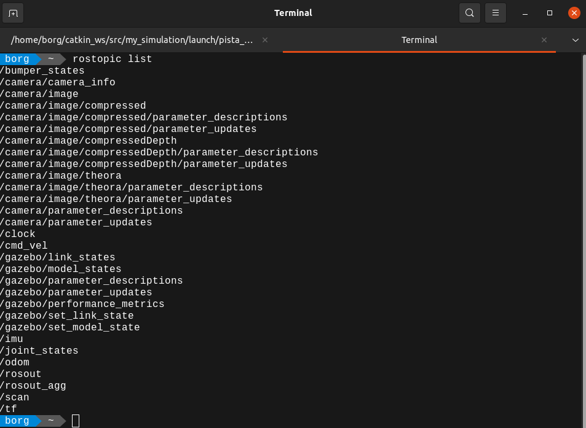
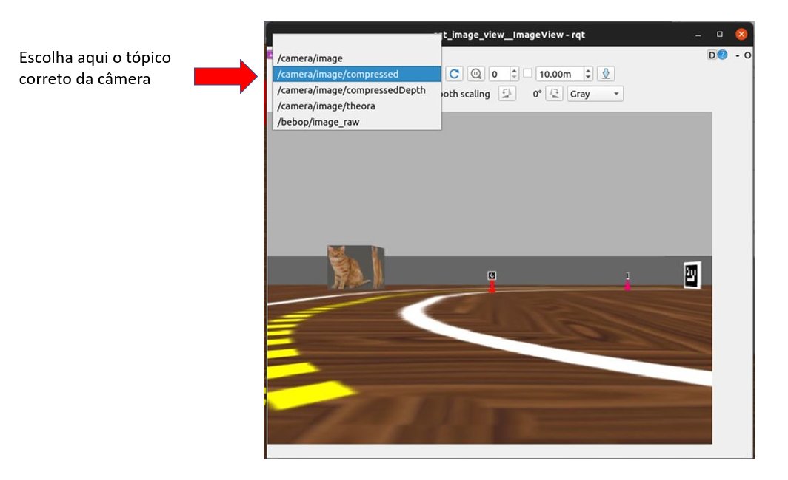

# Primeiros passos com o Robô Simulado

Neste guia iremos executar comandos para rodar o simulador usado na disciplina. O objetivo aqui é verificar se está tudo funcionando. Várias coisas serão um pouco misteriosas por enquanto, mas ficarão claras durante o semestre. 

## Configurando o arquivo .bashrc

O arquivo ~/.bashrc é excutado toda vez que abrimos um terminal. Nele podemos colocar configurações personalizadas para cada usuário. O SSD de robótica tem coisas úteis para as disciplinas de robótica el elementos. 

!!! tip
    Usamos o `~` comouma abreviação para a pasta `home` do usuário atual. No nosso caso, é equivalente a digitar `/home/borg/`

??? details
    BASH significa Bourne Again Shell. Há um número de shells diferentes, incluindo csh, zsh, dash e korn.

    Um shell é um interpretador que executa operações como navegar por um sistema de arquivos, executar programas, modificar permissões, enfim, é uma ferramenta importante do sistema operacional.


!!! tip
    O arquivo ~/.bashrc é um arquivo oculto, por isso tem um “.” no início do nome.
    
Para editar seu .bashrc, abra um terminal (<kbd>Ctrl</kbd> + <kbd>Alt</kbd> + <kbd>T</kbd>) e use o comando abaixo:

```bash
gedit ~/.bashrc
```

Perceba que lá no final do arquivo, temos algo como;

```bash
##########################
# 3s
##########################

source ~/elementos.sh
source ~/robotica.sh
```

Isso é porque estamos ativando esses arquivos que estão localizados na home, o *elementos.sh* e o , *robotica.sh*. Eles definem configurações especificas para o ambiente, tanto da matéria de Robótica, como da matéria de Elementos de Sistemas.

É preciso abrir o arquivo *robotica.sh* para definir as configurações que permitem o acesso ao Insperbot simulado. Abra um terminal (<kbd>Ctrl</kbd> + <kbd>Alt</kbd> + <kbd>T</kbd>)e use o comando a seguir para editar o arquivo robotica.sh

```bash
gedit ~/robotica.sh
```

Certifique-se de que as linhas 7 e 8 estão comentadas no seu arquivo robotica.sh.  Se não estiverem, comente colocando um `#` na frente da linha, salve e feche o arquivo.


Abra um novo terminal para recarregar as configurações do .bashrc que chama o arquivo *robotica.sh* (<kbd>Ctrl</kbd> + <kbd>Alt</kbd> + <kbd>T</kbd>)


## Abrindo o simulador

Execute o comando abaixo em um terminal novo para subir o cenário pista_s2 no simulador Gazebo.

```bash
ros2 launch my_gazebo pista-23B.launch.py
```

O seu terminal vai exibir algo parecido com isso:


!!! warning 
    Não feche o terminal, o gazebo está sendo executado através dele, se precisar usar o terminal, é melhor abrir um novo e deixar esse quietinho.
    


 Essa é a janela do Gazebo, o nosso simulador, com ele podemos simular o comportamento do robô, dos seus sensores, câmera, garra, quanto dos objetos como os creepers, arucos ou caixas coloridas. O ROS não sabe diferenciar se os dados estão vindo de um robô simulado ou se estão vindo de um robô real. É dessa forma porque os dados dos sensores chegam para o ROS através de tópicos, também é pelos tópicos que nós conseguimos enviar comandos para os motores ou para a garra do robô, isso é interessante porque via código o tratamento dos dados é bem parecido, tanto no robô real quanto no robô simulado. Para saber quais são os tópicos disponíveis para o ROS, abra um novo terminal  (<kbd>Ctrl</kbd> + <kbd>Alt</kbd> + <kbd>T</kbd>) e use o comando:

```bash
ros2 topic list
```

Uma lista de tópicos como essa vai aparecer pra você no terminal:



Conseguimos “escutar” os dados dos sensores que estão chegando via ROS usando o comando **rostopic echo nome_do_topico**

```bash
ros2 topic echo imu
```


Se quiser parar de acessar os dados da IMU do robô simulado, use o <kbd>Ctrl</kbd> + <kbd>C</kbd> 

Para abrir a câmera do robô use o comando:

```bash
ros2 run rqt_image_view rqt_image_view
```

Se a imagem não aparecer, provavelmente você está escutando um tópico fantasma, basta trocar a opção para acessar o tópico certo, conforme imagem abaixo:



Com o comando abaixo, podemos publicar valores de velocidade angular e linear direto no robô simulado

Em um novo terminal, utilize o comando fazer o robô andar loucamente:

```bash
ros2 topic pub -1 /cmd_vel geometry_msgs/msg/Twist "{linear: {x: 0.4, y: 0.0, z: 0.0}, angular: {x: 0.0, y: 0.0, z: 1.0}}"
```


Com o mesmo comando, podemos enviar 0 para os motores, parando o robô, **este comando pode ser útil em momentos de emergência**.

```bash
ros2 topic pub -1 /cmd_vel geometry_msgs/msg/Twist "{linear: {x: 0.0, y: 0.0, z: 0.0}, angular: {x: 0.0, y: 0.0, z: 0.0}}"
```


Também conseguimos teleoperar o robô com o comando abaixo:

```bash
ros2 run turtlebot3_teleop teleop_keyboard
```

Para controlar o robô, use 

- **w** para ir para frente
- **s** para parar o robô
- **a** para ir para esquerda <
- **d** para ir para direita >
- **x** para dar ré

 É importante que você mantenha o terminal ativo para conseguir teleoperar o robô (clicando no terminal pra ativar ele)


Foi divertido, porém, vamos controlar o robô via código não é mesmo?

Se estiver com o teleop aberto, mate o terminal, clicando no terminal que está com o comando do teleop e apertando as teclas <kbd>Ctrl</kbd> + <kbd>C</kbd>. Não é legal ter lugares diferentes enviando comandos para o robô, normalmente dá conflito.

## Parando o robô

Vamos mover novamente o robô, desta vez, sem passar o argumento `-1` que limita o número de vezes que o comando é publicado.

```bash
ros2 topic pub /cmd_vel geometry_msgs/msg/Twist "{linear: {x: 0.4, y: 0.0, z: 0.0}, angular: {x: 0.0, y: 0.0, z: 1.0}}"
```

Para interromper o comando, use o  <kbd>Ctrl</kbd> + <kbd>C</kbd>, você perceberá que o robô continuará girando loucamente, apesar do comando não estar sendo executado. Isso acontece porquê o robô mantém em execução o último comando enviado. Se você quiser parar o robô, é preciso enviar 0 para os motores, como fizemos anteriormente, mas desta vez vamos fazer diferente. Vamos facilitar nossa vida para **futuros momentos caóticos de robô desgovernado**, criando um alias no seu arquivo robotica.sh.

Primeiro, abra o arquivo *robotica.sh* 

```bash
code /$HOME/robotica.sh
```

Depois, defina o alias que será o seu “comando de emergência” no arquivo robotica.sh, vou deixar um de exemplo aqui, mas você pode personalizar o seu.

```bash
# Comando para parar o Insperbot

alias sos='ros2 topic pub -1 /cmd_vel geometry_msgs/msg/Twist "{linear: {x: 0.0, y: 0.0, z: 0.0}, angular: {x: 0.0, y: 0.0, z: 0.0}}"'
```

!!! tip
    Um *alias* é um apelido para um comando já existente. Quando digitarmos *sos* no terminal o *bash* irá substituir por todo aquele comando.

Salve o arquivo, abra um terminal novo e teste o seu alias, ele será seu fiel companheiro. Lembre-se de que é preciso encerrar o código python que controla o robô para que não existam comandos concorrendo o controle do robô. 


## Retornar o mundo simulado para posição inicial
Apertando as teclas `ctrl + r` você pode reiniciar o mundo simulado.
