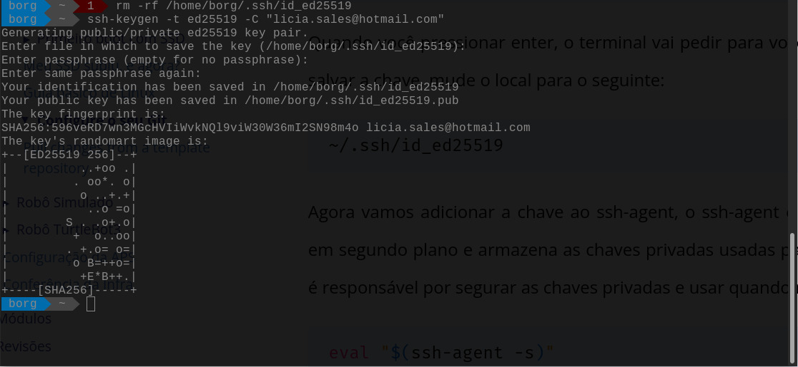

# Configure o seu Git

Boas noticias, não precisa instalar o Git, deixamos isso pronto pra você, porém, algumas configurações só você pode fazer, te mostramos neste guia algumas noções básica sobre Git, GitHub e quais são os passos para fazer as configurações necessárias, bom proveito!

## O que é o Git?

O Git é um sistema de controle de versão distribuído. Um sistemas de controle de versão tem a função de registrar qualquer alteração feita em cima de um código, armazenando essas informações e permitindo voltar a versões anteriores de uma aplicação de modo simples e rápido. Este tipo de sistema também simplifica muito o processo de compartilhamento de um projeto com um time.

Um repositório ou um projeto Git, engloba toda a coleção de arquivos e pastas associados a um projeto, junto com o histórico de revisão de cada arquivo. O histórico de arquivos aparece como instantâneos no tempo denominados commits. Os commits podem ser organizados em várias linhas de desenvolvimento denominadas branches. Os repositórios são unidades auto-confinadas e qualquer pessoa que tiver uma cópia do repositório pode acessar toda a base de código e seu histórico. Um repositório Git também permite a interação com o histórico, clonagem do repositório, criação de branches, commiting, merge, comparação de alterações entre versões de código e muito mais.

Por meio de plataformas como GitHub, o Git também oferece mais oportunidades para transparência e colaboração do projeto. Repositórios públicos ajudam as equipes a trabalhar juntas para criar o melhor produto final possível.


!!! tip
    Para saber mais, consulte a [documentação](https://docs.github.com/pt/get-started/using-git/about-git)

## O que é GitHub?

GitHub é uma plataforma de hospedagem de código para controle de versão e colaboração **usando as ferramentas Git**, possibilita que desenvolvedores trabalhem em um único projeto podendo acessar as contribuições da equipe em tempo real, o GitHub também possui recursos de organização e gestão de projetos.

GitHub cria colaboração diretamente no processo de desenvolvimento. O trabalho é organizado em repositórios onde os desenvolvedores podem definir os requisitos e expectativas para os integrantes da equipe. Em seguida, ao usar o fluxo GitHub, os desenvolvedores simplesmente criam um branch para trabalhar nas atualizações, enviar alterações para salvá-las, abrir um pull request para propor alterações e fazer merge de pull requests quando todos estiverem de acordo. Para obter mais informações, confira [Fluxo do GitHub](https://docs.github.com/pt/get-started/quickstart/github-flow).

## Resumindo as diferenças entre Git e GitHub:

### Git
É um software que é instalado na máquina do usuário e é executado localmente, possui um conjunto de ferramentas que monitora o histórico de alteraçoes onde qualquer versão anterior do projeto pode ser recuperada a qualquer momento, isso é Git:

- git init
- git clone
- git status
- git add meu_arquivo.py
- git add minha_pasta_completona
- git commit -m "minha mensagem de commit"
- git push origin nome_da_branch
- git checkout -b nome_da_nova_branch

[Resumo de comandos git via terminal](https://training.github.com/downloads/pt_BR/github-git-cheat-sheet/) 

### GitHub
É uma plataforma que hospeda códigos e possibilita a colaboração com repositórios públicos, é o chamado repositório remoto. Isso é GitHub:

- Abrir um pull request
- Criar um Fork de um repositório remoto
- Criar um repositório público
- Criar um repositório privado
- Criar um clone de um repositório remoto
- Criar plugins de automação com actions
- Criar Issues no repositório remoto
- Criar organizações com gerenciamento de permissões entre integrantes

Se quiser saber mais, visite o [canal do YouTube oficial do GitHub](https://www.youtube.com/githubguides) ou a [documentação oficial.](https://docs.github.com/pt/get-started/quickstart/hello-world)


## Se identificando para o Git

A primeira coisa que devemos fazer antes de começar a usar o Git é configurar o **nome de usuário** e **endereço de e-mail**. Isto é importante porque cada *commit*  usa esta informação, e ela é carimbada de forma imutável nos seus *commits*:

Abra um terminal usando o atalho `Super + T`, então use os comando a seguir para configurar o seu user name e seu email:

```bash
git config --global user.name "Seu Belo Nome Aqui"
git config --global user.email Seu_email_do_GitHub_aqui@exemplo.br
```

!!! tip
    Não precisa colocar o seu login do GitHub ao configurar o user.name, pode ser o seu nome sem problemas

Você precisara fazer a configuração de usuário e email somente uma vez, por que estamos usado a opção `--global`, o Git usará esta configuração para qualquer coisa que você fizer no Git em qualquer parte do sistema.
Se você precisar substituir os dados de usuário e email para um projeto específico, você pode executar o mesmo comando **sem a opção** `--global` dentro do projeto específico, então a configuração será local e só vai funcionar naquele espaço.

### Seu Editor

Agora que a sua identidade está configurada, você pode escolher o editor de texto padrão que será chamado quando o Git precisar que você digite uma mensagem. Se não for configurado, o Git usará o editor padrão, que normalmente é o nano.
Se você quiser usar um editor de texto diferente, como o Visual Code, você pode fazer o seguinte:

```bash
git config --global core.editor code
```

## Configurando autenticação por chave ssh
Autenticação por chave SSH é um método de garantir uma conexão segura entre dois sistemas. Uma chanve SSH na verdade consiste de um par de chaves, uma chave privada, que é mantida em segredo no computador do usuário, e uma chave pública, que é colocada no servidor. Quando você tenta conectar-se ao um servidor, no caso tenta se conectar na sua conta do Git, ele criará um desafio criptográfico usando sua chave pública, que só pode ser resolvido com a chave privada correspondente. Assim, o Git pode confirmar sua identidade automaticamente, sem que você precise enviar uma senha ou seu personal access token.

Vamos agora aprnder como confirguardar a sua chave SSH no GitHub.

### Gerando uma chave SSH

Primeiramente devemos criar uma chave SSH, para isso, abra um terminal e execute o seguinte comando substituindo o endereço de e-mail pelo seu GitHub. Pressione enter para aceitar o local padrão para salvar a chave, ao menos que você deseje salvar com outro nome.

```bash
ssh-keygen -t ed25519 -C "your_email@example.com"
```

Você receberá uma mensagem parecida com a imagem a seguir, se desejar adicionar uma senha para a chave, digite uma senha e pressione enter, se não quiser adicionar uma senha, pressione enter sem digitar nada. Se adicionar uma senha, você precisará digitar a senha toda vez que usar a chave.


Por fim, você receberá uma mensagem parecida com a imagem a seguir, isso significa que a chave foi criada com sucesso.



Agora vamos adicionar a chave ao ssh-agent, o ssh-agent é um programa que roda em segundo plano e armazena as chaves privadas usadas para autenticação SSH, ele é responsável por segurar as chaves privadas e usar quando necessário.

```bash
eval "$(ssh-agent -s)"
ssh-add ~/.ssh/id_ed25519
```

Você receberá uma mensagem parecida com a imagem a seguir.


### Adicionando a chave SSH ao GitHub

Agora vamos adicionar a chave SSH que criamos ao GitHub, para isso, vamos copiar o conteudo do arquivo `id_ed25519.pub` e cola-lo na sua página de configurações do GitHub. Voce pode fazer isso abri o arquivo com o seu editor de texto favorito e copiar o conteudo, ou pode usar o comando abaixo:
```bash
sudo apt install xclip
alias pbcopy="xclip -sel clip"
pbcopy < ~/.ssh/id_ed25519.pub
```

Após esse último comando, o conteúdo da sua chave SSH estará na sua área de transferência, agora basta colar na sua página de configurações do GitHub.
Para acessar a página de configurações, clique na sua foto de perfil no canto superior direito da página do GitHub, em seguida, clique em **Settings**.


Depois, na barra lateral esquerda, clique em **SSH and GPG keys**. Em seguida, clique em **New SSH key** ou **Add SSH key**.


Preencha o campo **Title** com um nome descritivo para a chave, por exemplo, **SSD Robotica**. Em seguida, cole a chave no campo **Key**. Finalmente, clique em **Add SSH key**.

Agora não será mais nescessario digitar seu usuário e senha toda vez que você executar um comando git, o GitHub vai reconhecer a sua chave SSH e vai autenticar você automaticamente.

### Clonando repositorios
Agora, quando for clonar um repositório do github, pegue o link clicando no botão **SSH**