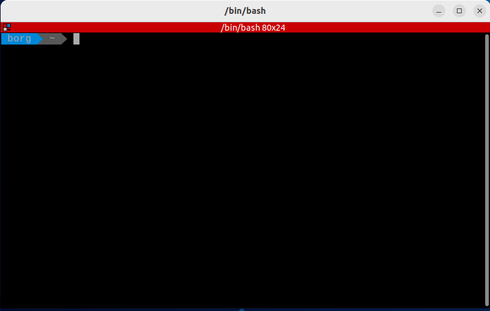
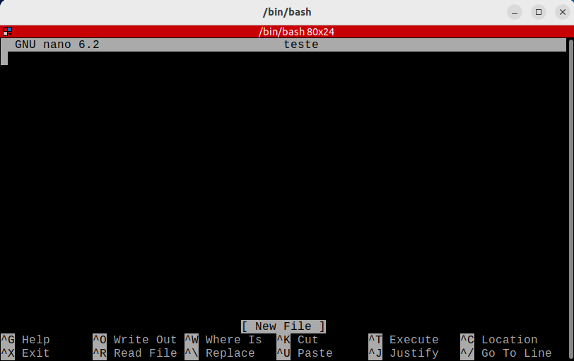

# Guia básico de Linux

Com este tutorial vamos guiar você por alguns exercícios práticos usando comandos e apresentando conceitos básicos que vão te ajudar muito no decorrer do curso. Não assumiremos nenhum conhecimento prévio, mas no final esperamos que você se sinta um pouco mais confortável na próxima vez que se deparar com algumas instruções que começam com “Abrir o terminal”. 

!!! tip 
    Caso tenha interesse em aprofundar alguns conceitos sobre o Sistema Operacional Linux, [clique aqui](um-pouco-de-historia.md).

## O que você vai aprender:

- Comandos básicos via terminal do Linux
- Comando bonus para facilitar sua vida


## Conhecendo e utilizando o Terminal

O Terminal do Linux é uma ferramenta que facilita a manipulação do sistema, interpretando os comandos do usuário, fazendo a ponte com o hardware do seu computador

### Abrindo o terminal

A forma mais facil de abrir o terminal é atraves do atalho:

Super  +  T

Neste momento nos deparamos com a janela do terminal aberta no ambiente do usuário (home ou ~) pronta para receber os primeiros comandos:



## Comando "apt"

`APT` é um conjunto de ferramentas usadas pelo Linux para administrar o sistema de forma automática, é possível instalar, atualizar e remover programas e suas dependências via apt;

### Atualizar a "lista de pacotes"

Com o comando abaixo, usamos o `apt` para atualizar todos os programas instalados com essa ferramenta;

```bash
sudo apt update

```

Com o comando abaixo, é possível baixar e instalar a versão mais atual de todos os programas instalados anteriormente via `apt`;

```bash
sudo apt upgrade

```

### Instalar pacotes via apt

Com este comando, usamos o `apt` para encontrar, baixar e instalar automaticamente o programa no nosso computador;

```bash
sudo apt install -y geogebra

```

Após finalizar a instalação, podemos executar a nova ferramenta, apenas digitando o nome dela no terminal.

```bash
geogebra

```

### Remover pacotes via apt

Tambem é possivel desinstalar um programa que foi baixado via `apt`, basta usar o comando `remove`, como no exemplo abaixo;

```bash
sudo apt remove geogebra

```


### Atualizar pacotes já instalados

Se quiser atualizar um pacote especifico, é possivel determinar o programa a ser atualizado;

```bash
sudo apt --only-upgrade install google-chrome-stable

```

```bash
sudo apt --only-upgrade install firefox

```


### Instalar pacotes via Ubuntu Software

{width=100}

Podemos instalar pacotes via `Ubuntu Software`, basta clicar em Show Applications, no canto inferior direito da tela, e digitar `Ubuntu Software` na janela de busca;

{width=800}

Agora clique na lupinha e digite o programa que deseja instalar;

{width=800}


Clique no software escolhido, e depois, clique no botão Instalar;

{width=800}

Terminada a instalação, basta clicar no botão `Launch` para executar o programa, ou `Remove` para desinstalar;

{width=800}

### Navegando entre diretorios e arquivos

O Sistema Linux trabalha com dois elementos principais: Diretórios(pastas) e Arquivos.

- Os arquivos armazenam dados(txt,md,doc...), executam ações (py,jar,bin...)
- Diretórios são as pastas que agrupam os arquivos e organizam o sistema.

{width=800}

[Fonte](https://commons.wikimedia.org/wiki/File:FilesAndFolders.png)

### Comando "cd"

O comando **cd** , vem de Change Directory, ele é um dos comandos mais utilizados no terminal do Linux, isso porque ele permite que acessemos um diretório especifico. Vamos acessar o nosso  repositorio de Elementos de Sistemas via terminal, e atualizar ele via comandos git.

Abra um terminal Super + T e execute o comando para entrar na pasta de Elementos de Sistemas:

```
cd /$HOME/Z01.1

```

No mesmo terminal, utilize o comando abaixo para garantir que estamos com a ultima versão disponível na branch principal do repositório de Elementos de Sistemas no GitHub:
```
git pull

```

!!! tip 
    É uma boa prática manter os seus repositórios do GitHub sempre atualizados, antes de começar a trabalhar, não esqueça de dar um `git pull`, para ter certeza de que está trabalhando com a ultima versão dos arquivos no seu repositório!

Feita a atualização, vamos instalar uma ferramenta que permite visualizar toda a estrutaras de árvore da pasta, no terminal que já está aberto, utilize o comando abaixo:

```
sudo apt install tree

```

Agora digite o comando para visualizar a árvore do repositório de Elementos de Sistemas:

```

tree -d -L 4

```

Esta ferramenta é útil para navegar de forma mais eficiente dentro do sistema, se não sabemos aonde determinado repositório está, é possivel consultar a árvore para localizar o seu caminho visualmente.

Os paramentros -d -L 2 indica que que queremos listar (-L )até o quarto (4) nível na hierarquia de pastas, apenas as pastas (-d)


Para listar tudo digite apenas tree.


Na pasta em home, Z01.1 -> Projetos -> B-LogicaCombinacional -> src  estão os arquivos .hdl da última aula, vamos dar uma olhada neles.

```
cd ~
cd Z01.1
cd Projetos
cd B-LogicaCombinacional
cd src

```

ou de forma mais ágil, digite:

```
cd /home/borg/Z01.1/Projetos/B-LogicaCombinacional/src

```

!!! tip  
    Utilize a tecla TAB para autocompletar ou sugerir comandos no terminal.


Para acessar o diretório anterior podemos digitar:

```
cd ..

```

### Comando "pwd"

Podemos verificar o caminho do diretório que estamos digitando:

```
pwd

```

Para acessar o diretório home, basta digitar;

```
cd

```

Toda vez que abrimos um novo terminal, ele é inicializado na home do usuário.


### Comando "ls"

O comando **ls** é utilizado pra visualizar o conteúdo de um diretório.

```
ls

```

## Visualização de arquivos e pastas ocultos

O comando "ls" sozinho não exibe arquivos ocultos, que são arquivos e pastas que começam com ".". Talvez, em algum momento será necessário atualizar ou modificar as variáveis de ambiente, para isso, teremos que editar um arquivo oculto chamado "**.bashrc**", no momento precisamos apenas saber que este arquivo se encontra na home do usuario `~` e que após editado precisamos executar o `source ~/.bashrc` ou `feche o terminal e abra um novo` para recarregar as atualizações do arquivo.

```
cd ~
ls -a

```

ou para listar informações mais detalhadas:

```
ls -la

```

ou simplismente:

```
ll

```

```
cd ~
code .bashrc
source .bashrc

```

### Comando "mkdir"

Para criar um novo diretório no ambiente em que você está, basta digitar o comando a seguir;

```
mkdir ~/Documents/nome_da_pasta/nome_da_pasta

```

Para criar um novo diretório em um local especifico, basta especificar o caminho que o diretório deverá ser criado;

!!! tip 
    Relembrando, Você sempre pode usar a tecla TAB para auto-completar os comandos.

```
mkdir /home/borg/Documents/nome_da_pasta

```

ou

```
mkdir ~/Documents/nome_da_pasta

```

### Comando "touch"

O comando  **touch** cria arquivos vazios, na extensão que você definir;

```
touch /home/borg/Documents/nome_da_pasta/teste.py

```

```
touch /home/borg/Documents/nome_da_pasta/testando_outra_extensao.txt

```

O comando **>** funciona exatamente como o **touch**:

```

> /home/borg/Documents/nome_da_pasta/outro_teste.py

```

```

> /home/borg/Documents/nome_da_pasta/mais_um_teste.txt

```

Se você tentar abrir um arquivo que não existe, usando um editor de texto pelo terminal, o sistema cria o arquivo pra você, observe;

```

nano /home/borg/Documents/nome_da_pasta/usando_o_nano.py
code /home/borg/Documents/nome_da_pasta/usando_o_vscode.md
gedit /home/borg/Documents/nome_da_pasta/o_bloco_de_notas.txt

```

### Comando "cp"

Para copiar arquivos e diretorios, basta  digitar:

```
> /home/borg/Documents/nome_da_pasta/meu_programa_python.py
cp -R /home/borg/Documents/nome_da_pasta/meu_programa_python.py /home/borg/Documents/

```

No exemplo acima foi criado um arquivo chamado meu_programa_python.py e uma copia do arquivo "meu_programa_python.py" dentro do diretório Documents.

### Comando "mv"

Para mover arquivos e diretorios, o famoso Ctrl + X - Ctrl + V, basta  digitar:

```
mv /home/borg/Documents/nome_da_pasta/testando_outra_extensao.txt /home/borg/Documents/

```

No exemplo acima o arquivo "testando_outra_extensao.txt" foi movido para dentro do diretório Documents (recortado e colado).

### Comando "mv"

O comando **mv** tambem serve tanto para mover, com para renomear arquivos e diretorios:

```
mkdir /home/borg/Documents/nome_da_pasta/pastinha
mv /home/borg/Documents/nome_da_pasta/pastinha /home/borg/Documents/nome_da_pasta/nova_pastinha

```

!!! warning 
    Cuidado para não sobrescrever arquivos e pastas impoortantes na hora de executar estes comandos.


### Comando "rm"

Para excluir arquivos e diretórios, o famoso  Shift +  Del basta digitar:

```
rm -rf /home/borg/Documents/nome_da_pasta/nova_pastinha

```

!!! warning 
    Arquivos e pastas são apagados permanentemente, não vão para lixeira. No caso de diretórios, apaga o diretório e tudo que está dentro dele, use o comando com sabedoria.

## Super Usuário

### Comando "sudo"

Por questões de seguraça, o Linux trabalha com permissões de usuários e para determinados arquivos ou comandos apenas o usuario administrador (root) pode executar.
A titulo de curiosidade, "sudo" significa **S**uper **U**ser **DO**. Quando executar comandos com sudo, será necessário informar a senha.

### Comando "chmod"

Chmod vem de change mode -> mode é o nome do campo que guarda as permissões de um arquivo. As permissões servem para determinar se um usuario ou grupo terá permissões para ler, gravar, executar. Existem diversas configurações possiveis e a que mais utilizamos dá a permissão de execução a um código qualquer, como um python, por exemplo;

```
touch /home/borg/Documents/nome_da_pasta/teste.py
chmod a+x /home/borg/Documents/nome_da_pasta/teste.py

```

A concatenação de a+x significa que estamos permitindo para todos (a = all) usuários e grupos executem (x = execution) o
**teste.py**

## Editando arquivos

Existem várias ferramentas para edição de texto, de um modo geral, podemos dizer que existem 2 grupos principais,
os que rodam direto no console (terminal) e os que possuem uma interface gráfica.

### Editor nano

O nano é um editor do modo console, ou seja, abre no proprio terminal.

{width=800}

### Abrir

Digite no terminal **nano** e o nome do arquivo com a extensão, caso não exista um arquivo com esse nome um novo arquivo será criado.

```
nano /home/borg/Documents/nome_da_pasta/nano.md
nano /home/borg/Documents/nome_da_pasta/nano.txt

```

### Localizar palavra

Para fazer uma busca no texto pressione Ctrl + W, digite a palavra e aperte Enter.

### Salvar e Sair

Para salvar, precione Ctrl + S.
Para sair Ctrl + X.
Para sair sem salvar alteraçes,  Ctrl + X e N.

### Editor gedit

Muito parecido com o famoso bloco de notas do Windows.

{width=800}

### Abrir

Digite no terminal **gedit** e o nome do arquivo com a extensão, caso não exista um arquivo com esse nome um novo arquivo será criado.

```
gedit /home/borg/Documents/nome_da_pasta/roda_tartaruga.py
gedit /home/borg/Documents/nome_da_pasta/roda_tartaruga.md

```

### Localizar palavra

Para fazer uma busca no texto pressione Ctrl + F, digite a palavra e tecle Enter.

### Salvar e Sair

Para salvar e sair, pressione Ctrl + S ou clique em salvar para salvar e para sair  Alt + F4.

### Editor vscode

O editor vscode é uma ferramenta que possui mais recursos que auxiliam no desenvimento de codigo.

{width=800}

### Abrir

Digite no terminal **code** e o nome do arquivo com a extensão, caso não exista um arquivo com esse nome um novo arquivo será criado.

```
code /home/borg/Documents/nome_da_pasta/roda_tartaruga.py

```

### Localizar palavra

Para fazer uma busca no texto pressione Ctrl + F, digite a palavra e tecle Enter.

### Salvar e Sair

Para salvar e sair, pressione  Ctrl + S ou clique em salvar para salvar e para sair Alt + F4

## BONUS

Comandos úteis para verificar informações do sistema, encontrar bugs, e encerrar programas travados;

### Informações dos dispositivos conectados na USB

Se você não tem certeza se o dispositivo conectado a sua porta USB foi reconhecido, use este comando e verifique o log do sistema;

```
lsusb

```

### Informações dos dispositivos conectados na PCI

Se você não tem certeza se o dispositivo conectado a sua porta PCI foi reconhecido, use este comando e verifique o log do sistema;

```
lspci

```

### O programa travou, e agora?

Para destravar uma tela, use "xkill" e clique na tela com o mouse.

```
xkill

```

Para emcerrar um processo, digite o comando abaixo, e o nome do software que deseja parar;

```
pkill terminal

```

Espero que você esteja se sentindo mais confortável para explorar e personalizar o seu Ubuntu, divirta-se!


### Fontes:
[Linux: conheça o Linux OS](https://www.redhat.com/pt-br/topics/linux)
[O que é open source?](https://www.redhat.com/pt-br/topics/open-source/what-is-open-source)
[Código Aberto e Software Livre não significam a mesma coisa!](https://www.tecmundo.com.br/linux/1739-codigo-aberto-e-software-livre-nao-significam-a-mesma-coisa-.htm)
[The Linux command line for beginners](https://ubuntu.com/tutorials/command-line-for-beginners#1-overview)
