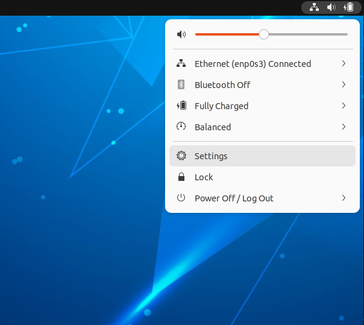

# Meu SSD subiu, e agora?

Assumindo que você seguiu o [tutorial anterior](../recebi-meu-ssd/index.md), este guia detalha como: 

**1.** Fazer o login

**2.** Trocar a senha

**3.** Configurar a rede

**4.** Atualizar o Sistema

## Fazendo Login

Se tudo deu certo até agora, você encontrará esta imagem:

{width="800"}

Clique no pinguin - Usuário **borg** - e coloque a senha inicial: **fl1pfl0p**

{width="800"}

Você encontrará este ambiente de trabalho

{width="800"}

## Trocando a Senha

A primeira configuração que recomendamos é trocar esta senha inicial. Temos duas formas de realizar esta tarefa, pelo ambiente gráfico e pelo terminal. Vamos ver as duas formas de realizar, iniciando pelo ambiente gráfico.

Clique no canto superior direito, em seguinda em settings.

{width="800"}

Na barra da esquerda, escolha o item Users e clique no botão no canto superior direito chamado Unlock.

{width="800"}

Ele pedira a senha de usuário (ainda é fl1pfl0p). Depois basta clicar em Password. Ele pedira a senha atual e a nova senha. Lembre-se que precisa ser uma senha forte, ou seja, ter letras maiúsculas, minúsculas, números e símbolos. Ter seu comprimento superior ou igual a 8 dígitos.

{width="800"}

Após preencher a nova senha e confirmar a nova senha, se ela estiver dentro dos padrões de segurança, o botão Change ficará habilitado.

{width="800"}
A partir de agora todas as vezes que for pedida a senha de usuário você deve usar a nova senha. É recomendado que reinicie a máquina para que o ambiente gráfico utilize a nova senha.

A outra forma de fazer a mudança de senha é pelo terminal. Para isso, você pode abrir o terminal (veja dois ícones de terminais na barra de atalhos). Você pode clicar no programa com o mouse ou usar as teclas de atalho SUPER+T **(Super é a tecla do windows).**

Com o terminal aberto (não importa qual dos dois você escolheu), você digitará o comando: `passwd` em seguida forneca a **senha atual** (fl1pfl0p) e depois a **nova senha**, lembrando que precisa ter no mínimo 8 dígitos, usar letras maíusculas e minúsculas, números e símbolos. Ele pedirá para **confirmar a nova senha** e pronto! Sempre que precisar trocar a senha, refaça este procedimento.

!!! dica
    É normal não aparecer nada no terminal quando você digita a senha, é uma medida de segurança do terminal esconder o display de caracteres.

{width="800"}
## Adicionando Teclado PT-BR

Estamos usando o Ubuntu no idimoa Inglês para facilitar a compreenção dos termos e palavras-chave, uma vez que o sistema é desenvolvido originlmante em inglês e depois traduzido para outros idiomas.

Para podermos utilizar as teclas das derivações do layout ABNT (aqueles teclados físicos que possuem as teclas de "ç" utilizados no idioma Português do Brasil), precisamos adicionar um novo layout. 

Clique, então no canto superior direito e em **Settings**, como na figura abaixo.

{width="800"}

Na tela de configurações, clique em **Keyboard** e depois no sinal de **+** encontrado abaixo do layout English (US) no item **Input Sources**.

{width="800"}

Agora clique nos três pontos que aparece após as possibilidades apresentadas:

{width="800"}

Role a tela até aparecer **Portugeses** e clique nesta opção:

{width="800"}

Então selecione **Porguese (Brazil)** e clque em **Add**

{width="800"}

Após adicionar o novo Layout que, ao selecionar, você troca o layout do seu teclado e o idioma de digitação, você encontrará um ícone com as iniciais do idioma em uso na parte superior direita da Área de Trabalho. Ela será **en** ou **pt** neste caso. Para trocar o idioma que está utilizando, você pode clicar neste ícione, como mostrado na figura a seguir, ou pressionando simultaneamente as teclas CTRL+SPACE.

{width="800"}


## Configurando a Rede

Esta etapa não é difícil mas requer atenção em alguns detalhes. Você utilizará a rede **insper_alunos** e as configurações de conexão são um pouco diferentes das que utiliza em sua casa ou locais públicos. Então após este tutorial você estará apto a logar em qualquer rede do INSPER com sua máquina.

O primeiro passo é clicar nos ícones no canto superior direito, depois clicar no item da Wi-fi seguido de “Select Network”, como visto na imagem abaixo.

{width="800"}

!!! dica
    Se não aparecer o ícone de rede sem fio, conecte seu computador com um cabo de rede e utilize o comando sudo ubuntu-drivers install. Se tiver dúvidas ou dificuldades, peça ajuda ao técnico.

Na tela que se abrirá, escolha a rede que deseja conectar e clique em “Connect”.

{width="800"}

Então você verá a tela de configurações de rede. São três informações que você deve passar:

**1.** Clicar (”check”) na caixa: No CA certificate is required

**2.** Username: seu usuário de rede (e-mail sem @al.insper.edu.br)

**3.** Password: senha do seu e-mail.

Depois clique em “Connect”.

{width="800"}

Após a conexão, você verá o ícone do Wi-Fi no canto superior direito da tela:

{width="800"}

## Atualizando o Sistema

Vamos abrir o terminal usando as teclas de atalho SUPER+T (lembrando que a tecla super é como a tecla “windows” é chamada no linux).

Em nosso SSD você verá a tela do Terminator após usar este atalho. Na imagem abaixo você verá o terminator aberto e o primeiro comando que iremos utilizar. 

{width="800"}

O primeiro comando que iremos utilizar,  `sudo apt update`,  é dividido em três partes. A primeira palavra **sudo** diz ao sistema que você usará permissão de **root** (administrador do sistema) para executar o comando a seguir, o comando **apt** chama o gerenciador de pacotes do ubuntu, que espera uma sequência de comandos, e por fim a palavra **update** que diz ao apt que precisamos atualizar as bases dos repositórios para saber se temos alguma atualização. Como estamos usando permissão de root, pedirá a senha de usuário a seguir. 

Com a mesma premissa, vamos atualizar os pacotes que ele encontrou com novas versões. para isto utilize o comando `sudo apt upgrade`.  Este comando perguntará, a cada pacote, se você quer ou não instalar, basta teclar ENTER se quiser instalar. Se você não quer confirmar pacote a pacote, pode acrescentar o “-y” no comando, já enviando antecipadamente o “yes”, então comando ficaria assim: `sudo apt upgrade -y`.

Podemos concatenar os dois comandos utilizando `&&` no terminal. Desta forma podemos executar o update e o upgrade na mesma linha, como segue: 

```bash
sudo apt update && sudo apt upgrade -y
```

!!! dica
    Use o TAB para autocompletar os comandos no terminal


Você tem um "alias" já adicionado no seu SSD chamado **update**. Este alias corresponde a concatenação de três comandos: 
```bash
sudo apt update && sudo apt upgrade -y && sudo apt autoremove
```
Este terceiro comando remove tudo o que ficou obsoleto e foi substituído no comando de upgrade.

Para chamar este comando, asta digitar **update** no seu terminal e fornecer a senha de usuário na sequência. 

## Terminator

Vamos aproveitar que você acabou de utilizar o Terminator, que é um emulador de terminal com diversos recursos interessantes, e aprender três recursos que serão extremamente úteis nas aulas de Robótica.

Abra o terminator utilizando a tecla de atalho (SUPER+T) e clique com o botão direito do mouse na tela do terminal. Abrirá um menu e você deve se atentar nas dus opçoes de Split que encontrará. 

{width="800"}

Primeiro vamos clicar em **Split Horizontally** e ver a tela ser dividia horizontalemnte como se fossem dois terminais, com a vantagem de conseguir observar os dois terminais simultaneamente.

{width="800"}

Repita o processo e abra uma divisão vertical agora. Para isso, clique com o botão direito numa área livre do terminal e clique em **Split Vertically**

{width="800"}

Você pode organizar da forma que for mais conveniente. Veja este exemplo com diversas divisões da tela:

{width="800"}

O último recurso que veremos agora é a divisão por "tabs", onde você pode ter dois terminais na mesma janela, mas sem a visualização simultânea.

Você deve clicar com o botão direito do mouse em uma parte livre do terminal e escolher **Open Tab** no menu que apaece:

{width="800"}

E você verá que o terminal ganhará outra **Tab** da mesma forma que acontece com os navegadores web.

{width="800"}


## Finalizando

Se você conseguiu seguir todos os passos até agora, o seu SSD já está pronto para ser utilizado. Como você utilizará linux em outras etapas do curso, a dica **é usar o SSD para tudo neste semestre**.
