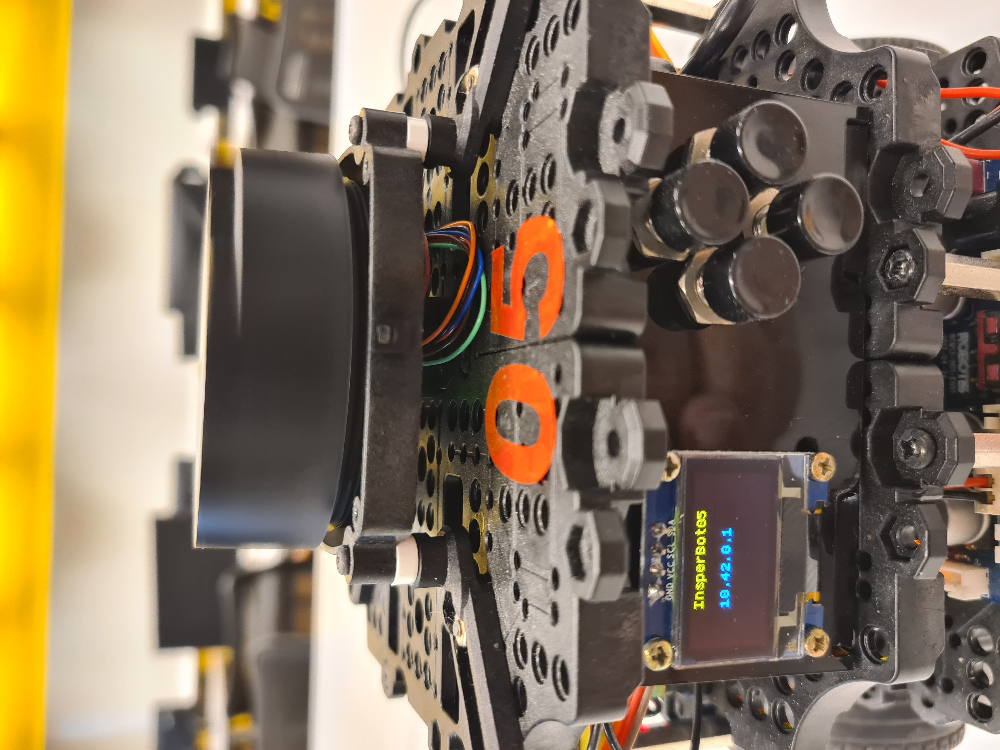
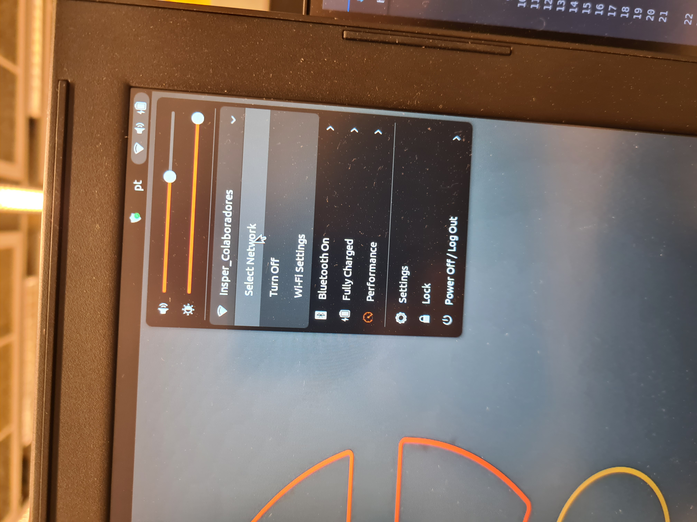

# Conectando no robô físico

Neste roteiro iremos controlar o robô físico pela primeira vez. Faremos as mesmas atividades que fizemos com o [robô simulado](../robo-simulado/index.md).

## Ligando o Robô

O primeiro passo para usarmos o Insperbot é ligar o robô. São três passos simples:

1. Primeiro você deve alocar a bateria, com cuidado, na parte inferior do robô;

2. Depois você deve conectar a batertia utilizando o conector amarelo;

3. Depois você deve ligar o robô utilizando o botão que fica no compartimento acima da bateria;

4. Por último você deve aguardar o robô ligar completamente. Quando o processo de iniciar estiver completo ou próximo de se completar, o seu nome e endereço IP aparecerão na telinha na parte de trás.


!!! warning 
    Em geral demora cerca de 2-3 minutos até o robô inicializar por completo. 


## Conectando na rede do robô

Cada robô cria duas redes Wifi própria que usaremos para enviar/receber dados diretamente. A primeira rede padrão está na banda 2.4GHz e a segunda na banda 5GHz (Ela é identificada pelo sufixo _5G). A banda 2.4GHz é a mais comum e tem maior alcance, enquanto a banda 5GHz oferece maior velocidade, mas com menor alcance. Troque entre as bandas conforme necessário para otimizar a conexão.

Agora que o Insperbot já está ligado, basta conectar na rede que ele liberou. Se atente ao número que está na parte de cima do robô, pois será o número da rede que você irá conectar. Por exmeplo, o Turtlebot 03 terá a rede: InsperBot03 e a senha da rede será **InsperBot03**. O mesmo acontecerá com todos os outros robôs. O nome exato da rede, considerando maiúsculas e minúculas, será a senha de rede.




Se tudo aconteceu como deveria, usando o comando:

```bash
ros2 topic list
```

Você verá a seguinte resposta:


!!! warning 
    Caso o comando não retorne nada, mesmo depois de muito tempo, você pode tentar **reiniciar os serviços** do robô, para isso, aperte o **botão da esquerda** e então o **botão para cima** para confirmar o comando.

## Teleoperando o robô

Para teleoperar o robô, você deve usar o seguinte comando:

```bash
ros2 run turtlebot3_teleop teleop_keyboard
```


como podemos ver na imagem acima, os comandos para movimentação do robô são w (para frente), x (para trás), a (para a esquerda), d (para a direita) e s (parar). quanto mais tempo ou vezes se pressiona a mesma tecla, maior a velocidade do movimento.

## Abrindo a câmera

Você pode visualizar a imagem da câmera com o mesmo comando usado no robô simulado:

```bash
ros2 run rqt_image_view rqt_image_view
```

Ao digitar este comando no terminal, teremos a seguinte janela aberta:


O ponto de atenção é o tópico da câmera, que no robô físico é: `/image_raw/compressed`

## Desligando o robô

Para **desligar o robô**, primeiro aperte o **botão da direita** e então o **botão para cima** para confirmar o comando, uma vez que o robô esteja completamente parado, desligue o botão e então desconecte a bateria.
