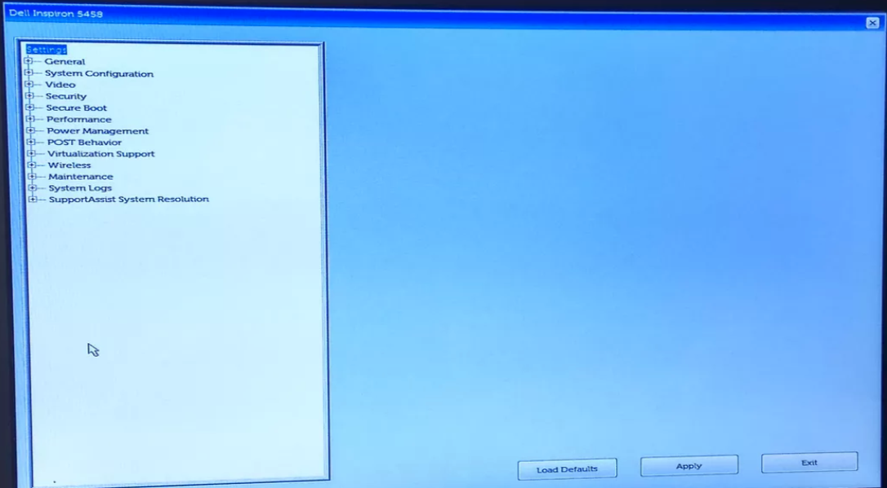
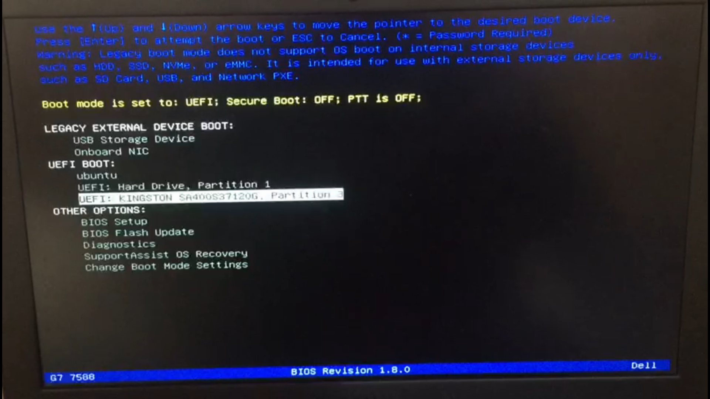
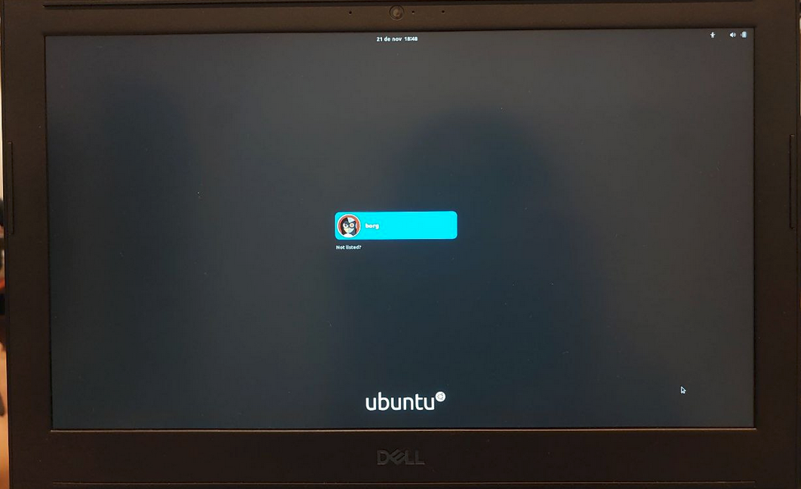

## Windows

1. Verificando o BitLocker do Windows
2. Configurando corretamente a BIOS
3. Inicializando o SSD

Para fazer esse tutorial, utilizamos um notebook Dell G7, de forma geral, estes procedimentos podem ser reproduzidos em notebooks de outras marcas, sendo feitas as adaptações para cada fabricante.

## Verificando o BitLocker do Windows

O BitLocker é uma tecnologia de proteção nativa do Windows, algumas versões possuem também o TPM (Trusted Platform Module) ativado. TPM é um componente de hardware instalado em alguns computadores pelos fabricantes. Ele funciona com o BitLocker para ajudar a proteger os dados do usuário e garantir que o computador não seja adulterado ou comprometido enquanto o notebook está offline.
Com o Bitlocker ativado, ao configurar a BIOS para inicilizar o sistema pelo SSD, o computador pode entrar em modo de segurança, bloqueando o processo normal de inicialização até que o usuário forneça um PIN (número de identificação pessoal) ou insira um dispositivo removível (como uma unidade flash USB) que contém uma chave de inicialização. Essas medidas de segurança adicionais fornecem autenticação multifator e garantia de que o computador não iniciará ou retomará da hibernação até que a chave PIN ou inicialização correta seja apresentada.
Verifique a [documentação oficial](https://www.dell.com/support/kbdoc/pt-br/000125409/como-habilitar-ou-desabilitar-o-bitlocker-com-tpm-no-windows) do seu fabricante para mais detalhes sobre o Bitlocker e o TPM

Para evitar chateações, vamos desabilitar o Bitlocker.

Com o Windowns inicializado, pesquise por **Bitlocker** no menu iniciar.

{width="800"}

O Bitlocker deve estar desabilitado, como aparece na imagem abaixo. Se o BitLocker estiver ligado, **Desligue**.

{width="800"}

## Configurando corretamente a BIOS
BIOS é a sigla para Basic Input/Output System, ou Sistema Integrado de Entrada e Saída. Por muito tempo, foi o programa responsável por iniciar os sistemas operacionais e as tarefas mais importantes de um computador. No momento em que você liga o seu notebook, a BIOS identifica todos os componentes conectados à placa-mãe, as informações salvas no CMOS (que armazena os parâmetros de configuração da placa, acessíveis pelo menu Setup), como qual unidade será carregada primeiro, altera a velocidade do processador (overclock e underclock) e checa também o relógio interno.
Uma vez que a BIOS confirma que tudo está bem, ela carrega o boot da primeira unidade definida no setup e, a partir daí, passa o controle para o sistema operacional. Por ser muito importante, a BIOS é salva em uma memória permanente, e não pode ser configurada ou apagada, apenas atualizada.

Cada fabricante tem uma tecla diferente para acessar a BIOS,  recomendo que **utilize o Google** para descobrir a sua, caso você encontre dificuldades, procure um dos técnicos para buscar essa informação no Google com você. Deixamos listado abaixo algumas sequências que são padronizadas e tem grandes chances de funcionar no seu notebook:

**Notebooks da DELL** - Ao ligar, pressione F2 para entrar no setup ou F12 para escolher a mídia bootavel;

**Notebooks da ASUS** - Mantenha F2 apertado com o note desligado e mantendo F2 apertado, ligue o computador;

**Notebooks da ACER** - Ao ligar, precione F2 (em alguns casos a tecla DELETE)  para entrar no setup;

**Notebooks da HP** - Ao ligar, pressione F10 para entrar no setup (Pode ser ESC, F2, F6 ou F11 dependendo do modelo);

**Notebooks LENOVO** - Na maioria dos modelos, ao ligar pressione ENTER em seguida F2. Caso seu notebok tenha um botão específico para entrar na BIOS, manter o botão pressoinando e ligar em seguida.

**Notebooks Toshiba** - Ao ligar, pressione F2 para entrar no setup;

**Notebooks Samsung** - Ao ligar, pressione F2 para entrar no setup.

!!! tip "Pesquise no Google a tecla de acesso a **BIOS** e a tecla de acesso ao **Boot Menu** do seu notebook"

**Para acessar a BIOS, é necessário:**

  **1.** Desligue o seu notebook

  **2.** Concecte o SSD na porta USB 3.X, se disponível, se não, concecte na porta USB mais conveniente para você.

  **3.** Ligue o notebook

  **4.** Assim que a logomarca do seu fabricante aparecer, pressione a telca de acesso a BIOS, no caso do Dell G7 é a **F2**

{width="800"}

Quando pressionar a tecla **F2** aparecerá uma mensagem no canto superior direto, ou no canto inferior diretio, depende do seu fabricante.

{width="800"}

Se tudo deu certo, você estará na BIOS do seu computador!

{width="800"}

Se a sua BIOS é diferente desta que aparece na imagem acima, não fique triste, diferentes modelos de notebook tem diferentes interfaces de BIOS

## Configurando corretamente a BIOS

Procure a opção de **Security Boot** e desmarque.

{width="800"}

Se o seu computador não tem essa opção, pode pular essa parte!

Agora procure a opção de **Boot Sequence***

Verifique se aparece a opção correspondente a seu SSD

{width="800"}

Se não apareceu, procure um técnico para te ajudar.

Salves as alterações em **Aplly** e **Exit** para sair da BIOS e reiniciar o notebook.

## **Inicializando o SSD**

Para inicialiar o boot pelo SSD:

1. Desligue o notebook;
2. Certifique-se de que o SSD está plugado na porta USB mais conveniente do seu notebook;
3. Assim que a logomarca do seu fabricante aparecer, pressione a tecla de **BOOT MENU** do seu notebook, no caso do **Dell G7** é a tecla **F12**

{width="800"}

4. Quando pressionar a tecla de acesso ao **Boot Menu** irá aparecer uma mensagem no canto superior direto, ou canto inferior direito, dependendo do modelo do seu notebook.

{width="800"}

5. Nas opções de Boot, escolha a opção correspondente ao seu SSD, normalmente é o nome da marca do SSD que aparece.

{width="800"}

6. Se tudo deu certo, vai aparecer para você a tela de grub do linux. Pressione ENTER e comemore

{width="800"}

!!! done
    Agora você tem um SSD externo configurado com tudo o que você precisa pra brilhar na matéria de Robótica e de Elementos neste semestre de emoções!

 {width="800"}

!!! warning
    A senha de acesso está disponivel no folder que acompanha o SSD. Recomendamos fortemente que troque a senha. [Veja aqui](../primeiros-passos/index.md) como fazer isso.

