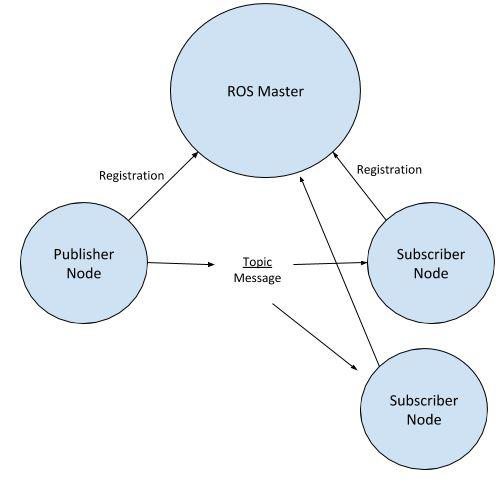

# Criando um Pubshisher e um Subscriber na ROS

## Pubshisher e Subscriber
Agora que você já sabe como criar um novo pacote, vamos aprender como se inscrever em um tópico para receber mensagens. Primeiro, vamos para algumas definições:

* **Subscriber:** Um subscriber é um nó que recebe mensagens de um tópico específico.

* **Publisher:** Um publisher é um nó que envia mensagens para um tópico específico.

Na ROS, quando um nó enviar uma mensagem para um tópico, todos os nós que estiverem inscritos nesse tópico receberão a mensagem. A figura abaixo ilustra esse processo:

## Criando um Subscriber

rodar com ROS RUN

## Criando um Publisher

rodar com ROS RUN

## Criando um Arquivo Launch

tralla