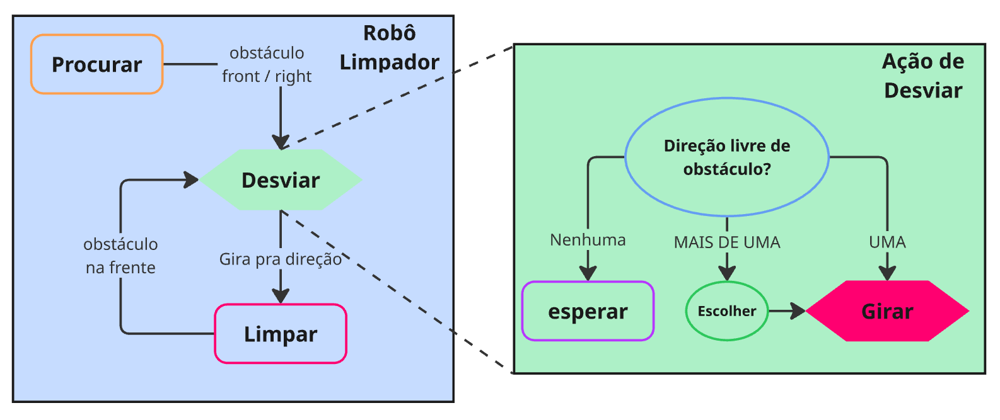

# Máquina de Estados em Robótica

Nesta atividade, vamos revisar o conceito de **máquina de estados finitos (FSM)** e como implementá‑la para controlar um robô.

## Conceito de Máquina de Estados Finitos (FSM)

Uma máquina de estados finitos (FSM) é um modelo computacional que descreve o comportamento do sistema a partir de **estados** e **transições**, permitindo que sistemas complexos sejam modelados de forma mais simples.

* **Estados:** representam condições atuais do sistema.
* **Transições:** representam mudanças de estado que ocorrem em resposta a eventos ou condições.

Essa abordagem é muito útil em robótica, pois organiza o fluxo de decisões do robô de forma clara e modular.

---

## Exemplo: Robô Limpador com Laser 2D

Agora, vamos aplicar o conceito de máquina de estados finitos (FSM) ao para um robô limpador que navega em um ambiente, procurando por áreas para limpar e desviando de obstáculos. Para melhorar a capacidade do nosso robô, equipamos ele com um sensor laser 2D.

### Estados principais

Nosso robô pode ser caracterizado pelos estados principais:

1. **Procurar** - o robô gira em trajetória elíptica até encontrar um obstáculo à frente ou à direita.
2. **Limpar** - o robô se move para frente, limpando a área à sua frente até que o sensor detecte um obstáculo em sua trajetória (frente).
3. **Esperar (Desviar)** - o robô espera até encontrar uma direção onde não exista obstáculos.
4. **Girar (Desviar)** - o robô gira até encontrar uma direção livre.

### Sub-estados da Ação "Desviar"

No caso do nosso robô, podemos explorar mais o estado de **Desviar**.

1. Esperar e Escolher - espera até avaliar encontrar direções livres (direita, esquerda, traseira).

    1.1. Se nenhuma → continua esperando e tenta novamente.

    1.2. Se uma → seleciona essa.

    1.3. Se mais de uma → seleciona aleatoriamente.

2. Girar - o robô gira até encontrar uma direção livre.

### Transições

Dado o ambiente do robô limpador, podemos definir as transições entre os estados como na tabela abaixo:

| Origem   | Condição                               | Destino             | Observação         |
| -------- | -------------------------------------- | ------------------- | ------------------ |
| Procurar | obstáculo em **frente** ou **direita** | Esperar             | ação Desviar       |
| Limpar   | obstáculo em **frente**                | Esperar             | ação Desviar       |
| Esperar  | **sem direção livre** (aguardar)       | Esperar             | tentar novamente   |
| Desviar  | pelo menos uma direção livre           | Girar               | ação Desviar       |
| Girar    | Girar até a direção livre              | Limpar              | fim ação Desviar   |

**Estado inicial:** `Procurar`.



### Estrutura de código em Python

Em Python, podemos implementar a máquina de estados com uma variável que guarda o **estado atual** `string` e uma **função por estado**, responsável pelas ações daquele estado. A função principal executa a função do estado atual e decide se o estado deve mudar.

Em vez de um grande bloco `if/elif`, essa é uma abordagem mais elegante que usa um **dicionário** que mapeia `estado → função`.

### Robo Limpador

Considerando os estados, podemos desenhar o esqueleto do codigo como abaixo:

```python
class RoboLimpador:
    def __init__(self):
        # Estado inicial
        self.robot_state = 'procurar'

        # Tabela de despacho: estado → método
        self.state_machine = {
            'procurar': self.procurar,
            'limpar': self.limpar,
            'esperar': self.esperar,
            'girar': self.girar,
        }

    def procurar(self):
        # Código para procurar
        # Gira em trajetória elíptica (v=0.1) e (rz=0.1)
        # Para de girar quando encontra um obstáculo na frente ou direita
        pass

    def limpar(self):
        # Código para limpar / verificar se frente está livre
        pass

    def esperar(self):
        # Estado para esperar
        # Avalia as direções livres (direita, esquerda, traseira)
        # Se nenhuma direção estiver livre, permanecer em "esperar"
        # Se uma direção estiver livre, selecionar essa direção
        # Se mais de uma direção estiver livre, selecionar aleatoriamente
        pass

    def girar(self):
        # Executar a rotação até o ângulo desejado e retornar sucesso.
        # Estado que chama a ação externa de Girar e espera sua execução
        pass

    def control(self):
        # ...
        # Executa a ação do estado atual
        self.state_machine[self.robot_state]()

```