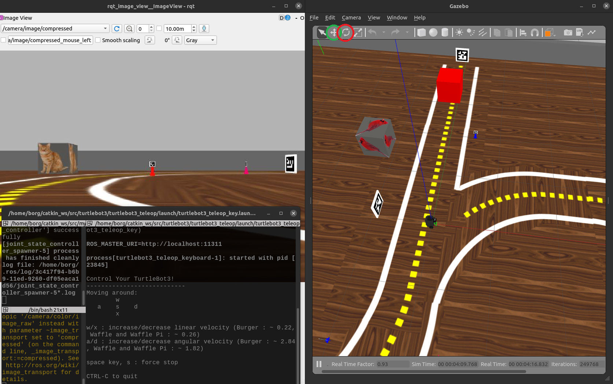

# Simulador do Turtlebot

Referência: Livro [ROS Robot Programming (disponível em PDFs)](http://community.robotsource.org/t/download-the-ros-robot-programming-book-for-free/51) Capítulos 5 e 6.

Abra um terminal. Dica: `Ctrl` `Alt` `T` abre terminais no Ubuntu

## Se você não usa o Linux fornecido pelo laboratório, faça as etapas a seguir

Vamos nos certificar de que temos alguns softwares essenciais para o Turtlebot 3:

```bash
sudo apt install ros-noetic-turtlebot3-msgs
```


Vamos nos certificar de que já temos os softwares do `Turtlebot` (só precisa ser feito uma vez):

```bash
sudo apt install terminator
mkdir -p ~/catkin_ws/src
cd ~/catkin_ws/src
git clone https://github.com/ros-teleop/teleop_twist_keyboard.git    
git clone https://github.com/ROBOTIS-GIT/turtlebot3.git
git clone https://github.com/ROBOTIS-GIT/turtlebot3_applications.git  

cd ~/catkin_ws
catkin_make
```

## A partir deste ponto todos devem executar os seguinte passos...
## Atualizar repositórios da disciplina
Digite os seguintes comandos para atualizar os repositórios da disciplina.

```bash
cd ~/catkin_ws/src/mybot_description
git pull
cd ~/catkin_ws/src/my_simulation
git pull
cd ~/catkin_ws
catkin_make
```

## Eliminando conflitos de configuração com o robô real

Abra seu `robotica.sh` e comente (colocando um caracter `#`) as linhas que definem as variáveis `ROS_IP` e `ROS_MASTER_URI`. Salve em seguida. Para abrir o arquivo execute.

```bash
code robotica.sh
```

Exemplo de como deve estar o arquivo. **Certifique-se** de que as variáveis `ROS_MASTER_URI` e `ROS_IP` estão desabilitadas. Estas variáveis são úteis somente quando trabalhamos com o robô real:

```bashrc
#############
# Robotica  #
#############

export IPBerry=192.168.50.250
# CANCELE  com # as linhas ROS_MASTER_URI  e ROS_IP se estiver usando com Gazebo, Sphinx ou Bebop
#export ROS_MASTER_URI="http://"$IPBerry":11311" 
#export ROS_IP=`hostname -I`

#escolha qual o modelo robo sera usado no simulador
export TURTLEBOT3_MODEL=burger 
```
    
Feche o terminal e abra um novo para carregar as alterações. Feche também qualquer terminal no VS Code também.

## Verificando se o simulador funciona

Tentar ver se o simulador do robô funciona:

```bash
export TURTLEBOT3_MODEL=burger
roslaunch my_simulation pista_s2.launch
```

É comum que na primeira vez que se executa o simulador haja demora para este abrir porque os modelos 3D estão sendo baixados. Seu computador precisa ter acesso à internet para funcionar.

### Visualizar a câmera do robô
Em outro terminal execute o seguinte comando para visualizar o conteudo da câmera do robô:

```bash
rqt_image_view
```

### Pilotar o robô
Em um novo terminal execute o seguinte comando para controlar o robo. Pilote o robô pelo cenário utilizando as teclas `WASD`, o terminal deve estar em destaque para controlar o robo:

```bash
roslaunch turtlebot3_teleop turtlebot3_teleop_key.launch
```

Neste ponto sua tela deve estar parecida com a figura abaixo:



### Mover objetos no ambiente simulado
Apertando os botões em destaque na imagem acima, você pode mover (verde) ou rotacionar (vermelho) os objetos no mundo simulado. Este recurso pode ser utilizado para mover o robô para o local específico onde deseja-se testar algum módulo do robô.

### Retornar o mundo simulado para posição inicial
Apertando as teclas `alt + r` você pode reiniciar o mundo simulado.
