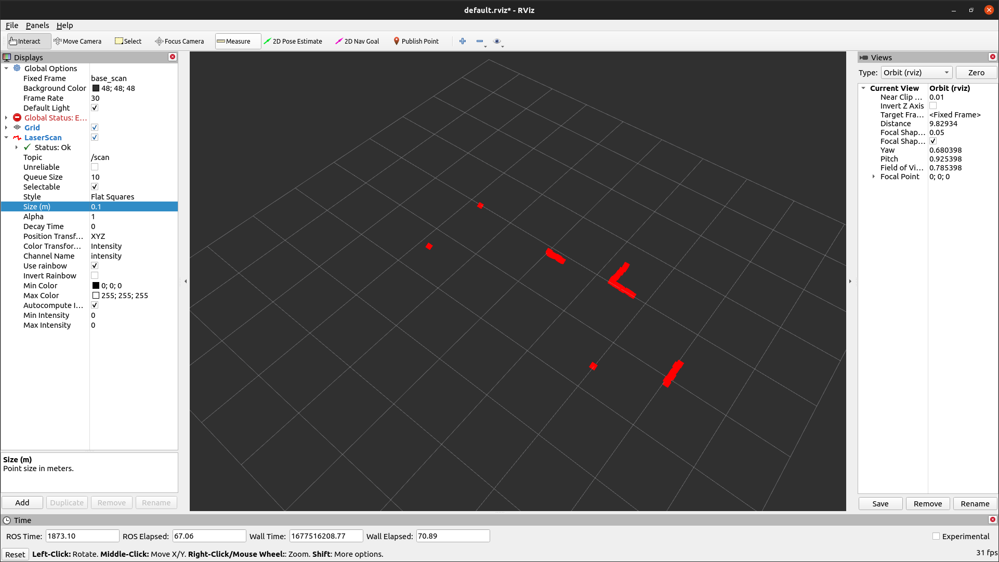
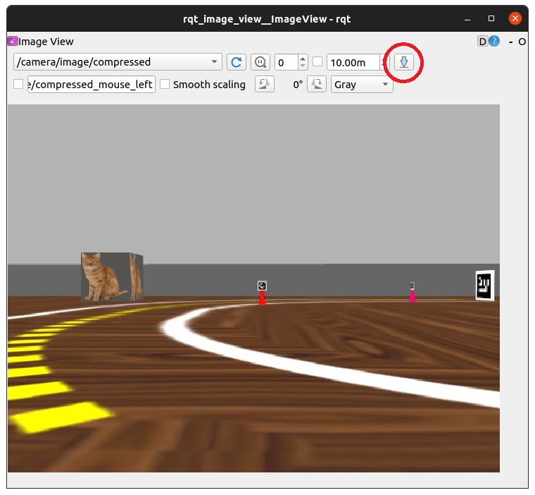

# Explorando as ferramentas de visualização da ROS
Na seção anterior observamos o conteúdo do tópico `scan`, retomando este topico tem a seguinte estrutura de dados.

```bash
borg@ubuntu:~$ rosmsg info sensor_msgs/LaserScan
std_msgs/Header header
  uint32 seq
  time stamp
  string frame_id
float32 angle_min
float32 angle_max
float32 angle_increment
float32 time_increment
float32 scan_time
float32 range_min
float32 range_max
float32[] ranges
float32[] intensities
```

Onde `ranges` tem o formato de uma lista com 360 elementos onde cada o index é a orientação e o valor do elemento é a distância, em metros, de um obstáculo até o robô. Existe uma diferença entre o robô real e o simulado, no robô simulado, valores muito longe recebem o valor `inf` e no real recebem o valor `0`.

## Visualizando com RViz.
Vamos executar o `RViz`, que é uma ferramenta importante de monitoramento de dados de sensores e estado interno do robô, em um novo terminal, execute:

```bash
rosrun rviz rviz
```

Quando o programa abrir, faça as seguites modificações:
* Mude a celula `Fixed Frame` para `base_scan`
* Ao clica no botão `Add` adicione `LaserScan`
* No LaserScan mude a celula `topic` para `/scan`
* E mude a celula `Size` para `0.1`



Agora é possível entender melhor as leituras do sensor, faça o teste colocando a mão na frente do lidar, se estiver no robô real, ou movendo algum obstáculo para perto do robô, se estiver na simulação.

## Visualizando o topico da imagem.
Para visualiza a imagem da camera do robo, execute o seguinte comando:

```bash
rqt_image_view
```

Quando o programa abrir, faça as seguites modificações:
* Atualize os topico clicando no botão verde.
* Selecione o topico `/camera/image/compressed`

Para capturar o frame atual da image, clique no botão `Save as image`.
