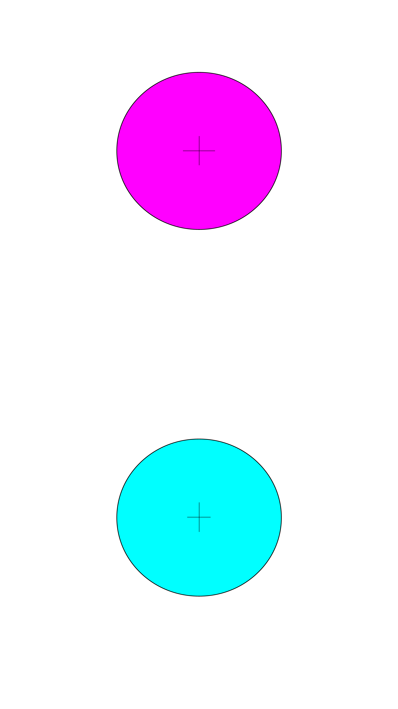
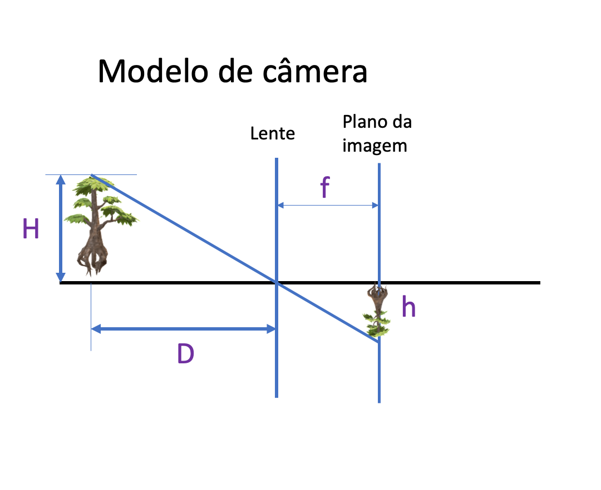
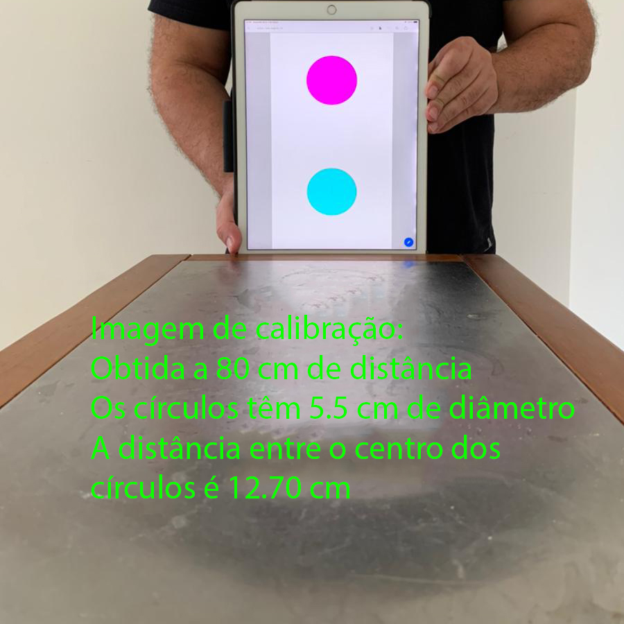

# Entregável 5 de Robótica Computacional

## Instruções gerais

**Aviso 1:** Sempre desenvolvam nos arquivos `.py` dos respectivos exercícios.

**Aviso 2:** Lembre-se de dar `commit` e `push` no seu repositório até o horário limite de entrega.

**Aviso 3:** Preencha o nome completo dos integrantes do seu grupo no arquivo `README.md` do seu repositório.

**Aviso 4:** Além de seu repositório, para todas as questões você **deve gravar um vídeo do seu robô executando a tarefa**. O vídeo deve ser feito gravando a tela do linux, [tutorial](https://insper.github.io/robotica-computacional/screen_record/), e deve ser postado no Youtube. 

No arquivo `README.md` do seu repositório existe o campo `Link do Vídeo` onde você deve colocar o link do video no youtube. Certifique-se de que o vídeo está público e que o link está correto. `NUNCA de commit no vídeo`, somente adicione o link.

**Aviso 5:** Para este entregável, você deve utilizar o robô real, mas você pode testar o código no simulador.

---

# Baixe o zip com as imagens de teste
Clique no link abaixo para baixar o zip com as imagens de teste dos exercícios.
!!! download
    [Download das Imagens de Teste](fig_aps5.zip)

---

# Exercício 1 - Latinhas (3 pontos)
Resolva o exercicio na atividade [2 - Identificação de Objetos](https://insper.github.io/robotica-computacional/modulos/05-visao-p2/atividades/2-identificacao/).

Adicione o arquivo `latinhas.py` no seu repositório juntamente com as imagens de teste.

Grave um vídeo da execução do código nas 3 imagens de teste e adicione o link no arquivo `README.md` do seu repositório.

---

# Exercício 2 - Vanishing Point (3 pontos)

Resolva o exercicio na atividade [4 - Detecção de Retas e Círculos](https://insper.github.io/robotica-computacional/modulos/05-visao-p2/atividades/4-retas-circulos/).

Tire uma foto da pista no laboratório e salve no seu repositório. No vídeo, mostre o código para detectar os pontos de fuga (vanishing points) em execução.

Adicione o arquivo `vanishing_point.py` no seu repositório juntamente com a imagem de teste do handout e a sua foto da pista, salve também a sua foto com o ponto de fuga desenhado detectado.

## Video
Grave um vídeo da execução do código na imagem de teste do handout e na sua foto da pista, e adicione o link no arquivo `README.md` do seu repositório.

Faça upload no YouTube e coloque o link no arquivo `README.md` do seu repositório.

---

# Exercício 3 - Estimando Pose (4 pontos)

Você vai precisar de uma folha com o padrão abaixo.

**Dica:** se não tiver impressa, pode exibir a imagem em um tablet ou smartphone.

Neste exercício vamos estimar a distância da câmera até a folha e o ângulo de inclinação da folha em relação à direção da câmera, realizando a conversão 2D para 3D com o modelo pinhole visto em aula.

Pela geometria do modelo pinhole, vale a relação entre distância focal $f$, distância entre os centros dos círculos na imagem $h$, distância da câmera ao objeto $D$ e distância real entre os centros na folha $H$:

$$
\frac{h}{H} = \frac{f}{D}
\qquad\Rightarrow\qquad
D = \frac{f \cdot H}{h}
$$

**Objetivo:** estimar $D$ (distância câmera-folha) e $\theta$ (inclinação da folha em relação à vertical).

**Arquivo de trabalho:** `./ex3.py`.

---

## O que fazer

### 1) Medições iniciais

1. Use a sua câmera para capturar **uma imagem da folha** a uma distância conhecida $D$ (meça com régua ou trena).
2. Meça a distância real $H$ entre os **centros** dos dois círculos na folha.
   **Atenção:** $D$ e $H$ devem estar **na mesma unidade** (por exemplo, centímetros).

### 2) Função `run`

Implemente a lógica principal chamando as funções auxiliares indicadas:

1. **Encontrar os centros** dos dois círculos na imagem da folha - `encontrar_centros`.
2. **Calcular $h$**, a distância em pixels entre os centros - `calcular_h`.

   

   
Spoiler*

   Distância entre os centros: \(h = \sqrt{(x_1 - x_2)^2 + (y_1 - y_2)^2}\)
   

3. **Calcular o ângulo $\theta$** da folha em relação à vertical - `calcular_theta`.
4. **Estimar $D$** usando o modelo pinhole - `encontrar_D`.
5. **Escrever na imagem** os valores de $D$ e $\theta$ com **duas casas decimais**.

   

   
Spoiler**

   Utilize `cv2.putText` para escrever na imagem.
   

6. **Retornar**: a imagem anotada, $D$, $\theta$ e $h$.
7. **Robustez**: se a folha **não** estiver presente na imagem, retorne `-1` para $D$ e para $\theta$. Ou seja, seu código não deve quebrar se a folha não for detectada.

### 3) Função `calibration`

Implemente o processo de calibração da câmera:

1. Ajuste a fonte de imagem para **a sua câmera** - `rodar_frame`.
2. Chame `run` para obter os centros dos círculos e $h$.
3. Chame `encontrar_foco` com os valores medidos de $D$ e $H$ para obter a distância focal $f$.

   Armazene $f$ como **parâmetro da classe**.

### 4) Execução em tempo real

Após passar no `pytest`, altere a `main` para executar `rodar_webcam`:

1. Ajuste a fonte de imagem para **a webcam** - `rodar_webcam`.
2. Chame `calibration` para **calibrar a câmera**.
3. Dentro do loop da webcam, chame `run` a cada frame para obter $D$ e $\theta$.
4. **Grave um vídeo** mostrando a câmera e a folha com **várias distâncias $D$** e **vários ângulos $\theta$**. Exiba $D$ e $\theta$ na imagem.
5. Faça **upload no YouTube** e coloque o **link no `README.md`** do seu repositório.

---

## Valores esperados

A imagem `./img/calib01.jpg` ilustra como tirar a foto de calibração. Com a sua câmera, capture uma foto similar, posicionando a folha a uma distância conhecida $D$.

Na legenda de exemplo: $D = 80\ \text{cm}$ e $H = 12{,}7\ \text{cm}$.

Saída esperada da calibração

* Distância entre os círculos na imagem $h$ ≈ **161** pixels
* Distância focal estimada $f$ ≈ **1014.1732283464568**

As imagens `./img/angulo01.jpg` a `./img/angulo04.jpg` exemplificam a estimativa do ângulo $\theta$.

Saídas esperadas de ângulo

* `angulo01.jpg`: **Ângulo de -0,18 graus**
* `angulo02.jpg`: **Ângulo de -51,98 graus**
* `angulo03.jpg`: **Ângulo de -88,93 graus**
* `angulo04.jpg`: **Ângulo de 118,57 graus**

## Video 

Grave um vídeo da execução do código utilizando a webcam, mostrando a distância estimada $D$ e o ângulo $\theta$ na imagem. Faça upload no YouTube e coloque o link no arquivo `README.md` do seu repositório.
