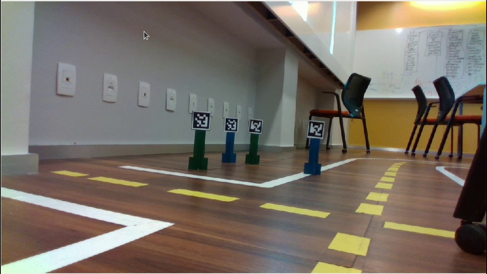

# Reconhecimento dos Creeper

Nesta atividade, voces vão combinar os conhecimentos adquiridos para identificar os creepers em uma imagem, com a identificação de marcadores arucos para reconhecer e diferenciar os creepers, através de suas cores e IDs.

Na imagem abaixo temos um onde o robô real está olhando para os "creepers". Neste contexto, um creeper é um marcador Aruco com um corpo de uma cor, "creepers" de mesma cor tem ids diferentes.

Voce deve trabalhar no arquivo [atividade3.py](atividade3.py) e implementar a classe `DistanceEstimator` que vai herdar a classe `ArucoDetector` e da classe `ImageModule`. A função `run` detectar os "creepers" e e calcular o centros dos corpos de cada um deles.

Por fim, deve associar os marcadores aruco com os corpos dos "creepers" e então rankear os "creepers" de acordo com a distância até o robô.

Siga as instruções numeradas no arquivo [atividade3.py](atividade3.py) para completar a atividade.

**Grave um video** com o resultado mostrando uma linha ligando o centro do marcador aruco ao centro do corpo do "creeper" e o id do "creeper" e coloque o link do video no arquivo `README.md` do seu repositório.

[Link Para Baixar o Video](https://insper-my.sharepoint.com/:v:/g/personal/diegops_insper_edu_br/EeOys3--O4tPhCbELsfZ9FABRMdAhARfKogGpqT1yHoLNQ?nav=eyJyZWZlcnJhbEluZm8iOnsicmVmZXJyYWxBcHAiOiJPbmVEcml2ZUZvckJ1c2luZXNzIiwicmVmZXJyYWxBcHBQbGF0Zm9ybSI6IldlYiIsInJlZmVycmFsTW9kZSI6InZpZXciLCJyZWZlcnJhbFZpZXciOiJNeUZpbGVzTGlua0RpcmVjdCJ9fQ&e=Tviiaw)
