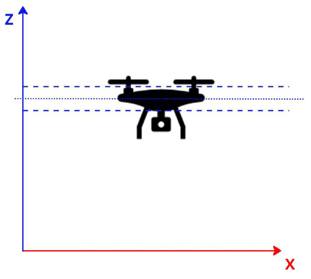

# Introdução ao Controle
O controle é uma disciplina fundamental da engenharia que lida com a gestão dinâmica dos sistemas para que eles se comportem de maneira desejada. A essência do controle está em monitorar e ajustar automaticamente a operação de sistemas, desde simples dispositivos mecânicos até complexas redes de comunicação e sistemas robóticos.

O princípio básico é regular as variáveis de um sistema mantendo-as próximas a um valor desejado ou setpoint. Isso é feita através do calculo do erro entre o valor desejado e o valor medido da variável controlada, e então aplicando ações corretivas para minimizar esse erro.

## Tipos de Controle
Existem dois tipos principais de controle: o controle em malha aberta e o controle em malha fechada:

1. Controle em Malha Aberta: Não há feedback do processo. As ações de controle são baseadas em um conjunto pré-definido de instruções que não se alteram em resposta ao estado atual do sistema. Um exemplo simples seria um forno elétrico programado para ficar ligado por um tempo determinado, independentemente da temperatura real dentro do forno.

2. Controle em Malha Fechada (ou Controle com Feedback): Usa o feedback do estado atual do sistema para tomar decisões de controle. Este tipo de controle é mais adaptativo e pode corrigir desvios em relação ao setpoint. Um exemplo seria adicionar um termostato ao forno elétrico para desligá-lo quando a temperatura desejada for atingida.

## Controle Proporcional (P)
Um dos métodos mais simples e amplamente utilizados no controle em malha fechada é o controle proporcional. Este método ajusta a saída do controlador de forma proporcional à diferença (erro) entre o valor desejado (setpoint) e o valor medido da variável controlada. O coeficiente que determina a relação entre o erro e a ação de controle é conhecido como ganho proporcional (K_p). Portanto uma ação de controle proporcional é dada pela seguinte equação:

```python
Ação de Controle = K_p * erro
```

Na esqueção acima, podemos ver que a ação de controle é proporcional ao erro. Se o erro for grande, a ação de controle será grande. Se o erro for pequeno, a ação de controle será pequena. Portanto no exemplo do forno elétrico, ao ligar o forno frio, o erro será grande e a ação de controle será grande, aumentando a potência do forno e elevando a temperatura rapidamente. À medida que a temperatura se aproxima do setpoint, o erro diminui reduzindo a potência do forno, evitando que a temperatura ultrapasse o setpoint drasticamente.

## Resposta da Ação de Controle
Outros conceitos importantes no controle são a resposta da ação de controle e o conceito de estabilidade. A resposta da ação de controle é a reação do sistema à ação de controle. Se a resposta for muito lenta, o sistema pode não atingir o setpoint ou pode crescer indefinidamente, levando o sistema a um estado instável. Se a resposta for muito rápida, o sistema pode ultrapassar o setpoint e oscilar em torno dele. Portanto, é importante ajustar o ganho proporcional para obter uma resposta rápida e estável.

# Exemplo de Controle Proporcional
A seguir, implementamos um exemplo simples de controle proporcional em Python. Neste exemplo, simulamos um sistema de controle de um drone que tenta manter a altitude constante para uma dada entrada de altitude, setpoint. Neste exemplo, você pode ajustar o ganho proporcional (K_p) e a resposta do sistema para visualizar como o controle proporcional afeta a resposta do sistema.

A figura abaixo ilustra o sistema:



Durante seus experimentos, tente responder às seguintes perguntas:

1. O que acontece se o ganho proporcional for muito baixo? E se for muito alto?
2. Qual a relação entre o ganho proporcional e a resposta do sistema para o momento em que o sistema nunca atinge o setpoint, ou seja, o sistema é instável?

# 🧠 Simulação Interativa – Controle Proporcional de Altitude (Drone)

Experimente ajustar o ganho proporcional **Kp** e o tempo de atualização do controlador para ver como o drone reage para atingir a altitude desejada.

<script src="https://cdn.plot.ly/plotly-latest.min.js"></script>

<div style="margin-top:1em; font-family:sans-serif; max-width:700px">
  <label for="kp"><b>Kp (Ganho):</b></label>
  <input type="range" id="kp" min="0" max="20" value="5" step="0.1" style="width:300px"
         oninput="document.getElementById('kp_val').textContent=this.value; updatePlot()">
  <span id="kp_val">5</span>
  <br><br>
  <label for="dt"><b>Tempo de Atualização (s):</b></label>
  <input type="range" id="dt" min="0.05" max="1.0" value="0.25" step="0.05" style="width:300px"
         oninput="document.getElementById('dt_val').textContent=this.value; updatePlot()">
  <span id="dt_val">0.25</span>
</div>

<div id="grafico" style="width:100%; max-width:700px; height:400px;"></div>

<script>
function simular(Kp, dt) {
  const setpoint = 10.0;
  const altitudeInicial = 0.0;
  const tempos = [];
  const altitudes = [];
  let altitude = altitudeInicial;
  for (let t = 0; t <= 10; t += dt) {
    tempos.push(t.toFixed(2));
    const erro = setpoint - altitude;
    const W = Kp * erro;
    altitude = altitude + W * dt;
    altitudes.push(altitude);
  }
  return {tempos, altitudes, setpoint};
}

function updatePlot() {
  const Kp = parseFloat(document.getElementById("kp").value);
  const dt = parseFloat(document.getElementById("dt").value);
  const {tempos, altitudes, setpoint} = simular(Kp, dt);

  const trace1 = {
    x: tempos, y: altitudes,
    mode: "lines", name: "Altitude do Drone",
    line: {color: "#0074D9", width: 3}
  };
  const trace2 = {
    x: tempos, y: Array(tempos.length).fill(setpoint),
    mode: "lines", name: "Altitude Alvo",
    line: {color: "red", dash: "dash"}
  };
  const layout = {
    title: `Simulação de Controle Proporcional (Kp=${Kp.toFixed(1)}, Δt=${dt.toFixed(2)}s)`,
    xaxis: {title: "Tempo (s)"},
    yaxis: {title: "Altitude (m)"},
    legend: {orientation: "h", y: -0.2},
    margin: {t:60, r:10, l:50, b:60}
  };
  Plotly.newPlot("grafico", [trace1, trace2], layout, {responsive:true});
}

updatePlot();
</script>
