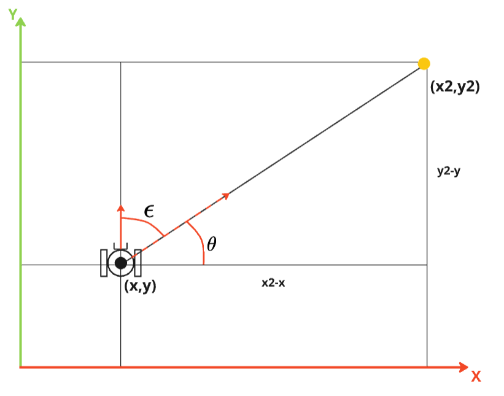

# GoTo (vai até coordenadas)

Quando o robô está em um ambiente conhecido, é possível fazer com que ele vá até uma coordenada específica. Para isso, é necessário que o robô saiba a sua posição e a posição desejada. Neste atividade, você irá criar um nó que faz o robô ir até uma coordenada específica.

## Geometria

Considere que o robô está em um plano cartesiano e que a posição do robô é dada por `(x, y)` e a posição desejada é dada por `(x2, y2)`.

Para fazer o robô ir até a posição desejada, devemos "mirar" o robô em direção ao ponto desejado e então fazer o robô se mover até o ponto. Para isso, devemos calcular o erro angular entre o `yaw` atual do robô e o ângulo `theta` formado entre o robô e o ponto desejado.

A distância entre o robô e o ponto desejado pode ser utilizado para controlar a velocidade do robô. Quanto mais perto do ponto, menor a velocidade.

## Comportamento

Para otimizar a trajetória do robô, é interessante que o robô gire até que ele esteja alinhado com o ponto desejado e então inicie o movimento. Para isso, o nó deve ter três estados, `center`, `goto` e `stop`.

* O estado `center` deve ser o estado inicial e faz o robô girar até que ele esteja alinhado com o ponto desejado.
* O estado `goto` deve utilizar controladores proporcionais para mover o robô até o ponto desejado (`kp_linear`) e ajustar a sua orientação (`kp_angular`).
* Quando chegar no ponto desejado, o robô deve entrar no estado `stop`.

## Atividade

Baseando-se no código `base_control.py` do módulo 3, crie um arquivo chamado `goto.py`, com uma classe `GoTo` e com um nó denominado `goto_node`, que, dado uma posição, faça o robô **simulado** `=)` se mova ***precisamente*** para este ponto em qualquer posição. O nó deve:

* A classe `GoTo` deve herdar de `Node` e `Odom`.

* A classe `GoTo` deve ter um método `__init__` que recebe a uma variável chamada `point` do tipo `Point` e salva em uma variável `self.point`.

* Ter três estados, `center`, `goto` e `stop`.

* O estado `center` deve ser o estado inicial e faz o robô girar até que ele esteja alinhado com o ponto desejado.

* Quando chegar no ponto desejado, o robô deve entrar no estado `stop`.

* Deve ter um função `get_angular_error` que primeiro calcula o angulo entre a posição atual e o ponto desejado `theta` e depois calcula o erro entre o angulo atual e o angulo desejado, ajustando o erro para o intervalo `[-pi, pi]`.

* `get_angular_error` também deve calcular a distância entre o robô e o ponto desejado.

* O estado `goto` deve fazer o robô se mover até o ponto desejado e parar quando estiver **BEM PERTO** do ponto.

* Utilize duas constante proporcionais, `self.kp_linear` e `self.kp_angular` para controlar a velocidade linear e angular do robô.