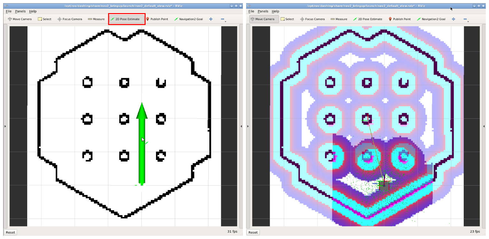

# ROS2 SLAM

Referência: [ROS2 SLAM](https://emanual.robotis.com/docs/en/platform/turtlebot3/slam/#run-slam-node)


SLAM (Simultaneous Localization and Mapping) ou Mapeamento e Localização Simultâneos é uma técnica usada por robôs e veículos autônomos para construir um mapa do ambiente e, ao mesmo tempo, localizar sua posição nesse ambiente. A ROS2 oferece uma série de pacotes que permitem a execução de algoritmos de SLAM no Turtlebot3.

Veja o vídeo abaixo de demonstração do SLAM no Turtlebot3:

[Turtlebot3 SLAM](https://www.youtube.com/watch?v=pJNSxDodhDk)

## Instalando os pacotes necessários

Para instalar os pacotes necessários para o SLAM, execute os comandos abaixo:

```bash
TODO
```

## Executando o Mapeamento

Para iniciar o mapeamento do ambiente, devemos executar o pacote denominado `Cartographer`. Para isso, execute os comandos abaixo:

```bash
ros2 launch turtlebot3_cartographer cartographer.launch.py use_sim_time:=True
```

Agora, abra um novo terminal com o `teleop` para controlar o Turtlebot3:

```bash
ros2 run turtlebot3_teleop teleop_keyboard
```

Com o `teleop` aberto, movimente o Turtlebot3 pelo ambiente para que o mapeamento seja realizado. Após finalizar o mapeamento, execute o comando abaixo para salvar o mapa:

```bash
ros2 run nav2_map_server map_saver_cli -f ~/map
```

O mapa será salvo no diretório `~/map` com os arquivos `map.pgm` e `map.yaml`.

## Visualizando o Mapa

O mapa será salvo como um arquivo de imagem no formato `pgm`. Como no exemplo abaixo:


O mapa ilustra o ambiente mapeado, onde os pixels pretos representam obstáculos, os pixels brancos representam áreas livres e os pixels cinzas representam áreas desconhecidas.

## Navegando no Mapa

Agora para navegar no ambiente, primeiro **feche todos os terminais abertos** e execute o pacote `Navigation`, através do comando abaixo:

```bash
ros2 launch turtlebot3_navigation2 navigation2.launch.py use_sim_time:=True map:=$HOME/map.yaml
```

Uma vez que o pacote de navegação esteja em execução, vamos primeiro definir a posição inicial do Turtlebot3 no mapa, para isso, clique no botão `2D Pose Estimate` no Rviz e clique e segure o botão esquerdo do mouse no local onde o Turtlebot3 está localizado no mapa. Em seguida, arraste o mouse para a direção que o Turtlebot3 está apontando e solte o botão esquerdo do mouse, conforme ilustrado na imagem abaixo:



### Extraindo a Posição do robô no Mapa

Quando estamos utilizando o `Navigation`, o tópico `/odom` por si só não é suficiente para extrair a posição do robô no mapa. Para isso, devemos utilizar combinar o tópico `/odom` com o tópico `/tf` para extrair a posição do robô no mapa. O tópico `/tf` contém as transformações entre os diferentes frames do Turtlebot3, incluindo a transformação entre o frame `odom` e o frame `map`. 

Felizmente, isso já foi implementado e está disponível no `robcomp_util`, bastando apenas utilizar herdar do arquivo `amcl.py` a classe `AMCL` no lugar da classe `Odom` para extrair a posição do robô no mapa.

## Definindo o Ponto de Destino da Navegação

Agora, para definir o ponto de destino da navegação, clique no botão `2D Nav Goal` no Rviz e clique e segure o botão esquerdo do mouse no local onde deseja que o Turtlebot3 vá. Em seguida, arraste o mouse para a direção que deseja que o Turtlebot3 esteja apontando e solte o botão esquerdo do mouse.

## Combinando Mapeamento e Navegação (SLAM)

Agora, vamos aprender a combinar o mapeamento e a navegação, executando o pacote `Navigation` e o pacote `Cartographer` juntos. Para isso, execute o comando abaixo (cada um em um terminal diferente):

```bash
ros2 launch turtlebot3_cartographer cartographer.launch.py use_sim_time:=True
ros2 launch turtlebot3_navigation2 navigation2.launch.py use_sim_time:=True \
map:='topic://map'
```
