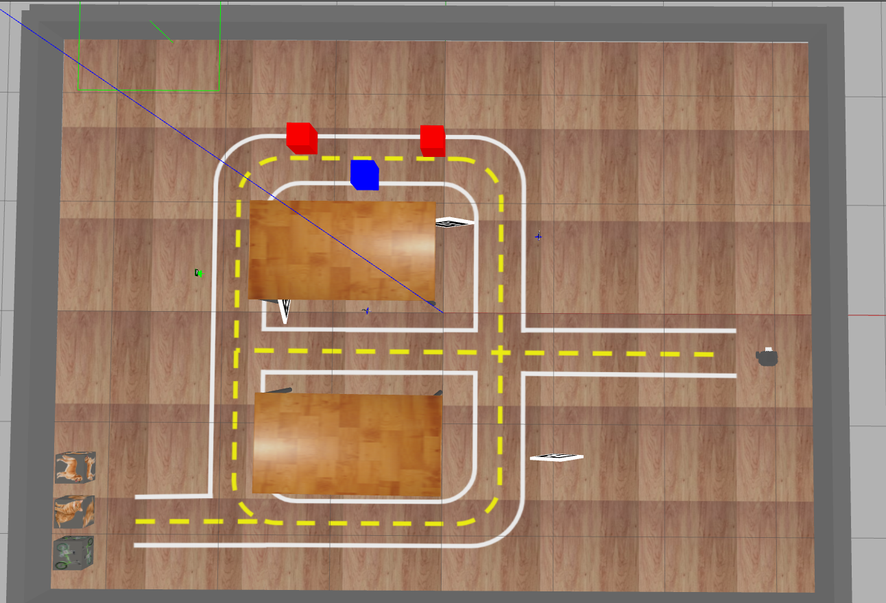

# Projeto - Missão na 404

O objetivo do projeto é programar nosso robô para cumprir um conjunto de missões na sala 404. Utilizaremos o cenário apresentado a seguir.



Os grupos, compostos por `até quatro integrantes`, deverão trabalhar em conjuto no repositório do GitHub Classroom disponibilizado. 

[Link para repositório do projeto GitHub Classroom](https://classroom.github.com/a/H90gUDvK){ .ah-button }

# **`Data de Entrega: 27/05 23:59`**

________________________________________________________

## Instruções gerais

**Aviso 1:** Sempre desenvolvam nos arquivos `.py` dos respectivos exercícios.

**Aviso 2:** Lembre-se de realizar `commit` e `push` no seu repositório até o horário limite de entrega.

**Aviso 3:** Preencha o nome completo dos integrantes do seu grupo no arquivo `README.md` do seu repositório.

**Aviso 4:** Além de seu repositório, para todas os conceitos vocês **`deveram gravar um vídeo do seu robô executando a tarefa`**. O vídeo deve ser postado no Youtube. 

No arquivo `README.md` do seu repositório existe o campo `Link do Vídeo` onde você deve preencher com apenas o link de cada video no youtube. Certifique-se de que o vídeo está público e que o link está correto. `NUNCA de commit no vídeo`, somente adicione o link.

**Aviso 5:** Para o projeto, as entregas são feitas utilizando o robô real. Entregas no simulador serão aceitas, conquistando no máximo **25%** da diferença de notas entre o último conceito com o robô real.

**Aviso 6:** O conceito **C** é o mínimo para aprovação e **deve ser feito com o robô real**.

## Configuração do Pacote (ROS 2)

- **Preparação Inicial:** Primeiro, aceite o convite do GitHub Classroom e clone o repositório **dentro da pasta** `colcon_ws/src/` no seu SSD.
- **Criação do Pacote ROS 2:** **Dentro do diretório do seu repositório**, crie um novo pacote nomeado `projeto_robcomp`.
    - **Dica:** Para utilizar os modulos desenvolvidos no módulo 3, inclua o pacote `my_package` como dependência do seu pacote, e então, importe como nos exemplos do módulo 3.

________________________________________________________

## Atualização dos Repositórios

```bash
cd ~/colcon_ws/src/my_simulation
git pull
cb
```

## Mapa Simulado

```bash
ros2 launch my_gazebo pista-24.launch.py
```
________________________________________________________

## Descrição das Missões

O projeto é composto por 4 missões de complexidade crescente, envolvendo tanto o design de software quanto a utilização dos sensores e comportamentos do robô. **É preciso concluir todas as missões anteriores para obter a nota da missão subsequente**.

Cada missão deverá ser registrada em um ou mais vídeos, com o link adicionado no arquivo README e versionado utilizando o **Releases** do GitHub, com a tag do conceito atingido.

As missões envolvem os seguintes elementos:

* **Pista**: O robô deve permanecer dentro da pista, retornando a ela o mais rápido possível caso saia.

* **Creepers**: Bonecos semelhantes aos do Minecraft, que devem ser transportados até a área de entrega. São posicionados de forma fixa no mapa, mas em ordem (cor/ID) aleatória.

* **Drop Area**: Caixas com imagens detectáveis pela MobileNet, local onde os creepers devem ser depositados. Elas são colocadas em locais fixos da pista.

<!--- Vai manter o slalom?
* **Slalom**: Sequência de três caixas coloridas dispostas em zigue-zague.
--->

Para completar uma missão, você deve:

1. Capturar a tela do robô realizando a missão no simulador.

2. Gravar o robô realizando a missão na pista real.

    2.1. Para filmar, é necessário agendar a preparação da pista com a equipe técnica, garantindo condições semelhantes para todos os grupos.

3. Incluir o link do vídeo no README do seu repositório e criar um Release com a tag referente ao último conceito alcançado.

4. Cada missão deve ser concluída em menos de 15 minutos.

5. **Deixar** o creeper em uma drop area inclui:

    5.1. Parar próximo à drop area.

    5.2. Posicionar-se de frente para a drop area.

    5.3. Aproximar-se até ficar a 0.5m de distância.

    5.4. Abaixar a garra e soltar o creeper em pé.

    5.5. Retornar à pista sem derrubar o creeper.

As missões podem ser validadas ao longo do projeto. Solicite a validação da parte de requisitos de software antes de gravar.

Os argumentos de linha de comando para o seu código devem ser:

```python
parser = argparse.ArgumentParser()
parser.add_argument('--cor', type=str, default='verde', help='cor do creeper desejado')
parser.add_argument('--id', type=int, default=10, help='id do creeper desejado')
parser.add_argument('--drop', type=str, default='bicicleta', help='drop area desejada')
args = parser.parse_args()
```

<!--- 
!!! Atenção
    Se uma missão for completada apenas no simulador, será concedido 25% da diferença dos conceitos de nota. **A missão C é obrigatória no robô real**.
--->
________________________________________________________

### Missão **C**

Essa missão é a mais simples do projeto e envolve aplicar diretamente os conceitos trabalhados na disciplina. Os seguintes passos devem ser realizados:

<!--- 
* **Nesta missão, vocês podem remover as caixas do Slalom**
--->

1. Crie um dicinário com as cores dos creepers e seus respectivas IDs para armazenar onde estão os creepers, como o exemplo abaixo:

```python
creepers = {
    'verde_10': ...,
    'verde_11': ...,
    'azul_10': ...,
    'azul_11': ...,
}
```

2. O robô sai da posição inicial e visita todos os lugares onde os creepers podem aparecer para encontrar os creepers;

3. Ao encontrar um creeper, armazene onde ele está no dicionário - você pode armazenar a posição (x, y) ou referênciar a posição do creeper de outra forma;

4. Ao encontrar todos os creepers, o robô retorna para a posição inicial, **pare** e **imprima** o dicionário com as posições dos creepers.

**Requisitos de projeto de software**:

* **Uso de Classes**: O código deve ser estruturado de forma orientada a objetos, utilizando classes para organizar as funcionalidades

* **Máquina de Estados**: Implemente uma máquina de estados para gerenciar as diferentes etapas da missão;

* **Controle Proporcional**: Utilize técnicas de controle proporcional para manter o robô na trajetória desejada, especialmente ao seguir a linha.

**Nota final desta missão:** 5,0

!!! warning
    É obrigatório rodar essa missão no robô real

________________________________________________________

### Missão **B**

Essa missão utiliza os conceitos da missão anterior e adiciona a capacidade de derubar os creepers. Os seguintes passos devem ser realizados:

<!--- 
* **Nesta missão, vocês podem remover as caixas do Slalom**
--->

1. O programa recebe um argumento na linha de comando: cor e o ID do creeper **desejado**;

1.1. Utilize a biblioteca `argparse` em Python;

2. O robô sai visitando todos os lugares onde os creepers podem aparecer para encontrar o creeper **desejado**;

4. O robô e derruba o creeper **desejado**;

5. Volta para a pista e retorna a posição inicial e para.

**Requisitos de projeto de software**:

- Mesmo do **C**

* **Subscriber para Aruco**: Crie um nó específico que identifica o creeper pela cor e ID desejados - tanto pode publicar todos os creepers encontrados quanto apenas o creeper desejado - é uma boa prática este nó se inscrever em um tópico *flag* que indica se o nó deve ou não processar.

**Nota final desta missão:** 8,0

________________________________________________________

### Missão **A**

Essa missão utiliza os conceitos das missões anteriores e adiciona a capacidade de entregar os creepers na drop area. Os seguintes passos devem ser realizados:

<!--- 
* **Nesta missão, vocês podem remover as caixas do Slalom**
--->

1. O programa recebe um argumento na linha de comando: cor eo ID do creeper **desejado** além da drop area **desejada**;

1.1. Utilize a biblioteca `argparse` em Python;

2. O robô sai visitando todos os lugares onde os creepers podem aparecer para encontrar o creeper **desejado**;

4. O robô pega o creeper **desejado**;

5. O robô segue para a região onde ficam as drop area;

6. O robô deixa o creeper **desejado** na drop area **desejada**;

7. O robô retorna para a posição inicial e para.

**Requisitos de projeto de software**:

- Mesmo do **B**

* **Subscriber para MobileNet**: Crie um nó para a leitura da MobileNet. Ele deve publicar um tópico com a posição (na imagem) e classe da caixa detectada - é uma boa prática este nó se inscrever em um tópico *flag* que indica se o nó deve ou não processar.

**Nota final desta missão:** 10,0

________________________________________________________

### Missão **Desafio**

Essa missão utiliza os conceitos das missões anteriores e adiciona a capacidade de entregar os creepers na drop area. Os seguintes passos devem ser realizados:

* **Slalom**: Sequência de três caixas coloridas dispostas em zigue-zague.


1. Mesmo do **A**

2. Com a adição do `Slalom`, o robô deve passar por todas as caixas coloridas, sem tocar nelas.

3. No vídeo, o robô deve nescessariamente aparecer realizando o Slalom.

**Requisitos de projeto de software**:

- Mesmo do **A**

**Nota final desta missão:** PF + 1,0
