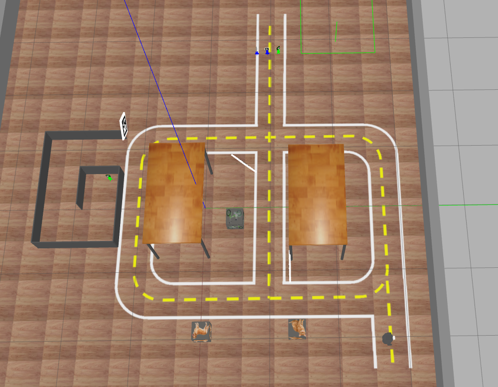

# Projeto - Missão na 404

O objetivo do projeto é programar nosso robô para cumprir um conjunto de missões na sala 404. Utilizaremos o cenário apresentado a seguir.



Os grupos, que podem ser compostos por `até quatro integrantes`, deverão trabalhar em conjuto no repositório do GitHub Classroom disponibilizado. 

[Link para repositório do projeto GitHub Classroom](TODO){ .ah-button }

# **`Data de Entrega: Dia da AF às 12h`**

________________________________________________________

## Instruções gerais

**Aviso 1:** Sempre desenvolvam nos arquivos `.py` dos respectivos exercícios.

**Aviso 2:** Lembre-se de realizar `commit` e `push` no seu repositório até o horário limite de entrega.

**Aviso 3:** Preencha o nome completo dos integrantes do seu grupo no arquivo `README.md` do seu repositório.

**Aviso 4:** Além de seu repositório, para todos os conceitos os grupos **`devem gravar um vídeo do seu robô executando a tarefa`**. O vídeo deve ser postado no Youtube. 

No arquivo `README.md` do seu repositório existe o campo `Link do Vídeo` onde você deve preencher com apenas o link de cada video no youtube. Certifique-se de que o vídeo está público e que o link está correto. `NUNCA de commit no vídeo`, somente adicione o link.

**Aviso 5:** Para o projeto, as entregas são feitas utilizando o robô real. Entregas no simulador serão aceitas, conquistando no máximo o conceito **D**.

**Aviso 6:** São aceitos videos com entregas parciais que comprovam que seu robô é capaz de realizar parte das tarefas. Inclua o link dos vídeos no README com um comentário. 

- É possível realizar a entrega parcial de conceitos avançados, por exemplo, entregar a parte de um conceito **B** antes de entregar a parte de um conceito **C**.

## Configuração do Pacote (ROS 2)

- **Preparação Inicial:** Primeiro, aceite o convite do GitHub Classroom e clone o repositório **dentro da pasta** `colcon_ws/src/` no seu SSD.
- **Criação do Pacote ROS 2:** **Dentro do diretório do seu repositório**, crie um novo pacote chamado `projeto_robcomp`.
    - **Dica:** Para utilizar os modulos desenvolvidos no módulo 3, inclua o pacote `robcomp_util` como dependência do seu pacote, e então, importe como nos exemplos do módulo 3.

________________________________________________________

## Atualização dos Repositórios

Em um novo terminal, execute os comandos a seguir linha por linha.

```bash
cd ~/colcon_ws/src/my_simulation
git stash
git pull
cb
```

## Mapa Simulado

Para inicializar o mapa do desafio, em um terminal digite:

```bash
ros2 launch my_gazebo pista-24B.launch.py
```
________________________________________________________


## Descrição das Missões

O projeto é composto por 4 missões de complexidade crescente, envolvendo tanto o design de software quanto a utilização dos sensores e comportamentos do robô. **É preciso concluir todas as missões anteriores para obter a nota da missão subsequente**.

Cada missão deverá ser registrada em um ou mais vídeos, com o link adicionado no arquivo `README` e o codigo deve ser versionado utilizando o **Releases** do GitHub, com a tag do conceito atingido.

As missões envolvem os seguintes elementos:

* **Pista**: O robô deve permanecer dentro da pista, retornando a ela o mais rápido possível caso saia.

* **Creepers**: Bonecos semelhantes aos do Minecraft, que devem ser transportados até a área de entrega. 
    
    - Eles estão posicionados no **creeper_place** em cor/ID aleatória, com excessão de um que está perdido.

* **"Drop Area"**: Caixas com imagens detectáveis pela MobileNet, local onde os creepers devem ser depositados. Elas são colocadas em locais fixos da pista.

* **Labirinto**: Um dos creepers está dentro de um labirinto, que deve ser percorrido pelo robô para encontrá-lo e resgatá-lo.

* **Placas**: Arucos de `ID` `100`, `150` e `250`. **O grupo pode coloca-las em qualquer lugar**, fora da linha branca, para auxiliar na navegação.

!!!tip
    No simulador, você pode alterar a posição das placas no arquivo `pista24B.world`, em um terminal digite:

    ```cmd
    code /home/borg/colcon_ws/src/my_simulation/my_gazebo/worlds/pista24B.world
    ```

### Para completar uma missão, o grupo deve:

1. Capturar a tela do robô realizando a missão no simulador (até o conceito **C**).

2. Gravar o robô realizando a missão na pista real.

3. Incluir o link do vídeo no README do seu repositório e criar um Release com a tag referente ao último conceito alcançado.

4. Cada missão deve ser concluída em menos de 15 minutos.

5. **Deixar** o creeper em uma "Drop Area" inclui:

    5.1. Parar próximo à "Drop Area".

    5.2. Posicionar-se de frente da "Drop Area".

    5.3. Aproximar-se até ficar a 0.5m de distância.

    5.4. Abaixar a garra e soltar o creeper em pé.

    5.5. Retornar à pista sem derrubar o creeper.

As missões podem ser validadas ao longo do projeto. Solicite a validação da parte de requisitos de software antes de gravar.

Sua classe deve receber como entrada, cor do creeper, ID do creeper e "Drop Area".

<!--- 
!!! Atenção
    Se uma missão for completada apenas no simulador, será concedido 25% da diferença dos conceitos de nota. **A missão C é obrigatória no robô real**.
--->
________________________________________________________

### Missão **D**

!!! warning
    Missão no robô simulado

Essa missão é a mais simples do projeto e envolve aplicar diretamente os conceitos trabalhados na disciplina, para criar um mapa da pista e a localização dos creepers e das "Drop Area".
Os seguintes passos devem ser realizados:

0. Inicie o `cartographer` com um mapa vázio e o nó do robô.

1. Crie um dicinário com as cores dos creepers e seus respectivas IDs e as o objeto das "Drop Area", como o exemplo abaixo:
    
    * Para os creepers, armazene como 

```python
creepers = {
    'verde_10': '',
    'verde_11': '',
    'azul_10': '',
    'azul_11': '',
    'bicicleta': (0,0),
    'cavalo': (0,0),
    ...
}
```

2. O robô sai da posição inicial e visita o local onde estão os creepers.

3. Para cada creepers presente no local, salve sua posição como a string `creeper_place`

4. O creeper que não está no `creeper_place` está no labirinto, anote sua posição como `labirinto`

5. Depois continue andando pela pista até encontrar todas as "Drop Area".

6. Ao encontrar uma "Drop Area", armazene onde ela está no dicionário guardando a posição `(x, y)` do robô quando o viu ou estime sua posição no mapa.

7. Ao encontrar todas as "Drop Area", o robô retorna para a posição inicial, **para** e **imprime** o dicionário com as posições dos creepers.

8. Salve o mapa da pista


**Requisitos de projeto de software**:

* **Uso de Classes**: O código deve ser estruturado de forma orientada a objetos, utilizando classes para organizar as funcionalidades

* **Máquina de Estados**: Implemente uma máquina de estados para gerenciar as diferentes etapas da missão;

* **Controle Proporcional**: Utilize técnicas de controle proporcional para manter o robô na trajetória desejada, especialmente ao seguir a linha.

**Nota final desta missão:** 4,0

________________________________________________________


### Missão **C**

!!! warning
    Realizar a Missão no robô real

Essa missão se resume a executar a missão D no robô real.

**Requisitos de projeto de software**:

- Mesmo desafio da missão **C**
- Utilizar o robô real

**Nota final desta missão:** 5,0


________________________________________________________

### Missão **B**

!!! warning
    Realizar a Missão no robô real

Essa missão utiliza o mapa e a localização dos artefatos da missão anterior e adiciona a capacidade de derubar os creepers. Os seguintes passos devem ser realizados:

0. Iniciar o `navigator` e o nó do robô.

1. A classe recebe a cor e o ID do creeper **desejado** com excessão do creeper perdido no labirinto e a "Drop Area" **desejada**;

2. O robô navega diretamente até o `creeper_place` e pega o creeper **desejado**; 

3. Depois navega até a "Drop Area".

4. O robô deixa o creeper **desejado** na "Drop Area" **desejada**;

5. Volta para a pista e retorna a posição inicial e para.

**Requisitos de projeto de software**:

- Mesmo do **C**

* **Subscriber para Aruco**: Crie um nó específico que identifica o creeper pela cor e ID desejados - tanto pode publicar todos os creepers encontrados quanto apenas o creeper desejado - é uma boa prática este nó se inscrever em um tópico *flag* que indica se o nó deve ou não processar.

* **Subscriber para MobileNet**: Crie um nó para a leitura da MobileNet. Ele deve publicar um tópico com a posição (na imagem) e classe da caixa detectada - é uma boa prática este nó se inscrever em um tópico *flag* que indica se o nó deve ou não processar.

**Nota final desta missão:** 8,0

#### Entrega Parcial
1. O robô derruba um creeper em uma posição específica;
2. O robô derruba um creeper em uma posição específica e retorna a posição inicial.
3. O robô derruba um creeper e se move para a "Drop Area".
4. O robô consegue pegar um creeper em um ambiente controlado;


________________________________________________________

### Missão **A**

!!! warning
    Realizar a Missão no robô real

Essa missão utiliza os conceitos das missões anteriores adicionando `resgatar o creeper` do labirinto e levar ele para a "Drop Area". Os seguintes passos devem ser realizados:

0. Iniciar o `navigator`, o `cartografer` e o nó do robô.

1. A classe recebe a cor e o ID do creeper **desejado** (no caso o que está perdido no labirinto) e a "Drop Area" **desejada**;

2. O robô vai até o labirinto, navegando pelo labirinto até encontrar o o creeper **desejado**;

4. O robô pega o creeper **desejado**;

5. O robô sai do labirinto e segue para a "Drop Area";

6. O robô deixa o creeper **desejado** na "Drop Area" **desejada**;

7. O robô retorna para a posição inicial e para.

**Requisitos de projeto de software**:

- Mesmo do **B**

**Nota final desta missão:** 10,0

#### Entrega Parcial
1. O robô consegue entrar e sair do labirinto sem ter o mapa do labirinto.
________________________________________________________

### Bonus

Boas práticas de Python e ROS que podem render pontos bônus no projeto:

- Utilização de Launch Files para execução do projeto
- Implementação de múltiplos "Action Servers" para todas as ações relevantes do robô.
- Configuração eficiente de parâmetros ROS
- POO, Modularização e reusabilidade de código.
