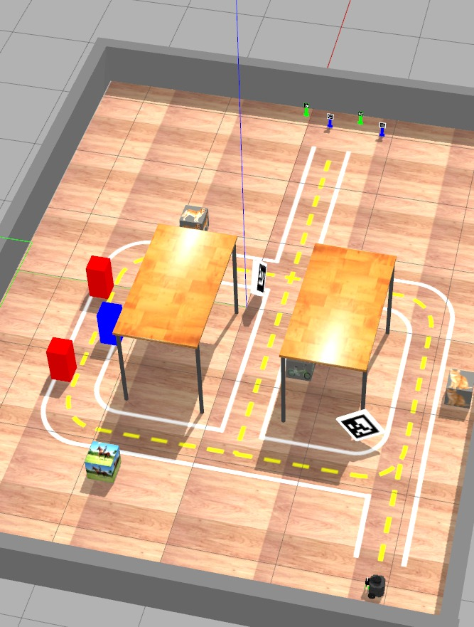

# Missão na 404

O objetivo deste projeto, realizado no contexto da disciplina, é programar um TurtleBot para cumprir uma série de missões robóticas na sala 404. Utilizaremos o cenário apresentado abaixo.



Os grupos, compostos por quatro integrantes, deverão trabalhar juntos utilizando o repositório do GitHub Classroom disponibilizado. 


[Link para tarefa do GH Classroom](https://classroom.github.com/a/NkmSeO1t){ .ah-button }

**Data de Entrega: 01/12 23:59**

## Inicialização do Projeto

O repositório do Github Classroom conterá apenas o arquivo README. O primeiro passo para iniciar o projeto é seguir o [guia de início de projetos ROS](criar-projeto.md), a ser realizado por um dos membros do grupo.

Após essa etapa, os demais membros devem clonar o repositório ROS na pasta `~/catkin_ws/src` utilizando o comando:

```bash
git clone SEU_REPO_AQUI ~/catkin_ws/src/
```

É essencial que **todos os integrantes do grupo** atualizem os repositórios locais para obter a pista do projeto. Utilize os comandos a seguir para isso:

```bash
cd ~/catkin_ws/src/mybot_description
git pull
cd ~/catkin_ws/src/my_simulation
git pull
cd ~/catkin_ws
catkin_make
```

Para iniciar a simulação da pista do projeto, execute o comando abaixo.

```bash
roslaunch my_simulation pista23-B.launch
```

Para habilitar controles da garra

```bash
roslaunch mybot_description mybot_control2.launch
```

Cada missão deverá ser registrada em um ou mais vídeos, com o link adicionado no arquivo README e versionado utilizando o **Releases** do GitHub, com a tag do conceito atingido.

## Descrição das Missões

O projeto é composto por várias missões de complexidade crescente, envolvendo tanto o design de software quanto a utilização dos sensores e comportamentos do robô. **É preciso concluir todas as missões anteriores para obter a nota da missão subsequente**. As missões envolvem os seguintes elementos:

* **Pista**: O robô deve permanecer dentro da pista, retornando a ela o mais rápido possível caso saia.

* **Creepers**: Bonecos semelhantes aos do Minecraft, que devem ser transportados até a área de entrega.

* **Drop Area**: Caixas com imagens detectáveis pela MobileNet, local onde os creepers devem ser depositados.

* **Slalom**: Sequência de três caixas coloridas dispostas em zigue-zague.

Para completar uma missão, você deve:

1. Capturar a tela do robô realizando a missão no simulador.

2. Gravar o robô realizando a missão na pista real.

    2.1. Para filmar, é necessário agendar a preparação da pista com a equipe técnica, garantindo condições semelhantes para todos os grupos.

3. Incluir o link do vídeo no README do seu repositório e criar um Release com a tag referente ao último conceito alcançado.

4. Cada missão deve ser concluída em menos de 15 minutos.

5. **Deixar** o creeper em uma drop area inclui:

    5.1. Parar próximo à drop area.

    5.2. Posicionar-se de frente para a drop area.

    5.3. Aproximar-se até ficar a 0.5m de distância.

    5.4. Abaixar a garra e soltar o creeper em pé.

    5.5. Retornar à pista sem derrubar o creeper.

As missões podem ser validadas ao longo do projeto. Solicite a validação da parte de requisitos de software antes de gravar.

Os argumentos de linha de comando para o seu código devem ser:
```python
parser = argparse.ArgumentParser()
parser.add_argument('--cor', type=str, default='verde', help='cor do creeper desejado')
parser.add_argument('--id', type=int, default=10, help='id do creeper desejado')
parser.add_argument('--drop', type=str, default='bicicleta', help='drop area desejada')
args = parser.parse_args()
```

!!! Atenção
    Se uma missão for completada apenas no simulador, será concedido 25% da diferença dos conceitos de nota. **A missão D é obrigatória no robô real**.

### Missão **D**

Essa missão é a mais simples do projeto e envolve aplicar diretamente os conceitos trabalhados na APS04. Os seguintes passos devem ser realizados:

1. O programa recebe um argumento na linha de comando: cor do creeper **desejado**;

1.1. Utilize a biblioteca `argparse` em Python;

1.2. Exemplo de chamada: `python3 missaoD.py --cor verde`

2. O robô sai da posição inicial e segue reto na bifurcação;

3. Ele segue pela área da direita até juntar novamente os caminhos;

4. Vai em direção aos creepers e derruba o creeper **desejado**;

5. Retorna para a posição inicial usando a mesma pista

**Requisitos de projeto de software**:

* **Uso de Classes**: O código deve ser estruturado de forma orientada a objetos, utilizando classes para organizar as funcionalidades

* **Máquina de Estados**: Implemente uma máquina de estados para gerenciar as diferentes etapas da missão;

* **Controle Proporcional**: Utilize técnicas de controle proporcional para manter o robô na trajetória desejada, especialmente ao seguir a linha.

**Nota final desta missão:** 3,0

!!! Atenção
    É obrigatório rodar essa missão no robô real

### Missão **C**

A missão **C** envolve usar a garra para pegar o creeper (e possivelmente o LiDAR para medir a distância até ele). Neste estágio também será necessário diferenciar os creepers da mesma cor pelo ID.

1. O programa recebe um argumento na linha de comando: cor do creeper **desejado**;

2. O robô sai da posição inicial e segue reto na bifurcação;

3. Ele segue pela área da direita até juntar novamente os caminhos;

4. Ele pega o creeper **desejado** e retorna pela pista do centro;

5. Ele **deixa** o creeper na bicicleta;

6. Para na posição inicial.

**Requisitos de projeto de software**:

* **Uso de Classes**: O código deve ser estruturado de forma orientada a objetos, utilizando classes para organizar as funcionalidades

* **Máquina de Estados**: Implemente uma máquina de estados para gerenciar as diferentes etapas da missão - **apenas** a função control deve publicar comandos para o robô;

* **Controle Proporcional**: Utilize técnicas de controle proporcional para manter o robô na trajetória desejada, especialmente ao seguir a linha.

* **Subscriber para Aruco**: Crie um nó específico para a leitura dos marcadores Aruco. Ele deve publicar um tópico com a posição e orientação do marcador detectado - é uma boa prática este nó se inscrever em um tópico *flag* que indica se o nó deve ou não processar.

* **Subscriber para MobileNet**: Crie um nó para a leitura da MobileNet. Ele deve publicar um tópico com a posição e orientação do marcador detectado - é uma boa prática este nó se inscrever em um tópico *flag* que indica se o nó deve ou não processar.

**Nota final desta missão:** 5,0

### Missão **C+**

A missão **C+** adiciona um novo desafio de controle: fazer o **Slalom**

1. O programa recebe dois argumentos na linha de comando: cor e id do creeper **desejado**.
1. O robô sai da posição inicial, vira à esquerda na bifurcação
3. Segue até a pista da esquerda
2. Faz o **Slalom** e prossegue até a área dos creepers
3. Pega o creeper **verde** e deposita na drop área da pista do centro
4. Volta para posição inicial

**Requisitos de projeto de software**:

- Mesmo do **C**

**Nota final desta missão:** 6,5

### Missão **B**

Agora vamos integrar tudo, com objetivos que dependem da *MobileNet*

1. O programa recebe 3 argumentos na linha de comando: cor e id do creeper **desejado** e drop área
2. Vai até a área do creepers usando qualquer caminho que quiser e pega o creeper
3. Encontra a drop área passada como argumento. **Neste item ela sempre estará no centro ou na direita.**
4. Deposita o creeper na drop área requisitada
5. Retorna ao ponto inicial

!!! warning
    Para demonstrar o funcionamento do seu robô será necessário fazer vários testes:

    - combinações de creepers e ID diferentes
    - depositar creeper em cada uma das 2 drop áreas

    Planeje bem o desenvolvimento do seu projeto para que isso seja feito na menor quantidade possível de filmagens.

    Para a filmagem, é necessário agendar a preparação da pista com a equipe técnica, garantindo condições semelhantes para todos os grupos. O ID do creeper e a drop área serão escolhidos aleatoriamente pela equipe técnica.

**Requisitos de projeto de software**:

- Mesmo do **C**
* Código não leva em conta conhecimento sobre a posição das drop áreas, mas sim a detecção da imagem das caixas;

* Parte da visão do código está feita em um **nó separado** do nó de controle. Nó de visão publica um ou mais tópicos com as informações detectadas.


**Nota final desta missão:** 8,0

### Missão **B+**

Esse item é exatamente igual ao anterior, mas deve-se demonstrar a missão acima com caixas em posições diferentes das que estão no cenário simulado. Ou seja, faça dois vídeos em que

1. todas as drop áreas estão em locais diferentes (e longe dos locais originais)
2. trocou as drop áreas de lado (a do centro foi para a direita e a da direita para o centro) 

**Requisitos de projeto de software**:

- Mesmo do **B**


**Nota final desta missão:** 9,0

### Missão **A+**

A missão final é a mesma da **Missão B**, mas com um adendo: qualquer uma das 4 drop áreas pode ser passada na linha de comando e elas podem estar em qualquer lugar da pista. Isso significa que iremos juntar tudo o que foi feito em um único programa:

1. **Garra** e **LiDAR** para pegar os creepers
2. **mobile net** para detectar as drop áreas corretas
3. **aruco** para encontrar encruzilhadas e creepers
4. **controle proporcional** para andar na pista sem sair
5. **planejamento e máquina de estados** para criar comportamento complexo a partir de estados "simples"

!!! warning
    Aqui será necessário criar várias filmagens para validar. Isso dá um certo trabalho fazer no robô real, então algumas delas podem ser feitas no simulador. Faça várias combinações possíveis de

    - cores do creeper a ser pego
    - drop área para depositar (colocar no lado do slalom e no outro lado)

**Nota final desta missão:** 10,0

-----------------------------------------


!!! people "Contribuições"
    -  **Diego Pavan Soler** *Professor*
    -  **Arnaldo Alves Viana Junior** *Prof. Auxiliar*
    -  **Rogério Cuenca** *Técnico de lab*
    -  **Igor Montagner** *Professor-23a*


