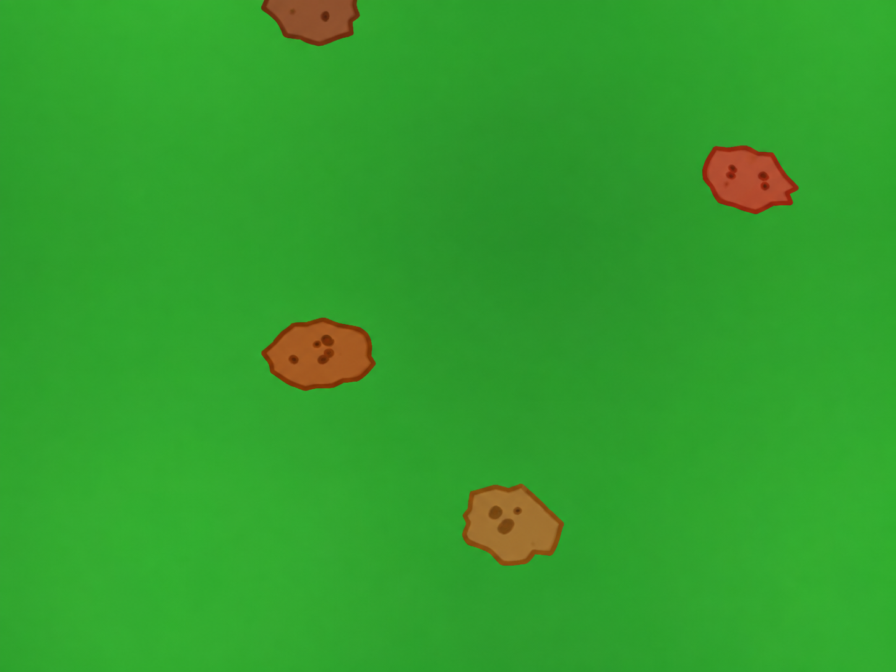

# Robótica Computacional 2026.2 - AI

Instruções para a avaliação:

* A prova tem duração de **4 horas**.
* Inicie a prova no Blackboard para que a ferramenta Smowl seja iniciada.
* O Smowl é obrigatório durante toda a prova.
* Só finalize o Blackboard depois de enviar a prova para o repositório informado, incluindo o hash do último commit na resposta do Blackboard.
* Durante a prova serão registrados a câmera, a tela, as páginas visitadas, os acessos on-line e o teclado.
* Coloque seu `nome` e `e-mail` no `README.md` do seu repositório.
* A prova deverá ser realizada individualmente.
* Não é permitido consultar a internet, com exceção do site da disciplina, do Blackboard e do repositório da avaliação informado no Blackboard.
* **Não é permitido usar ferramentas de IA**, como ChatGPT, Copilot, Gemini ou similares, durante a prova.
* Não é permitido usar ferramentas colaborativas, como Google Docs, Google Slides, Notion ou similares.
* Não é permitido usar ferramentas de comunicação, como Discord, WhatsApp, Telegram ou similares.
* Não é permitido usar editores de código com IA, como Cursor ou Windsurf. É permitido apenas o uso do **VS Code**, com o Copilot desativado.
* Não é permitido acessar redes sociais, fóruns ou plataformas de comunicação.
* Só é permitido acessar documentos e arquivos estáticos em PDF, TXT, MD, DOCX ou DOC utilizando ferramentas off-line.
* Não é permitido fazer `push` ou `pull` de repositórios que não sejam o repositório da avaliação informado no Blackboard.
* Faça commits e pushes regularmente durante a avaliação.
* Eventuais avisos importantes serão feitos em sala.
* Escreva a frase `yey` como resposta da soma no arquivo `README.md`, como teste de atenção.
* A responsabilidade pelo funcionamento da infraestrutura, das configurações e do ambiente é de cada estudante.
* **SÓ SERÃO ACEITOS REPOSITÓRIOS DE ESTUDANTES QUE ASSINARAM A LISTA DE PRESENÇA.**

**BOA PROVA!**

## Atualização dos pacotes ROS 2

Execute os comandos abaixo para atualizar os pacotes obrigatórios para a prova:

```bash
cd ~/colcon_ws/src/my_simulation
git add .
git stash
git checkout main
git pull
cb
```

## Configuração do pacote ROS 2

* **Preparação inicial:** clone o repositório informado no Blackboard dentro da pasta `~/colcon_ws/src/` do SSD.
* **Criação do pacote:** dentro do diretório do seu repositório, crie um pacote chamado `avaliacao_ai`.
* Para utilizar os módulos desenvolvidos no capítulo 3, inclua `robcomp_util` e `robcomp_interfaces` como dependências do pacote.

---

# Exercício 0 - Organização e qualidade (gate)

Este exercício avalia a organização da entrega, a execução dos programas e a qualidade dos vídeos. O descumprimento deste gate limita a nota total da prova a **2,0 pontos**.

## Critérios do gate

* O pacote `avaliacao_ai` foi criado e configurado corretamente.
* As dependências do pacote estão declaradas corretamente.
* Todos os scripts da prova estão no módulo Python `avaliacao_ai` do pacote `avaliacao_ai`.
* Os nós ROS 2 são executados usando `ros2 run`.
* Os programas são executados sem alterações manuais durante a demonstração.
* Os vídeos permitem compreender claramente a execução e mostram os terminais solicitados.
* O `README.md` contém o nome completo, o e-mail e os links solicitados.

---

# Exercício 1 - Segue Comando (5,0)

Baseando-se no código `base_control.py` do capítulo 3, crie um arquivo chamado `q1.py` com uma classe denominada `SegueComando`. A classe deve implementar um nó chamado `segue_comando_node`, responsável por executar comandos enviados por um **Comandante** e informar medidas sobre a execução.

O Comandante publica no tópico `/comando`, usando mensagens do tipo `robcomp_interfaces.msg.ComandanteMSG`. O nó do aluno responde no tópico `/resposta`, usando mensagens do tipo `robcomp_interfaces.msg.RoboMSG`.

Toda mensagem enviada pelo robô deve conter o **nome completo do aluno** e o **horário atual**, preenchidos nos campos apropriados. O horário deve ser atualizado a cada publicação; não copie o valor recebido do Comandante.

Para verificar as interfaces instaladas, utilize:

```bash
ros2 interface show robcomp_interfaces/msg/ComandanteMSG
ros2 interface show robcomp_interfaces/msg/RoboMSG
```

## Comandos

O Comandante pode enviar os seguintes comandos, com os parâmetros preenchidos nos campos apropriados:

* `andar`: andar em linha reta a distância positiva indicada, em metros.
* `girar`: girar o ângulo indicado, em graus. Valores positivos representam o sentido anti-horário e valores negativos, o sentido horário.
* `parar`: interromper imediatamente um comando `andar` ou `girar`.
* `quadrado`: completar um quadrado de lado `1,0 m` e retornar à pose inicial.
* `triangulo`: completar um triângulo equilátero de lado `1,0 m` e retornar à pose inicial.
* `erro`: responder com o erro da tarefa atual ou da última forma concluída, conforme descrito abaixo.

Os comandos `quadrado` e `triangulo` **não serão interrompidos** pelo Comandante.

## Estados e respostas do robô

O robô deve utilizar somente os sseguintes valores no campo apropriado de estado da mensagem `RoboMSG`:

* `READY`: publicado uma única vez, no início do nó para iniciar a execução (publicar novamente reinicia o Comandante).
* `IN_PROGRESS`: publicado uma única vez quando o robô começa um movimento.
* `STOPPED`: utilizado nas respostas enviadas enquanto o robô estiver efetivamente parado.

Ao receber `parar`, o robô deve primeiro interromper o movimento e somente então responder `STOPPED`. Depois dessa resposta, o Comandante enviará `erro`:

* se a tarefa interrompida for `andar`, o robô responde com a distância que falta, em metros;
* se a tarefa interrompida for `girar`, o robô responde com o módulo do ângulo que falta, em graus.
* se a última tarefa for `quadrado` ou `triangulo`, o robô responde com a deriva da forma, em metros. 

**Deriva** é a distância euclidiana, em metros, entre a posição em que o robô inicia uma forma geométrica e a posição em que termina essa forma.

## Sequência do Comandante

Em cada execução, o Comandante:

1. envia dois comandos, sempre um `andar` e um `girar`, em ordem aleatória;
2. envia `parar` durante cada uma dessas tarefas;
3. aguarda o robô responder `STOPPED`, envia `erro` e segue para o próximo comando;
4. depois que `andar` e `girar` forem interrompidos, escolhe aleatoriamente `quadrado` ou `triangulo`;
5. aguarda o robô concluir a forma e responder `STOPPED`;
6. envia `erro`, a deriva informada pelo robô e encerra a sequência.


## Simulador

Utilize o comando abaixo para iniciar o simulador:

```bash
ros2 launch my_gazebo empty_world.launch.py
```

Para verificar a comunicação, mantenha dois outros terminais exibindo os tópicos:

```bash
ros2 topic echo /comando
```

```bash
ros2 topic echo /resposta
```

## Requisitos

1. Deve existir um arquivo chamado `q1.py`.
2. A classe deve se chamar `SegueComando` e o nó, `segue_comando_node`.
3. O nó deve assinar `/comando` com `robcomp_interfaces.msg.ComandanteMSG` e publicar em `/resposta` com `robcomp_interfaces.msg.RoboMSG`.
4. A implementação deve seguir a estrutura de máquina de estados do exemplo `base_control.py`.
5. A função `control` deve ser a única a publicar no tópico `/cmd_vel` e deve permanecer idêntica à função fornecida no exemplo.
6. Não é permitido usar `sleep`, loops infinitos ou loops `while` para controlar o movimento dentro de estados.
7. O robô deve parar imediatamente ao receber `parar`, responder `STOPPED` e permanecer imóvel até receber o próximo comando do Comandante.
8. Toda `RoboMSG` deve conter o nome completo do aluno e o horário atual nos campos apropriados.
9. Cada mudança de estado e cada solicitação de `erro` devem produzir exatamente uma resposta em `/resposta`; não é permitido publicar continuamente ou enviar spam.

## Rúbrica

1. **+0,5:** comunica-se com os tipos customizados, preenchendo todos os campos apropriados e sem enviar spam.
2. **+1,0:** executa corretamente os comandos `andar` e `girar` nos dois sentidos, usando odometria.
3. **+1,0:** interrompe imediatamente `andar` e `girar` e informa corretamente quanto faltava para concluir cada tarefa.
4. **+1,0:** executa corretamente `quadrado` ou `triangulo` e retorna próximo da posição inicial.
5. **+1,5:** calcula e publica corretamente a deriva da forma concluída.

Os itens são cumulativos: um item pressupõe o funcionamento dos anteriores.

## Vídeo

Grave um vídeo contínuo mostrando:

* o terminal do nó do robô;
* o terminal da simulação;
* o `echo` de `/comando` e `/resposta`;
* as interrupções de `andar` e `girar` e os respectivos erros informados;
* a execução completa da forma geométrica;
* a resposta final contendo a deriva.

Publique o vídeo no YouTube e inclua apenas o link no `README.md`. Entregas parciais são aceitas, sem garantia de nota; explique no `README.md` e na descrição do vídeo até onde a implementação funciona.

---

# Exercício 2 - Contador de Batatas (5,0)

LINK DOWNLOAD DOS VIDEOS: https://insper.github.io/robotica-computacional/provas/ai/videos_batatas.zip

Crie um arquivo chamado `q2.py` com uma classe `ProcessaImage` e um método `roda_video`:

```python
class ProcessaImage:
    def roda_video(self, caminho_video: str) -> int:
        ...
```

O método deve abrir **um vídeo por vez**, contar quantas batatas atravessam a cena e retornar esse total como `int`.

Os vídeos possuem fundo verde e batatas marrons. Em cada vídeo, as batatas seguem trajetórias paralelas em um único sentido, que pode ser horizontal, vertical ou diagonal. As velocidades podem ser diferentes, mas não ocorrem colisões. Cada batata deve ser contada apenas uma vez.



Ao final, durante o processamento, você deve exibir uma janela contendo:

* o contorno de cada batata detectada;
* a trajetória de cada batata;
* o contador atualizado de batatas.

Ao terminar o vídeo, deve imprimir o total:

```text
Total de batatas: <quantidade>
```

!!! dica
    Para escrever o contador na imagem com OpenCV, utilize `cv2.putText`:

    ```python
    cv2.putText(
        frame,
        f"Batatas: {contador}",
        (20, 40),
        cv2.FONT_HERSHEY_SIMPLEX,
        1,
        (255, 255, 255),
        2,
        cv2.LINE_AA,
    )
    ```

## Requisitos

1. Deve existir um arquivo chamado `q2.py`.
2. A classe deve se chamar `ProcessaImage` e possuir o método `roda_video` com a assinatura especificada.
3. O método deve abrir o vídeo com `cv2.VideoCapture`, processá-lo até o fim e retornar um `int`.
4. A solução deve segmentar e rastrear as batatas, desenhando suas trajetórias.
5. Cada batata deve ser contada exatamente uma vez, mesmo permanecendo visível durante vários frames.
6. A visualização deve mostrar os contornos, as trajetórias e o contador atualizado.
7. A solução será avaliada também com um vídeo oculto, não disponibilizado previamente. Não é permitido determinar a resposta pelo nome ou pela duração do arquivo.

## Rúbrica

1. **+0,5:** segmenta todas as batatas nos vídeos.
2. **+1,0:** identifica todas as batatas nos vídeos.
3. **+1,5:** conta cada batata uma única vez, sem duplicar objetos presentes em vários frames.
4. **+1,5:** identifica e desenha as trajetórias das batatas.
5. **+0,5:** retorna e imprime o total de batatas no vídeo.

Os itens são cumulativos: um item pressupõe o funcionamento dos anteriores.

## Vídeo

Grave um vídeo mostrando o processamento completo de **um** dos vídeos fornecidos, incluindo a janela do OpenCV e o total final impresso no terminal. Publique-o no YouTube e inclua apenas o link no `README.md`.
