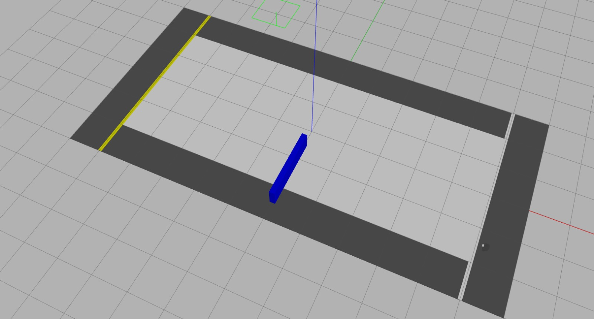

# Robótica Computacional 2025.1 - DELTA

Instruções para a avaliação:

* A prova tem duração de **4 horas**.
* Inicie a prova no Blackboard para a ferramenta do Smowl ser iniciada. 
* O Smowl é obrigatório durante toda a prova.
* Só finalize o Blackboard quando enviar a prova via Github Classroom incluindo o hash do último commit na resposta do Blackboard.
* Durante a prova vamos registrar, a tela, as páginas visitadas, os acessos online e os registro do teclado.
* Coloque seu `nome` e `email` no `README.md` do seu repositório.
* A prova deverá ser realizada de forma individual.
* É permitido consultar a internet ou qualquer material utilizado no curso, mas não será permitida a comunicação com terceiros durante a prova *`em qualquer plataforma`*.
* `Não é permitido o uso de ferramentas de **IA** como chatGPT, Copilot, Gemini ou similares durante a prova`.
* `Não é permitido o uso de ferramentas colaborativas como Google Docs, Google Slides, ou similares durante a prova`.
* `Não é permitido o uso de ferramentas de comunicação como Discord, WhatsApp, Telegram ou similares durante a prova`.
* `Não é permitido o uso de ferramentas de colaboração de código como GitHub Codespaces, Codeshare ou similares durante a prova`.
* `Não é permitido o uso de editores de codigo com IA como Cursor ou Windsurf durante a prova, sendo **permitido apenas o uso do VSCode**`.
* `Não é permitido o uso de redes sociais, fóruns ou plataformas de comunicação durante a prova`, com exceção apenas do `Stack Overflow` e `ROS Answers`, desde que o aluno não faça perguntas nas plataformas.
* Faça commits e pushes regularmente de sua avaliação.
* Eventuais avisos importantes serão realizados em sala durante a prova.
* Escreva a frase "robcomp" como a resposta da soma no arquivo `README.md` como teste de sua atenção.
* A responsabilidade por *`infraestrutura`*, *`configurações`* e *`setup`* em funcionamento pleno, é de cada estudante.
* **SÓ SERÃO ACEITOS REPOSITÓRIOS DE ALUNOS QUE ASSINARAM A LISTA DE PRESENÇA.**

* **BOA PROVA!**

## Atualização do Pacote (ROS 2)

Execute os comandos abaixo para atualizar os pacotes da `ros2` obrigatórios para a prova:

```bash
cd ~/colcon_ws/src/my_simulation
git stash
git pull
cb
```

## Configuração do Pacote (ROS 2)

- **Preparação Inicial:** Primeiro, aceite o convite do GitHub Classroom e clone o repositório **dentro da pasta** `colcon_ws/src/` no seu SSD.

- **Criação do Pacote ROS 2:** **Dentro do diretório do seu repositório**, crie um novo pacote chamado `avaliacao_sub`.

    - **Dica:** Para utilizar os módulos desenvolvidos no capitulo 3, inclua o pacote `robcomp_util` e o pacote `robcomp_interfaces` como dependência do seu pacote, e então, importe como nos exemplos do capitulo 3.

____________________________________________________________________

# Exercício 0 - Organização & Qualidade (0 ou penalidade de até -2)
Este exercício avalia a organização e a qualidade dos vídeos dos exercícios e do arquivo `README.md`.

## Critérios de Avaliação:
1. Configuração do Pacote:
    * O pacote foi corretamente configurado.
    * As dependências estão declaradas corretamente e funcionando.
    * Os diretórios e arquivos estão organizados de forma adequada.
    * Todos os scripts estão na pasta `avaliacao_sub` do pacote `avaliacao_sub`.
2. Execução dos Nós:
    * A configuração dos nós foi realizada corretamente.
    * Os nós da ROS 2 foram executados utilizando o comando `ros2 run`.
3. Vídeo de Demonstração:
    * A execução do robô é clara, objetiva e compreensível no vídeo.
4. README.md:
    * O link do vídeo foi adicionado corretamente no campo indicado.
    * O arquivo contém o nome completo e o e-mail do estudante.
____________________________________________________________________

# Exercício 1 - Teleop Visual (5)

<!-- <div style="text-align: center;">
    
</div> -->

# Exercício 1 - Batatinha-Frita-1-2-3 (6)

<div style="text-align: center;">
    
</div>

Baseando-se no código `base_control.py` do capitulo 3, crie um arquivo chamado `q1.py` contendo uma classe denominada `Jogador`. Esta classe deve implementar um **nó** chamado `jogador_node`, responsável por fazer com que o robô **simulado** jogue o jogo da batatinha-frita-1-2-3 com **Young-Hee**.

No jogo batatinha-1-2-3, **Young-Hee** vai publicar as palavras sequenciais "ba", "ta", "ti", "nha", "fri", "ta", "1", "2", "3" e então, **Young-Hee** vai aguardar entre 2 a 5 segundos antes de voltar a publicar a mesma sequência. O robô só pode se mover enquanto **Young-Hee** estiver publicando as palavras "ba", "ta" e "ti". Se o robô se mover enquanto **Young-Hee** não estiver publicando, o robô perde o jogo e deve recomeçar. O robô vence o jogo se chegar no final da pista. 

Ao chegar no final da pista, **Young-Hee** vai publicar o tempo que o robô levou para chegar no final e o robô deve parar e comemorar de alguma forma.

Utilize o comando abaixo para iniciar o simulador no mapa da prova:

```bash
ros2 launch my_gazebo run_turtle.launch.py
```

O nó criado deve: 

* Criar um publisher para o tópico `/young_hee` que publica mensagens do tipo `robcomp_interfaces.msg.GameStatus`.
* Ao iniciar, o nó deve publicar uma mensagem com o status READY, com o horário atual e o nome do aluno nos campos apropriados.
* Com isso, **Young-Hee** vai começar o jogo, mudando o status para IN_PROGRESS e publicando as palavras em sequenciais em loop.
    * **Young-Hee** demora de 0.5 a 2 segundos para publicar cada palavra.
    * Após publicar a palavra "3", **Young-Hee** vai aguardar entre 2 a 5 segundos antes de voltar a publicar a mesma sequência.
* O robô deve se mover para frente enquanto **Young-Hee** estiver publicando as palavras "ba", "ta" e "ti"...
* O robô deve estar parado a partir de quando **Young-Hee** publicar a palavra "3".
* Se **Young-Hee** mudar o status do jogo para LOST, o robô deve parar e nunca mais se mover, sendo nescessário reiniciar o nó.
* O robo deve seguir a pista so se movendo na hora certa.
* Quando o robô chegar no final da pista, à partir de `X = -5`, **Young-Hee** vai mudar o status para WIN e o robô deve parar e imprimir no terminal uma comemoração - seja criativo!
* Depois de chegar no final da pista o robô deve parar enquanto ainda na região preta e não se mover mais.


!!! dica
    Durante a execução do nó, você terá que interroper algum estado do robô, enquanto **Young-Hee** não estiver publicando. Portanto, armazene o estado do robô em uma variável, enquanto o robô não estiver se movendo e então, retorne o estado do robô para o valor original quando **Young-Hee** voltar a publicar.

<div style="text-align: center;">
    
</div>

## Requisitos

1. Deve existir o arquivo chamado `q1.py`.
2. O programa deve ser executado sem erros.
3. A classe deve ser chamada `Jogador`.
4. A implementação deve seguir a estrutura da classe `Jogador`, conforme exemplo no `base_control.py`.
5. A função `control` deve ser a única à publicar no tópico `/cmd_vel`.
6. A função `control` deve ser idêntica à do arquivo `base_control.py`, com excesão ao `check_danger` que pode ser removido. Todas as decisões de controle devem ocorrer dentro dos nós, sem alterações na função `control`.
7. Não utilizar loops infinitos ou `sleep` durante o controle do robô.
8. Deve se inscrever e publicar no tópico `/young_hee` com mensagens do tipo `robcomp_interfaces.msg.GameStatus`.
9. Deve seguir as regras do jogo da batatinha-frita-1-2-3.
10. Deve começar sempre da posição padrão inicial do robô.
11. Você pode remover a parede, mas dessa forma sua nota será limitada a 3,0.

## Rúbrica

1. O programa deve respeitar as restrições definidas.
2. Nota: +0,0 - [1] & o robô mantém a conversa com o **Young-Hee** sem spamar.
3. Nota: +0,0 - [2] & o robô consegue andar e parar quando **Young-Hee** não está falando.
4. Nota: +3,0 - [3] & o robô consegue chegar até o final da circuito e vencer o jogo, comemorando e parando na região preta.
5. Nota: +3,0 - [4] & não foi feito nenhum ajuste no mapa, tento o robô de contornar a parede enquanto segue as regras do jogo.

## Vídeo

Grave um vídeos, mostrando a conversa com o **Young-Hee** (`echo no tópico`), o terminal da simulação, o terminal do robô (3 terminais no total) e o robô executando as intruções. Publique os vídeos no YouTube e inclua apenas o `link` no arquivo `README.md` do seu repositório.

Entregas parciais são aceitas, sem garantia de nota, o aluno deve explicar no `README.md` e na descrição do vídeo até onde foi feito.

___________________________

# Exercício 2 - Mede Caixa (4)

Baseando-se no código `base_control.py` do capitulo 3, crie um arquivo chamado `q2.py` contendo uma classe denominada `MedirCaixa`. Esta classe deve implementar um **nó** chamado `medidor_node`, responsável por fazer com que o robô **simulado** navegue automaticamente até a caixa, contorne-a e meça a sua largura e comprimento.

Utilize o comando abaixo para iniciar o simulador no mapa da prova:

```bash
ros2 launch my_gazebo vazio.launch.py
```

O nó criado deve: 

* Funcionar completamente de forma autônoma, sem intervenção humana em nenhum momento (como por exemplo, mapear a caixa manualmente antes de iniciar o nó).
* Navegar até a caixa, contorná-la e retornar ao ponto de partida.
* Medir a largura e o comprimento da caixa e imprimir no terminal utilizando a função de `log` da ROS 2. (Não imprimir utilizando a função `print` do Python).

## Restrições

1. A caixa estará sempre na origem e na mesma orientação.
2. As dimensões da caixa são desconhecidas e devem ser medidas pelo robô.
3. As dimensões da caixa podem variar entre 0.5 e 2.0 metros.
4. O robô pode iniciar em duas posições diferentes (2,2) ou (-2,2), mas a caixa sempre estará no alcance do laser do robô.

!!! dica
    Você pode modificar o tamanho da caixa editando o arquivo `model.sdf` no diretório `my_gazebo/models/caixas/caixa/` **linha 51**.

    ```bash
    code /home/borg/colcon_ws/src/my_simulation/my_gazebo/models/caixas/caixa/model.sdf
    ```

!!! dica
    Utilize o laser para medir/navegar até a caixa e contorná-la.

## Rúbrica

1. O programa deve respeitar as restrições definidas.
3. Nota +1,0 - [2] & o robô consegue contornar a caixa e retornar ao ponto de partida.
5. Nota +3,0 - [4] & o robô consegue medir e mostrar a largura e o comprimento da caixa com precisão de +- 10%.

## Vídeo

Grave **DOIS** vídeos, mostrando o robô executando as intruções com caixas de tamanhos diferentes. Publique os vídeos no YouTube e inclua apenas os `links` no arquivo `README.md` do seu repositório.