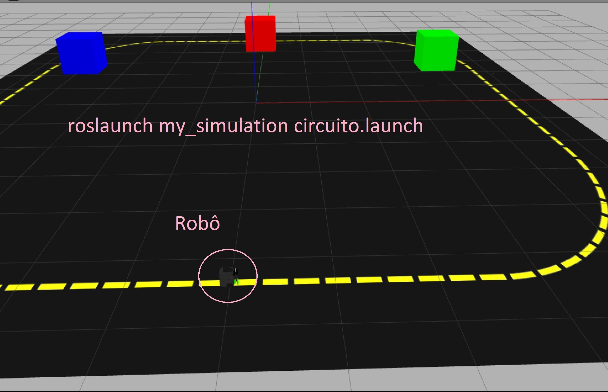
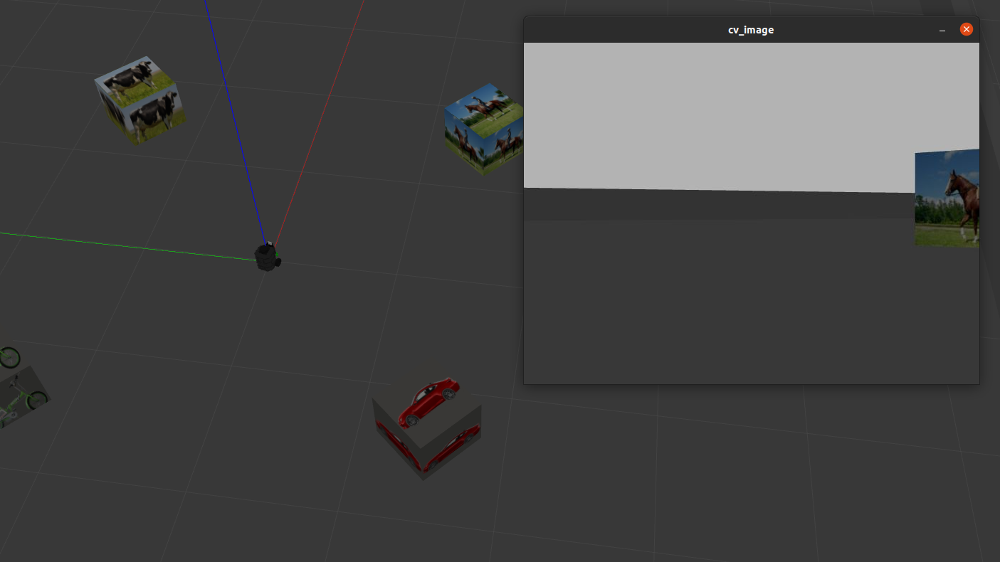
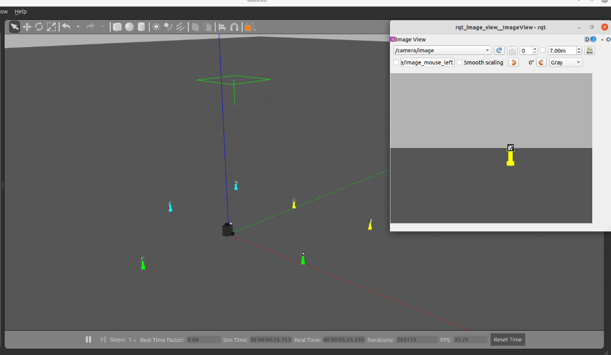

# Robótica Computacional 2023.1 - Prova Final

EMAIL: ______________

Observações de avaliações nesta disciplina:

* Inicie a prova no Blackboard para a ferramenta de Proctoring iniciar. Só finalize o Blackboard quando enviar a prova via Github classroom
* Durante esta prova vamos registrar somente a tela, não a câmera nem microfone
* Ponha o nome no enunciado da prova no Github
* Você pode consultar a internet ou qualquer material que usamos no curso, mas não pode se comunicar com pessoas ou colegas a respeito da prova. Também não pode usar ferramentas de **IA** como chatGPT ou Github Copilot durante a prova.
* Faça commits e pushes frequentes no seu repositório
* Avisos importantes serão dados na sala da prova
* Permite-se consultar qualquer material online ou próprio. Não se pode compartilhar informações com colegas durante a prova.
* Faça commits frequentes. O primeiro a enviar alguma ideia será considerado autor original
* A responsabilidade por ter o *setup* funcionando é de cada estudante
* Questões de esclarecimento geral podem ser perguntadas
* É vedado colaborar ou pedir ajuda a colegas ou qualquer pessoa que conheça os assuntos avaliados nesta prova.


## Instruções para a prova

**Link Classroom: ** https://classroom.github.com/a/jMp3s1SY

Como a prova é um projeto ROS, é necessário colocá-la dentro da pasta de projetos ROS `~/catkin_ws/src`. Você pode fazer isso executando os comandos abaixo, substituindo `<REPO>` por seu repositório da PF.

```
cd ~/catkin_ws/src
git clone <REPO>
cd ~/catkin_ws
catkin_make
```

### Dicas:

1. leia com atenção os enunciados e critérios de correção
1. leia o código inteiro de cada questão, incluindo os comentários
2. muito disso já foi feito em projetos ou APS, você pode (e deve!) reaproveitar partes dos trabalhos feitos anteriormente nessa questão


## Questão 1 (4,0)

Nesta questão usaremos o cenário `roslaunch my_simulation circuito.launch`:



Seu robô deverá ter os seguintes comportamentos:

1. dá uma volta completa na pista, voltando a posição inicial
2. gira 90 graus e fica com todas as caixas no campo de visão
3. centraliza na caixa da cor passada na criação da classe `Questao1`
4. vai até a caixa da cor selecionada, parando quando estiver a 20 centímeros de distância
5. volta para posição inicial

Os seguintes critérios de correção serão usados

* **(0,5)** dá volta completa na pista, mas não usou controle proporcional para seguir a linha amarela
* **(1,0)** dá volta completa na pista, usando controle proporcional para seguir a linha amarela
* **(2,0)** faz até o passo 4, mas 
	* centraliza em uma caixa de cor fixa (não usa o parâmetro passado na classe) ou 
	* não dá o giro de 90 graus, indo para a caixa logo que a encontrou
	* não usa controle proporcional para girar e andar até a caixa
* **(3,0)** faz até o passo 4, usando o parâmetro passado no construtor da classe
* **(4,0)** faz todos os passos corretamente 

## Questão 2 (4,0)

Nesta questão usaremos o cenário `roslaunch my_simulation encaixotado.launch`:



Seu robô deverá ter o seguinte comportamento:

1. o robô deve dar uma volta completa, registrando a ordem que os objetos aparecem
2. após dar a volta completa, deve centralizar nos objetos na seguinte ordem: carro, vaca, bicleta, cavalo
3. ao centralizar no objeto o robô sobe e desce a garra. O robô só deve ir para a próxima caixa quando a garra voltar para baixo.

Os seguintes critérios de correção serão usados:

* **(1,0)** o robô dá uma volta completa, mostrando no terminal quando os objetos são detectados
* **(2,0)** o robô faz até o passo 2, mas
	* **não** usa controle proporcional para rodar até os objetos ou
	* colocou no código os ângulos que o robô deve virar ao invés de registrá-los a partir das detecções
* **(3,0)** o robô faz até o passo 2, usando controle proporcional para centralizar nos objetos e registrando o `yaw` de cada objeto durante o passo 1. 
* **(4,0)** o robô faz todos os passos corretamente

**Importante**: note que, para obter a nota completa, as detecções da mobileNet são usadas apenas no passo 1. A ideia aqui é registrar o `yaw` de cada objeto quando ele for visto e ir direto para esse `yaw` ao invés de procurar o objeto de novo usando a mobileNet.

## Questão 3 (4,0)


Nesta questão usaremos o cenário `roslaunch my_simulation reuniao.launch`:



Nosso robô irá fazer um strike nos creepers! Seu robô deverá ter o seguinte comportamento:

1. gira até encontrar um creeper
2. vai até ele e o derruba
3. volta para o passo 1 até não sobrar creeper em pé
4. quando acabarem os creepers, imprime `FIM` no terminal e para

Os seguintes critérios de correção serão usados:

* **(1,0)** gira e derruba somente um creeper
* **(2,0)** gira e derruba mais de um creeper, mas não consegue derrubar todos
* **(3,0)** derruba todos os creepers com sucesso, mas não faz o passo 4
* **(4,0)** faz todos os passos corretamente
* **(+1,0)** usa a garra para derrubar os creepers. Esse ponto bônus vale somente se o robô derruba mais de um creeper.


