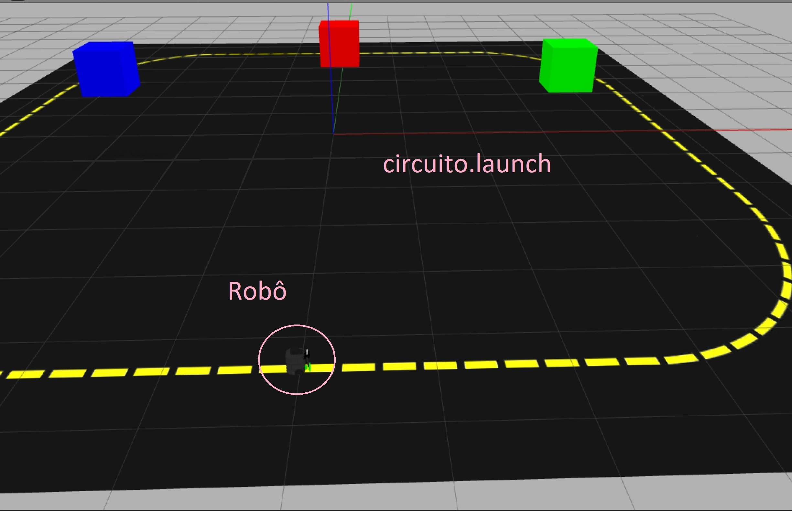
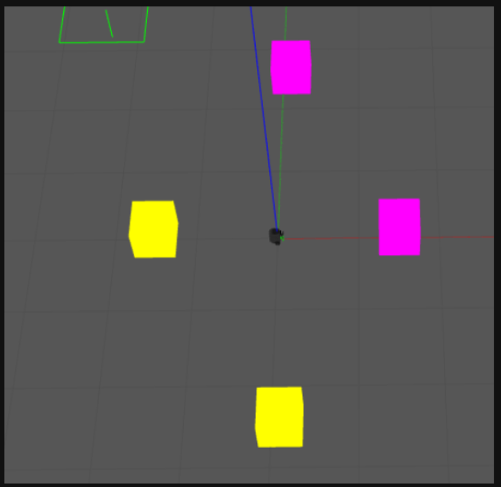

# Robótica Computacional 2024.1 - Simulado AI

Observações de avaliações nesta disciplina:

* A prova tem duração de **4 horas**.
* Inicie a prova no Blackboard para a ferramenta de Proctoring iniciar. Só finalize o Blackboard quando enviar a prova via Github classroom.
* Durante a prova vamos registrar as páginas visitadas e acessos online e o teclado.
* Coloque seu nome e email no README.md do seu repositório.
* Você pode consultar a internet ou qualquer material que utilizado no curso, mas não pode se comunicar com pessoas ou colegas a respeito da prova *em qualquer plataforma*.
* `Não é permitido o uso de ferramentas de **IA** como chatGPT, Copilot ou similares durante a prova`.
* Faça commits e pushes frequentes no seu repositório.
* Eventuais avisos importantes serão realizados em sala durante a prova.
* Escreva o número 42 como a resposta da soma no arquivo `README.md` como teste de sua atenção.
* A responsabilidade por *infraestrutura*, *configuração* e *setup* em funcionamento pleno, é de cada estudante.

## Atualização dos Pacote (ROS 2)

Execute os comandos abaixo para atualizar os pacotes da `ros2` obrigatórios para a prova:

```bash
cd ~/colcon_ws/src/my_simulation
git stash
git pull
cd ~/colcon_ws/src/insperbot
git pull
cb
```

## Configuração do Pacote (ROS 2)

- **Preparação Inicial:** Primeiro, aceite o convite do GitHub Classroom e clone o repositório **dentro da pasta** `colcon_ws/src/` no seu SSD.

- **Criação do Pacote ROS 2:** **Dentro do diretório do seu repositório**, crie um novo pacote chamado `avaliacao_ai`.

    - **Dica:** Para utilizar os modulos desenvolvidos no módulo 3, inclua o pacote `my_package` como dependência do seu pacote, e então, importe como nos exemplos do módulo 3.

___________________________

# Exercício 1 (5)

Baseando-se no código `base_control.py` do módulo 3, crie um arquivo chamado `q1.py` contendo uma classe denominada `Circuito`. Esta classe deve implementar um **nó** chamado `circuito_node`, responsável por fazer com que o robô **simulado** siga a linha amarela, ao completar uma volta, gire 90 graus e vá até a caixa da cor passada na criação da classe `Circuito`.

Utilize o comando abaixo para iniciar o simulador no mapa da prova:

```bash
ros2 launch my_gazebo circuito.launch.py
```



O nó criado deve: 

1. Dar uma volta completa na pista, parando na posição inicial
2. Girar 90 graus e parar olhando na direção das caixas.
3. Centralizar na caixa da cor passada na criação da classe `Circuito`
4. vai até a caixa da cor selecionada, parando quando estiver a bem próxima
5. volta para posição inicial e para

## Restrições

1. Deve existir o arquivo chamado `q1.py`.
2. O programa deve ser executado sem erros.
3. A classe deve se chamar `Circuito`.
4. A implementação deve seguir a estrutura da classe `Circuito`, conforme exemplo no `base_control.py`.
5. A função `control` deve ser a única a publicar no tópico `/cmd_vel`.
6. A função `control` deve ser idêntica à do arquivo `base_control.py`. Todas as decisões de controle devem ocorrer dentro dos nós, sem alterações na função `control`.
7. Não utilizar loops infinitos ou `sleep` durante o controle do robô.

___________________________

# Exercício 2 (5)

Baseando-se no código `base_control.py` do módulo 3, crie um arquivo chamado `q2.py` contendo uma classe denominada `Aleatorio`. Esta classe deve implementar um **nó** chamado `aleatorio_node`, responsável por fazer com que o robô **simulado** gire a uma velocidade de 0.5 rad/s por um tempo aleatório entre 5 e 10 segundos, e então realizar um comportamento diferente dependendo da cor da caixa mais prevalecente no campo de visão do robô.

Utilize o comando abaixo para iniciar o simulador no mapa da prova:

```bash
ros2 launch my_gazebo caixas.launch.py
```



O nó criado deve: 

1. Girar a uma velocidade de 0.5 rad/s por um tempo aleatório entre 5 e 10 segundos
2. Parar de girar.
3. Identificar a cor da caixa mais prevalecente no campo de visão do robô
4. Realizar um comportamento diferente dependendo da cor da caixa mais prevalecente:
    * **Magenta:** Se aproximar da caixa enquanto centraliza a caixa no campo de visão
    * **Amarela:** Se afastar da caixa enquanto centraliza a caixa no campo de visão
5. Voltar para posição inicial e parar

## Restrições

1. Deve existir o arquivo chamado `q2.py`.
2. O programa deve ser executado sem erros.
3. A classe deve se chamar `Aleatorio`.
4. A implementação deve seguir a estrutura da classe `Aleatorio`, conforme exemplo no `base_control.py`.
5. A função `control` deve ser a única a publicar no tópico `/cmd_vel`.
6. A função `control` deve ser idêntica à do arquivo `base_control.py`. Todas as decisões de controle devem ocorrer dentro dos nós, sem alterações na função `control`.
7. Não utilizar loops infinitos ou `sleep` durante o controle do robô.
