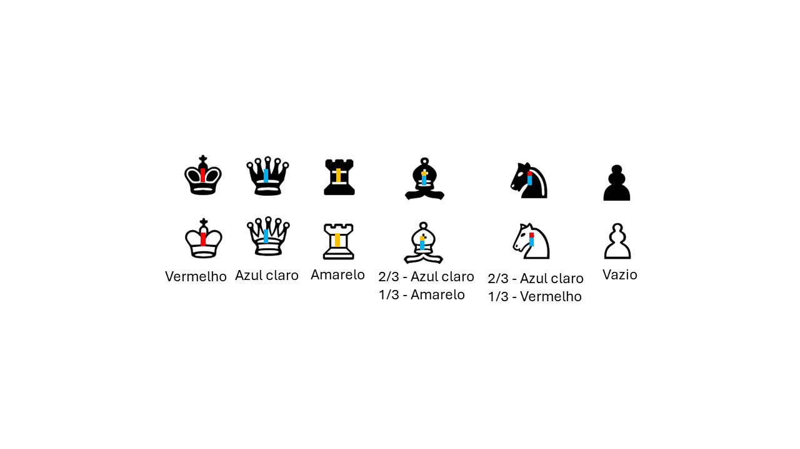
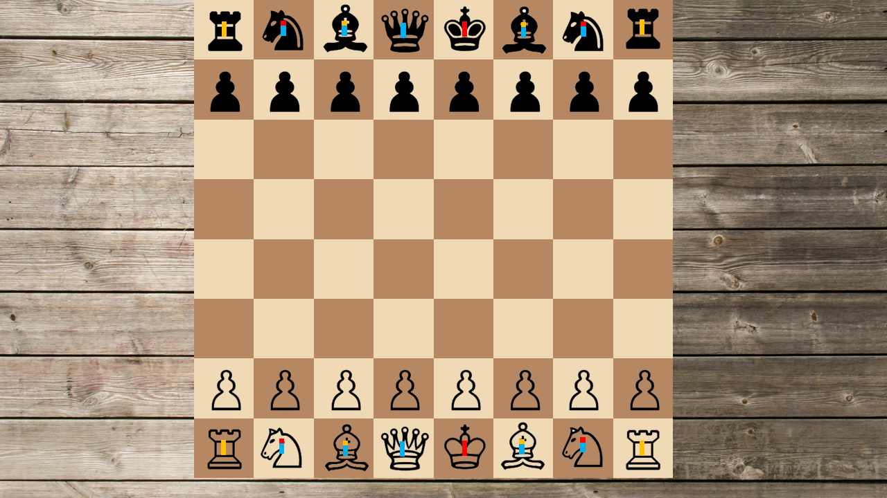

# Robótica Computacional 2024.1 - Simulado AI

Observações de avaliações nesta disciplina:

* A prova tem duração de **4 horas**.
* Inicie a prova no Blackboard para a ferramenta de Proctoring iniciar. Só finalize o Blackboard quando enviar a prova via Github classroom.
* Durante a prova vamos registrar as páginas visitadas e acessos online e o teclado.
* Coloque seu nome e email no README.md do seu repositório.
* Você pode consultar a internet ou qualquer material que utilizado no curso, mas não pode se comunicar com pessoas ou colegas a respeito da prova *em qualquer plataforma*.
* `Não é permitido o uso de ferramentas de **IA** como chatGPT, Copilot ou similares durante a prova`.
* Faça commits e pushes frequentes no seu repositório.
* Eventuais avisos importantes serão realizados em sala durante a prova.
* Escreva o número 42 como a resposta da soma no arquivo `README.md` como teste de sua atenção.
* A responsabilidade por *infraestrutura*, *configuração* e *setup* em funcionamento pleno, é de cada estudante.

## Atualização dos Pacote (ROS 2)

Execute os comandos abaixo para atualizar os pacotes da `ros2` obrigatórios para a prova:

```bash
cd ~/colcon_ws/src/my_simulation
git stash
git pull
cd ~/colcon_ws/src/insperbot
git pull
cb
```

## Configuração do Pacote (ROS 2)

- **Preparação Inicial:** Primeiro, aceite o convite do GitHub Classroom e clone o repositório **dentro da pasta** `colcon_ws/src/` no seu SSD.

- **Criação do Pacote ROS 2:** **Dentro do diretório do seu repositório**, crie um novo pacote chamado `avaliacao_ai`.

    - **Dica:** Para utilizar os modulos desenvolvidos no módulo 3, inclua o pacote `my_package` como dependência do seu pacote, e então, importe como nos exemplos do módulo 3.

___________________________

# Exercício 1 (5)

Baseando-se no código `base_control.py` do módulo 3, crie um arquivo chamado `q1.py` contendo uma classe denominada `Fugitivo`. Esta classe deve implementar um **nó** chamado `fugitivo_node`, responsável por fazer com que o robô **simulado** fuja do labirinto e pare do lado de fora.

Utilize o comando abaixo para iniciar o simulador no mapa da prova:

```bash
ros2 launch my_gazebo labirinto.launch.py
```

`**Importante**`: Note que o robô pode `nascer` aleatoriamente na posição `A` ou `B` do labirinto e independetemente da posição inicial o robô deve ser capaz de fujir do labirinto, como ilustrado na imagem a seguir:


O nó criado deve: 

* Criar um publisher para o tópico `/watcher` que publica mensagens do tipo `std_msgs.msg.String`.
* Ao iniciar, o nó deve publicar a mensagem `start` no tópico `/watcher`.
* Ao sair do labirinto, o nó deve publicar a mensagem `stop` no tópico `/watcher`.
* Controlar o robô para que ele saia do labirinto e pare do lado de fora.
* Deve ser capaz de sair independentemente da posição inicial do robô.
* Deve resolver o labirinto em menos de 5 minuto.

## Restrições

1. Deve existir o arquivo chamado `q1.py`.
2. O programa deve ser executado sem erros.
3. A classe deve se chamar `Fugitivo`.
4. A implementação deve seguir a estrutura da classe `Fugitivo`, conforme exemplo no `base_control.py`.
5. A função `control` deve ser a única a publicar no tópico `/cmd_vel`.
6. A função `control` deve ser idêntica à do arquivo `base_control.py`. Todas as decisões de controle devem ocorrer dentro dos nós, sem alterações na função `control`.
7. Não utilizar loops infinitos ou `sleep` durante o controle do robô.
8. Publicar a mensagem `start` ao iniciar e `stop` ao sair do labirinto no tópico `/watcher`.

## Rúbrica

1. O programa deve respeitar as restrições definidas.
2. Nota: ~1,0 - [1] + O robô consegue chegar na posição `1` de ambos os lados do labirinto e parar.
3. Nota: ~2,5 - [1] + O robô consegue chegar na posição `2` de ambos os lados do labirinto e parar.
4. Nota: ~5,0 - [1] + O robô consegue sair do labirinto e parar em menos de 5 minutos.

## Vídeo

Grave dois vídeos, um para cada posição inicial do robô, mostrando que o robô é capaz de sair do labirinto e parar do lado de fora. Publique os vídeos no YouTube e inclua apenas o `link` no arquivo `README.md` do seu repositório.

___________________________

# Exercício 2 (5)

Essa questão envolve apenas OpenCV Não utiliza ROS2. Crie um arquivo chamado `q2.py` com uma classe chamada `ChessDetector`, que possui um método `run`. Este método deve receber uma imagem e retornar um `np.array` de dimensão `(8, 8)` contendo as seguintes siglas para as peças de xadrez no tabuleiro:

* Brancas:
    * Peão: `WP`
    * Torre: `WT`
    * Cavalo: `WC`
    * Bispo: `WB`
    * Rainha: `WQ`
    * Rei: `WK`
* Pretas:
    * Peão: `BP`
    * Torre: `BT`
    * Cavalo: `BC`
    * Bispo: `BB`
    * Rainha: `BQ`
    * Rei: `BK`

Coloque `--` onde não houver peças.

Todas as peças de xadrez possuem um tag para auxiliar na identificação. Os tags estão presentes na imagem a seguir:



O tabuleiro de xadrez tem o formato e peças tradicionais. Na imagem, o tabuleiro pode estar em qualquer posição e tamanho (limitado entre o tabuleiro do `exemplo2.png` e do `exemplo3.png`). As peças não estão necessariamente no centro de um quadrado do tabuleiro.

Exemplo de tabuleiro de xadrez:



Saída esperada:
    
```python
[
    ['BT', 'BC', 'BB', 'BQ', 'BK', 'BB', 'BC', 'BT'],
    ['BP', 'BP', 'BP', 'BP', 'BP', 'BP', 'BP', 'BP'],
    ['--', '--', '--', '--', '--', '--', '--', '--'],
    ['--', '--', '--', '--', '--', '--', '--', '--'],
    ['--', '--', '--', '--', '--', '--', '--', '--'],
    ['--', '--', '--', '--', '--', '--', '--', '--'],
    ['WP', 'WP', 'WP', 'WP', 'WP', 'WP', 'WP', 'WP'],
    ['WT', 'WC', 'WB', 'WQ', 'WK', 'WB', 'WC', 'WT']
]
```

## Objetivo

Desenvolver um programa capaz de identificar todas as peças do tabuleiro de xadrez e retornar um `np.array` com as siglas das peças presentes no tabuleiro, colocando `--` onde não houver peça.

## Restrições

1. Deve existir um arquivo chamado `q2.py`
2. O programa deve ser executado sem erros.
3. A classe deve se chamar `ChessDetector`
4. A classe deve possuir um método `run` que, ao receber uma imagem, identifica retorna um `np.array` com as siglas das peças de xadrez presentes no tabuleiro.
5. O programa deve conter uma função `main` que lê a imagem, chama o método `run`, escreve o resultado na tela e exibe a imagem original.
6. A função `main` deve ser executada apenas se o arquivo for rodado diretamente, não quando importado como módulo.

## Rúbrica

1. O programa respeitar as restrições definidas.
2. Nota: ~1,0 - [1] + O programa consegue identificar o tabuleiro de xadrez.
3. Nota: ~1,5 - [0,5] + O programa identifica corretamente **1** das peças do tabuleiro e retorna o `np.array` correto contendo a peça e sua posição.
4. Nota: ~2,5 - [3] + O programa identifica corretamente a peça e a posição de 25% das peças do tabuleiro.
5. Nota: ~3,5 - [3] + O programa identifica corretamente a peça e a posição de 50% das peças do tabuleiro.
6. Nota: ~5,0 - [3] + O programa identifica corretamente a peça e a posição de todas (100%) as peças do tabuleiro.

## Vídeo

Grave um vídeo mostrando o funcionamento do programa para cada uma das 6 imagens de exemplo, mostrando a imagem de entrada e o `np.array` de saída. Publique os vídeos no YouTube e inclua apenas o `link` no arquivo `README.md` do seu repositório.

___________________________

# Desafio (+1 ou +2)

Neste desafio, dentre os alunos que finalizarem a questão 1, aquele com o melhor tempo receberá um bônus de 2 pontos na nota de AI. Além disso, os 50% melhores classificados ganharão 1 ponto extra na nota de AI.

Para participar da competição, após o robô sair do labirinto e a mensagem "Watcher stopped - run time: …" ser exibida no terminal do mapa, copie o arquivo `AI_RUNTIME.txt`, que foi salvo na sua pasta Home, para a raiz do seu repositório (no mesmo diretório do README.md).
