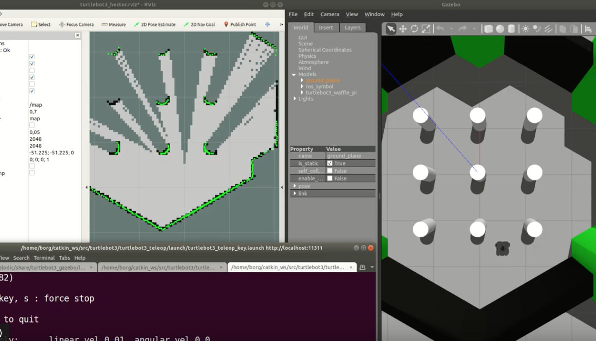

# SLAM no Turtlebot 3

[Fonte das informações]()

Estes são os comandos necessários para executar o SLAM (*simultaneous localization and mapping*) com o software do Turtlebot3.

Cada comando precisa ser dado num terminal diferente.

## Instalação

Vamos instalar os pacotes capazes de realizar *slam*:

    sudo apt-get install ros-melodic-slam-karto

Vamos precisar compilar o hector_map a partir do código-fonte:

    cd ~/catkin_ws/src
    git clone https://github.com/tu-darmstadt-ros-pkg/hector_slam

    cd hector_slam
    rm -Rf hector_geotiff*

    cd ~/catkin_ws
    catkin_make

## Robô

As instruções abaixo são mostradas neste vídeo

[https://www.youtube.com/watch?v=njhYGFo8G-o](https://www.youtube.com/watch?v=njhYGFo8G-o)

Primeiro precisamos definir qual Turtlebot usar na simulação. A versão *Waffle* é interessante porque já vem com a câmera (este comando deve ser repetido em todo terminal, ou adicionado ao final do ~/.bashrc).

    export TURTLEBOT3_MODEL=burger

Caso você vá rodar um robô simulado (como do exemplo abaixo) desabilite as variáveis `ROS_IP` e `ROS_MASTER_URI`. Depois iniciamos o ambiente virtual de simulação:

    roslaunch turtlebot3_gazebo turtlebot3_world.launch

Lembre-se de que existem as alternativas (use apenas uma de sua preferência)

    roslaunch turtlebot3_gazebo turtlebot3_stage_4.launch

    roslaunch turtlebot3_gazebo turtlebot3_stage_1.launch

    roslaunch turtlebot3_gazebo turtlebot3_stage_2.launch

    roslaunch turtlebot3_gazebo turtlebot3_stage_3.launch

    roslaunch turtlebot3_gazebo turtlebot3_house.launch

## SLAM - mapeamento

Depois o serviço de SLAM

    roslaunch turtlebot3_slam turtlebot3_slam.launch  slam_methods:=hector

Agora abra um terminal que nos permita controlar o robô com as teclas:

    roslaunch turtlebot3_teleop turtlebot3_teleop_key.launch

Pilote seu robô ao longo do mapa - quem faz o mapa ser gerado é o *laser* em conjunto com odometria

Quando você executa o *SLAM* o *Rviz* também executa. Se precisar rodar o RViz separado,  use o seguinte comando

    rviz -d `rospack find turtlebot3_slam`/rviz/turtlebot3_hector.rviz

### SLAM Methods

Existem diversos outros métodos de SLAM que pode ser passados no argumento `slam_methods`: 

* gmapping 
* cartographer 
* hector
* karto
* frontier_exploration

Ainda não estão funcionando no ROS Melodic:
* gmapping 
* cartographer 
* frontier_exploration

Cada um deles precisa usar o *Rviz* de forma diferente. Veja os comandos abaixo:

    rviz -d `rospack find turtlebot3_slam`/rviz/turtlebot3_cartographer.rviz
    rviz -d `rospack find turtlebot3_slam`/rviz/turtlebot3_hector.rviz
    rviz -d `rospack find turtlebot3_slam`/rviz/turtlebot3_karto.rviz
    rviz -d `rospack find turtlebot3_slam`/rviz/turtlebot3_frontier_exploration.rviz

## Para salvar o mapa ao final

O mapa vai ser salvo no diretório em que o map_saver for executado. Cada mapa são dois arquivos, um chamado `map.pgm`
 e outro `map.yaml`.
    rosrun map_server map_saver -f ~/map

## Links e referências interessantes

[Testes de SLAM 3D](https://www.youtube.com/watch?v=EU6X1AYEksc)

[Google Cartographer - um dos algoritmos de SLAM](https://github.com/googlecartographer/cartographer)

[Hector SLAM - outro dos algoritmos](https://www.youtube.com/watch?v=F8pdObV_df4)

