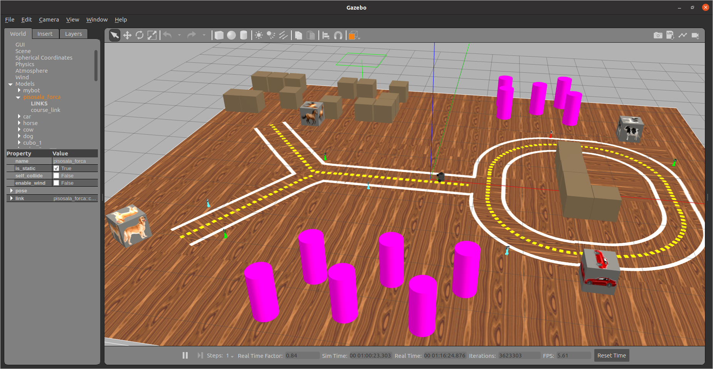

# Projeto 1

Deadline 24/05


```
      May 2021        
Su Mo Tu We Th Fr Sa  
                   1  
 2  3  4  5  6  7  8  
 9 10 11 12 13 14 15  
16 17 18 19 20 21 22  
23 24 25 26 27 28 29  
30 31 


```


# Rubricas

**Conceito C**

Robô é capaz de percorer toda a pista e se chocar contra um creeper da cor certa, voltando depois à pista.

No retorno à pista apo grupo de alunos não precisa gravar vídeo comprobatório por muito tempo. Apenas o suficiente para demonstrar que o robô encontrou a pista e voltou a executar o código de seguir.

**Conceito B** 

Pega o creeper da cor e ID corretos com a garra e volta para a pista.  


No retorno à pista o grupo de alunos não precisa gravar vídeo comprobatório por muito tempo. Apenas o suficiente para demonstrar que o robô encontrou a pista e voltou a executar o código de seguir.

O código tem que estar bem modularizado e cada função deve estar documentada explicando de forma resumida o que faz, como no gabarito da Q4, ou:

```python

def soma(a,b):
	“””
	Retorna a soma de a e b
	”””
  	return a + b
```

**Conceito A**

Itens do conceito B + um uso de classes e objetos Python    

Só pode ter sleep dentro do `while` principal. 

Pegar o creeper da cor certa, com o ID certo, e deixar na base certa 

Fazer um dentre os cinco *especiais*:
* Gravar e filmar no robô real funcionado (possível apenas em fase amarela)
* Fazer um controle proporcional derivativo ou PD para manter o robô na pista e fazer funcionar rápido baseado no ângulo de visão da pista, mais ou menos como [neste exemplo](https://github.com/Insper/robot21.1/blob/main/aula03/aula03_RegressaoPixelsAmarelos.ipynb)
* Usar ARUCO em modo 3D 
* Encontrar os creepers que se encontram fora da pista usando mapeamento ( https://github.com/Insper/404/blob/master/tutoriais/robotica/navigation_gazebo_simulador.md)
* Estruturar o programa com pelo menos um node ROS prestando serviço para o outro. Ver gabarito Q4 da P1
* Completar e filmar os 3 objetivos usando a pista aleatória: `roslaunch my_simulation forca_random.launch`


Para saber como implementar controle proporcional derivativo ou PD se inspire [neste link](https://www.a1k0n.net/2018/11/13/fast-line-following.html)

## Grupos de 4 pessoas 

Os grupos de 4 pessoas terão sempre um conceito deslocado em relacão aos de 3 pessoas.

Para obter A num grupo de 4, é necessário  fazer 3 especiais.

O necessário para conceito B em grupos de 3 representa o conceito C em grupos de 4.





# Objetivos 

Cores válidas do creeper: blue, green, pink Estações válidas: dog, cat, bicycle e bird

Cores válidas do creeper: `blue`, `orange`, `pink`
Estações válidas: `dog`, `cat`, `bicycle` e `bird`


### Exemplos de objetivos: 

Os objetivos abaixo são exemplos de objetivos possíveis.  O seu robô deve ser capaz de realizar *qualquer* objetivo. 


```python
goal1 = ("blue", 22, "dog")

goal2 = ("green", 13, "bird")

goal3 = ("orange", 11, "cat")
```


Por exemplo, o objetivo `("blue", 22, "dog")` significa *Encontre o creeper azul de ID 22 e o traga até a caixa com figura de cão*. 

A lista de todas as possibilidades que seu programa pode encontrar [está neste link](./todas_possibilidades.md). Lembre-se de que o código deve estar preparado para funcionar com *qualquer uma*. 


# Objetivos que devem ser filmados 

```python
goal1 = ("blue", 12, "dog")

goal2 = ("green", 23, "horse")

goal3 = ("orange", 11, "cow")
```


# Instruções

Comandos para atualizar os repositório
```bash
    cd ~catkin_ws/src/mybot_description
    git stash
    git pull
    cd ~catkin_ws/src/my_simulation
    git checkout master
    git pull
    cd ~catkin_ws/src/robot21.1
    git pull
```

Para executar:

	roslaunch my_simulation forca.launch

Para habilitar o controle da garra executar:

	roslaunch mybot_description mybot_control2.launch 	

Para editar:

Sugerimos que crie um projeto próprio e se baseie no seguinte arquivo:

    ~/catkin_ws/src/robot21.1/projeto/ros_projeto/scripts


Como atividade inicial, sugiro que tente fazer o robô *seguir a pista* . Você pode se basear em sua Atividade 3, ou ainda desenvolver uma abordagem baseada em centro de massa da linha amarela, como [encontrada neste link](https://github.com/osrf/rosbook/blob/master/followbot/follower_color_filter.py)


# Exemplo do ARUCO 

Exemplo de como programar usando os markers ARUCO 

[https://github.com/Insper/robot211/blob/master/ros/exemplos211/scripts/aruco.py](https://github.com/Insper/robot211/blob/master/ros/exemplos211/scripts/aruco.py)

# Instruções sobre os tópicos da garra 

[Fonte: https://github.com/arnaldojr/mybot_description/](https://github.com/arnaldojr/mybot_description/)

Launch para subir os controles da garra e RViz

    roslaunch mybot_description mybot_control2.launch 

Para publicar um topico da garra:

Joint1 = braço da garra. Valores máximos:

    Garra recolhida: -1
    Garra para frente: 0
    Garra levantada: 1.5
    
    No terminal:
    rostopic pub -1 /joint1_position_controller/command std_msgs/Float64 "data: 0"
    
Joint2 = Pinça da garra.

    Pinça fechada: 0
    Pinça aberta: -1
    
    No terminal:
    rostopic pub -1 /joint2_position_controller/command std_msgs/Float64 "data: 0"
    
Visualizar arvore:

    rosrun rqt_gui rqt_gui 
    
Exemplo de codigo py

[https://github.com/Insper/robot21.1/blob/master/ros/exemplos211/scripts/move_garra.py](https://github.com/Insper/robot21.1/blob/master/ros/exemplos211/scripts/move_garra.py)


