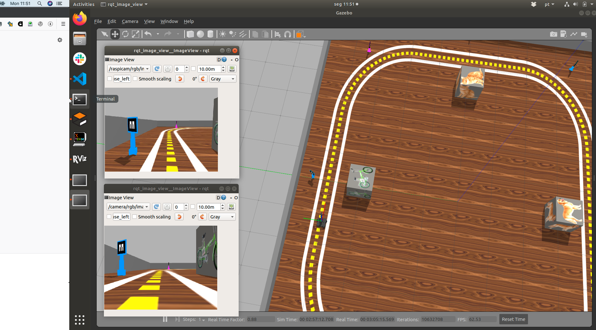
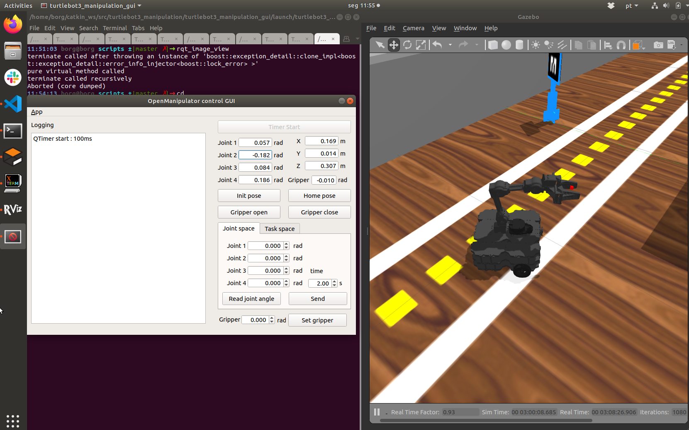

# Projeto 1

Datas:

Deadline 11/05 para primeira entrega. 

Quem na entrega de 11/05 entregar um vídeo com o que já foi completado  e a URL do código ganha prazo até 14/05. 


        Maio 2020
    Su Mo Tu We Th Fr Sa
                    1  2
    3  4  5  6  7  8  9
    10 11 12 13 14 15 16
    17 18 19 20 21 22 23
    24 25 26 27 28 29 30
    31


# Rubrica


C - Ficar na pista, encontrar creeper da cor certa, derrubar e voltar para a pista

B - Pegar um creeper da cor certa, voltar para a pista e deixar na base certa. **Pode usar a inteface manual para controlar a garra** 

A - Pegar creeper da cor e Id certos. Deixar na base certa. Estar bem modularizado 


Cores válidas do creeper: `blue`, `green`, `pink`
Estações válidas: `dog`, `cat`, `bicycle` e `bird`

### Exemplo de objetivo: 

O objetivo abaixo significa "Encontre o creeper azul que tem o ID número 23 e o traga até perto da caixa com o pássaro"

~~~python

    goal = ["blue", 23, "bird"]

~~~

A lista de todas as possibilidades que seu programa pode encontrar [está neste link](./todas_possibilidades.md). Lembre-se de que o código deve estar preparado para funcionar com *qualquer uma*. 

### Objetivos de testes - vídeos

Você deve mostrar, para todas as rubricas, três vídeos do seu sistema  completando as seguintes atividades:

```python
goal1 = ("blue", 11, "cat")

goal2 = ("green", 21, "dog")

goal3 = ("pink", 12, "bicycle")
```

Lembre-se que todos os campos são importantes para o **A**.  

A rubrica **B** leva em conta somente cor e estação. 

A rubrica **C** leva em conta somente cor. 

Note que não há problema se você editar somente o *goal* no código (sem fazer um menu ou um *input*). Você pode reiniciar tudo entre um objetivo e outro.

# Como rodar 

Atualizar `my_simulation` 

Atualizar `robot20`  


# Rodar script instala_garra.sh:

O comando abaixo é capaz de executar o comando:

    sh $(rospack find my_simulation)/garra/instala_garra.sh
    

# Rodar cenário:

Tesmos disponivel 4 opções de mapas, com pequenas diferenças entre eles.

## Opção 1:
Pista larga e sem base nos creppers. Esta pista *consegue* deduzir a posição do tag da cabeça do creeper usando o tag auxiliar que fica na base. 

    roslaunch my_simulation proj1_mult.launch
    
</img>


## Opção 2:
Pista estreita e sem base nos creppers. Pista larga e sem base nos creppers. Esta pista *consegue* deduzir a posição do tag da cabeça do creeper usando o tag auxiliar que fica na base. 

    roslaunch my_simulation proj1_mult_estreita.launch

</img>

**Obs.:** Os launches `proj1_mult` e `proj1_mult_estreita` foram alterados para usar multi-marker, que aumentam a precisão.  

## Opção 3:
Pista larga e com base nos creppers. Esta pista <font color=red>só consegue informar o tag quando a cabeça do *creeper* estiver visível</font>. 

    roslaunch my_simulation proj1_base.launch

</img>


## Opção 4:
Pista estreita e com base nos creppers. Esta pista só <font color=red>consegue informar o tag quando a cabeça do *creeper* estiver visível</font>. 

    roslaunch my_simulation proj1_base_estreita.launch


</img>


A figura abaixo mostra a pista do projeto. 

</img>


# Rodar exemplo 

Existe um código exemplo que junta 

    rosrun projeto1_base base_proj.py

Este exemplo pode ou não ser usado, conforme seu grupo achar melhor. 

# Rviz - visualizador dos sensores

Existe uma configuração do Rviz já adequada a visualizar os sensores (câmera, laser, tag) pertinentes deste projeto. Para usá-la faça:

    roslaunch my_simulation rviz.launch

O Rviz deve se abrir numa visão semelhante ao que temos abaixo.  O uso do Rviz é essencial [só se você estiver convertendo entre sistemas de coordenadas em seu programa Python](./transformacoes.md).

</img>


# Usando a garra

Iniciando o módulo de controle da garra:

    roslaunch turtlebot3_manipulation_moveit_config move_group.launch

Para abrir o software para controlar a garra interativamente e aprender os ângulos e posições:


    roslaunch turtlebot3_manipulation_gui turtlebot3_manipulation_gui.launch

O software permite que você especifique o movimento da garra **tanto em ângulos** quando em termos da posição desejada para a ponta da garra.

</img>

[Este vídeo  demonstra como agarrar o creeper e suspendê-lo](https://www.youtube.com/watch?v=Sq5ZDQDoR4w&feature=youtu.be) para que fique acima da câmera sem atrapalhar a visão.


Note que até o conceito B você pode oeprar a garra manualmente. Para fazer isso programe seu robô para chegar perto o suficiente do creeper e pedir explicitamente que você o opere. Você vai precisar usar um `raw_input()` no código para **congelar** o terminal enquanto faz a pilotagem. Par

Existem algumas orientações sobre como controlar a garra neste link [https://github.com/arnaldojr/my_simulation/blob/master/garra/Open_manipulator_gui.md](https://github.com/arnaldojr/my_simulation/blob/master/garra/Open_manipulator_gui.md).

Note que você **precisa** ter este projeto em seu `catkin_ws/src` senão a garra fica com um dos lados frouxos. O script `instala_garra.sh` faz o download dele, mas certifique-se. 

    cd ~/catkin_ws/src
    git clone https://github.com/roboticsgroup/roboticsgroup_gazebo_plugins


## Controlando a garra por código

Rodando o software para controlar a garra

[Exemplo que controla](https://github.com/arnaldojr/my_simulation/blob/master/garra/scripts/garra_demo.py) passando tanto ângulos quanto posições-objetivo. 

    rosrun my_simulation garra_demo.py 

## Transformações 

Veja o [adendo sobre transformações](./transformacoes.md) e os tags Alvar se estiver já buscando o conceito A. 


