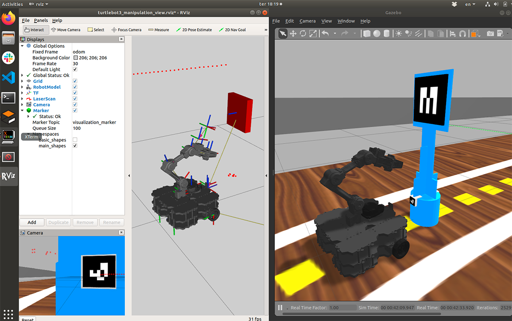

# Transformações, sistemas de coordenadas e conversões

O ROS tem embutidas facilidades para lidar com vários sistemas de coordenadas e converter objetos de um sistema para outro. 

## Referenciais

Para saber todos os referenciais $x,y,z$ disponíveis numa simulação, rode o comando abaixo que vai gerar um arquivo frames.pdf:

    rosrun tf view_frames 

Ou o comando abaixo, que documenta os sistemas de coordenadas na tela:

    rosrun rqt_tf_tree rqt_tf_tree

Um exemplo de arquivo *frames.pdf* gerado quando se via o marker 11 está [disponível aqui](./frames_projeto1.pdf), e pode-se ter uma ideia observado o gráfico abaixo:


Podemos notar que existem alguns sistemas de coordenadas que são úteis:


* base_link é o centro de coordenadas no robô inteiro 

* camera_rgb_optical_frame é o centro de coordenadas da câmera 

* end_effector_link é o centro da garra do robô, que corresponde ao cubo vermelho

* ar_marker_11 é o tag número 11, que aparece num creeper azul

## Executando o Rviz

Para que os sistemas de coordenadas da garra do robô (juntas e end_effector_link) funcionem adequadamente, precisamos de um *robot state publisher*. Vamos aproveitar que há um embutido no Rviz. 

Depois de executar em um terminal diferente os comandos vistos na página anterior:

    roslaunch my_simulation proj1_mult_estreita.launch

    roslaunch turtlebot3_manipulation_moveit_config move_group.launch

    roslaunch turtlebot3_manipulation_gui turtlebot3_manipulation_gui.launch

Não deixe de fazer: 

    roslaunch my_simulation rviz.launch

O ambiente com a pista simulada no Gazebo e o Rviz ficará como a seguir.

</img>

## Exemplo no código

No ROS a função `lookupTransform`  da classe `tf2_ros.Buffer`é capaz de calcular as transformações entre quaisquer referenciais presentes na cena.  

```python
    transf = tf_buffer.lookup_transform(ref1, ref2, rospy.Time(0))
```

O código abaixo, por exemplo, encontra a transformação entre o centro o marcador 11 e o centro da garra. 

```python
    transf = tf_buffer.lookup_transform("end_effector_link", "ar_marker_11", rospy.Time(0))end_effector_link 
```

Foi criado um exemplo em Python que ilustra o uso desta função para converter entre as coordenadas de alguns referenciais importantes e as coordenmadas. Para executar, faça no terminal

    rosrun projeto1_base exemplos_transformacoes.py


A saída impressa deverá mostrar as conversões para todos os marcadores presentes no projeto e que forem vistos em cada momento:

    Marcador  11
    No referencial : end_effector_link  que é 
    Cubo vermelho da mão
    y 0.017 x 0.119 z 0.120 graus 174.234 alpha 3.041 

    Marcador  11
    No referencial : camera_rgb_optical_frame  que é 
    Coordenadas da câmera
    y -0.331 x -0.028 z 0.216 graus 90.849 alpha 1.586 

    Marcador  11
    No referencial : base_link  que é 
    Base do robô
    y 0.017 x 0.289 z 0.415 graus 178.269 alpha 3.111 


