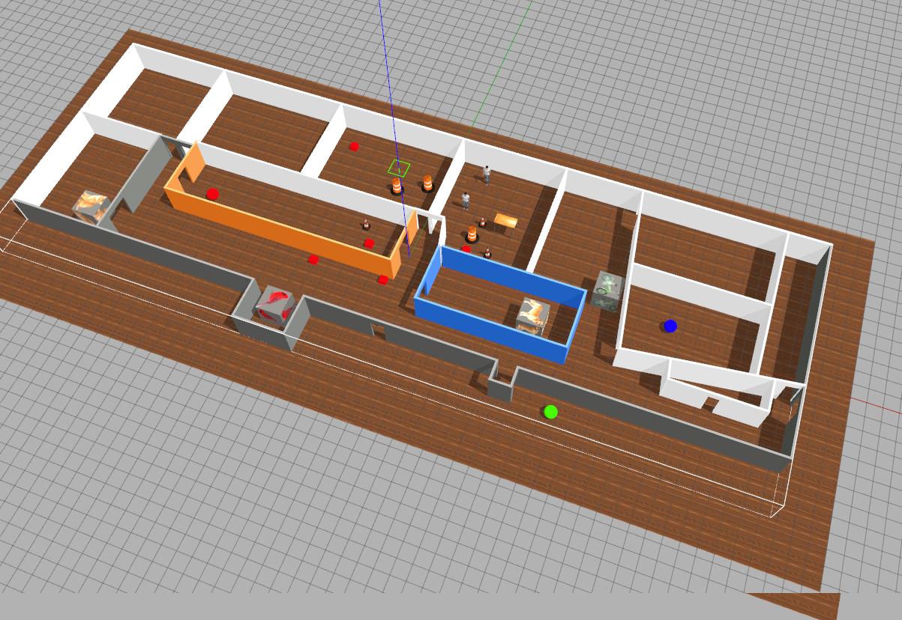

# Projeto Delta



## Adequação e critérios

Este projeto deverá ser realizado por todos os grupos que não atingiram pelo menos conceito `C` no Projeto de Robótica.

Completar este projeto leva grupos *que já entregaram* o projeto 1 ao conceito C.

O deadline é 20:00 do dia 04/07, mas se terminar antes envie e-mail pedindo para o professor já avaliar.

## Objetivo do robô

O robô receberá uma lista de objetos a localizar no 4.o andar e tem que *tirar uma foto* ou seja, capturar subimagem de cada objeto desejado.

Pode ser necessário localizar mais de um objeto numa execução do código. 

Exemplo de objetivo:

```python
goal = ["cat", "green_sphere"]
```

A partir do objetivo dado o robô precisa achar um jeito de percorrer o 4.o andar e localizar a esfera verde e o gato.  Deve adotar alguma estratégia de percorrer o andar.

Assim que localizar um objeto precisa capturar o retângulo que contém o objeto fazendo slicing e depois prosseguir em direção ao próximo

Quando terminar deve escrever uma mensagem clara na tela para avisar que terminou, e parar.


## Objetivo a ser filmado

Seu programa precisa demonstrar que funciona para o seguinte objetivo: 

```python
goal = ["bird", "red_sphere"]
```

## Questionário

[Link para entrega do projeto](https://insper.blackboard.com/webapps/assessment/take/launchAssessment.jsp?course_id=_32801_1&content_id=_731628_1&mode=cpview)


## O que é para fazer

Defina uma rota de pontos-chave no mapa usando odometria e, ao longo dessa rota, o robô deve procurar os objetos.  Periodicamente ao longo da rota o robô deve parar e gazer um giro de 360 graus para procurar os objetos.

Assim a *mesma rota* serve para todos os objetivos.

Sempre que um objeto for encontrado, deve-se criar uma janela secundária apenas com este objeto (mostrando com `cv2.imshow`), e aparecer um texto na visão do robô indicando de forma ativa que foi capturado.

## Formato do objetivo

Elementos possíveis

```python

"person"

"cat"

"dog"

"bird"

"blue_sphere"

"red_sphere"

"green_sphere"

"bike"
```

Portanto o objetivo mais complexo que pode existir é este abaixo:

```python
goal = ["person", "cat", "dog", "bird", "bird", "blue_sphere", "red_sphere", "green_sphere", "bike"]
```

Não importa a ordem em que os objetos são encontrados.


Para lançar o mapa atualize o repositório [my_simulation](https://github.com/arnaldojr/my_simulation/) e faça:

    roslaunch my_simulation esconde-esconde.launch

Para ver o grid do chão com mais células para ter uma referência melhor use a opção `GUI` `grid` `cell count`


Lembre-se que as coordenadas de odometria são centradas na posição inicial do robô, e não no `(0,0,0)` do universo.


# Dica

Sugerimos que estude a solução da questão de odometria da Prova P2 

[https://github.com/mirwox/p2/blob/solution/p2_20/scripts/Q3_controle.py](https://github.com/mirwox/p2/blob/solution/p2_20/scripts/Q3_controle.py)

Também sugerimos o estudo da questão de deteção de esferas da P2

[https://github.com/mirwox/p2/blob/solution/p2_20/scripts/Q4_formas.py](https://github.com/mirwox/p2/blob/solution/p2_20/scripts/Q4_formas.py)

O slicing feito no gabarito da P1 Q1 é um jeito de criar uma imagem menor contendo apenas uma parte retangular da imagem original

```python
     submask = mask[y1:y2,x1:x2]
```

Veja mais [aqui](https://github.com/mirwox/prova1_2020/blob/solution/q1/Solucao_Q1.ipynb)